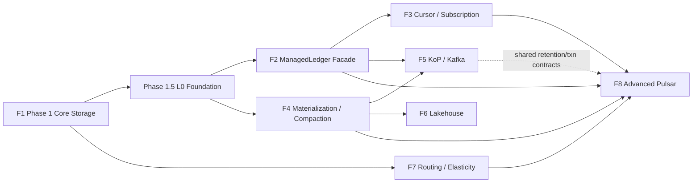

# Nereus Capability Tracks and Delivery Plan

> 状态：Current roadmap
> `Future 1-8` 是稳定的能力轨道编号，不是“全部尚未开始”的阶段标签。

## 1. 交付原则

Nereus 的 north-star architecture 一次定义，工程按能力依赖增量交付。每个轨道必须保持：

```text
logical truth = stream head + reachable commit log
logical coordinate = streamId + offset
physical selection = generation-aware read index
protocol/table state = projection
```

跨轨道规则：

- 下层 API 不引入 Pulsar/Kafka 类型；
- 所有成功 append 都有 stable offset，不允许 profile 跳过 Oxia head commit；
- async 只延后 object/read-optimized generation，不延后逻辑提交；
- higher generation 不改变 offsets/projections；
- routing 不成为 durable ownership；
- catalog 不进入 producer ack；
- `Designed/Reserved` 不得写成 `Implemented`。

## 2. 当前交付状态

| Track | Delivery mapping | Status | Next gate |
| --- | --- | --- | --- |
| F1 Core Stream Storage | Phase 1 M0-M8 + Phase 1.5 P15-M0-M6 | Implemented/final-gated | F2/F4 consume the stable L0 surface |
| F2 ManagedLedger Facade | Phase 2 F2-M0-M6 | Implemented/final-gated（M0/M0R/M0R2 + P15-M6 + F2-M1-M6 complete） | F3/F4 consume the locked facade/storage boundary |
| F3 Cursor/Subscription | Phase 3 F3-M0-M6 | Implemented/final-gated | F4/F5/F8 consume stable cursor/reference semantics |
| F4 Materialization/Compaction | Phase 4 F4-M0-M6 | In progress / F4-M1–M3 final-gated；M4 through BA implements recovery/retirement/GC fences、activation/global domains、cursor protection、physical/cursor live-reference backfill、restart-reconstructable cursor/ownerless execution、strict current-writer inventory/missing-root registration、registration-last retirement、the metadata-first fixed-delay lifecycle、exact broker typed GC configuration、configured-scope object-store capability proof、bounded atomic deletion activation、provider/Pulsar sequencing、exact-scope restart fencing、shared reference-domain assembly、real wrong-scope/empty-list/lost-response recovery、post-DELETE/pre-root-CAS independent recovery、applied-DELETED-CAS exact reload without repeated DELETE、two-worker shared-intent/idempotent-delete convergence、all-256-shard mixed-state recovery with opaque LIST progress、fresh-process real-Oxia 1,001-root hot-shard pagination over 1,256 roots、10,000-DELETED-root dual-window/audit/root-last bounded retirement、exact 10,000-cursor-root live/old/CAS-lost/deleted-cursor classification/deletion and restart-safe journaled source/protection post-delete recovery；M5 through AI adds durable registration/readiness/activation、protected async Object-WAL acknowledgement、pre-I/O lag admission、the coupled production read-repair/materialization runtime、stable exact-evidence retention planning/F3 logical-trim delegation、shared bounded retention execution、production ledger/config installation and exact Pulsar retention/backlog/admin admission；safe defaults keep production deletion disabled | Complete the late-PUT/tombstone and actual two-broker destructive matrix plus M4–M6 gates |
| F5 KoP/Kafka | later phase | Designed | F2 facade + stable offset/projection + txn boundary |
| F6 Lakehouse | later phase | Designed | F4 compacted generation and GC references |
| F7 Routing/Elasticity | later phase | Designed | F1 session/fencing + F2/F5 lookup projections |
| F8 Advanced Pulsar | later phase | Designed | F2/F3/F4/F7 foundations |

Phase 1 implements only `OBJECT_WAL_SYNC_OBJECT` execution。Phase 1.5 changes the L0 abstraction/recovery/lifecycle
foundation but intentionally keeps that executable-profile boundary。Future 2 consumes the same strict Object-WAL
profile from the completed P15-M6 surface；BookKeeper and async profiles remain reservations until their adapters/state machines pass their
own gates。

## 3. Dependency graph



这不是所有设计工作的严格串行计划。F2-M0R2 新发现的 P15-M6 cumulative-result handoff 与 F2-M1-M6
production milestones 已完成；Future 2 已 final-gated。Phase 3 的 M0/M0R 已把 cursor/reference/trim
handoff 冻结到代码级，F3-M1 metadata/snapshot foundation 与 F3-M2 CursorStorage/retention state machines
已 final-gated；F3-M3 facade、F3-M4 Pulsar broker integration、F3-M5 real recovery/retention 与 F3-M6
compatibility/incarnation/F4-handoff 已完成并通过对应 gate。F4-M0 已用本地 Nereus/Pulsar
source 完成代码级设计门禁；F4 production 现在可以从 M1 开始消费 F3 的稳定
cursor/reference/trim boundary，但仍必须通过自己的 generation/GC gates 才能对 production
topic 发布或删除 physical bytes。

## 4. F1 — Core Stream Storage

Detailed design: `nereus-future1-core-stream-storage.md`
Implemented Phase 1 contract: `../phase-1-core-stream-storage/README.md`
Active Phase 1.5 contract: `../phase-1.5-core-storage-foundation/README.md`
Delivery decision: `../decisions/0004-insert-phase-1-5-generic-storage-foundation.md`

### Owns

- protocol-neutral `StreamStorage`；
- stream identity/lifecycle；
- append session and fencing；
- primary WAL boundary and Object WAL v1；
- stream head / commit log / generation-0 read index；
- resolve/read/trim/recovery；
- checksum、format、timeout、close contracts。

### Does not own

- ManagedLedger/MessageId semantics；
- durable cursor/group/transaction semantics；
- higher-generation compaction workers；
- routing and catalog operations。

### Current implementation gate

Phase 1 done requires M0-M8 and the full definition in
`../phase-1-core-stream-storage/05-implementation-plan-and-tests.md`。BookKeeper/async profiles are not
part of that done definition。

### Phase 1.5 delivery extension

F2-M0R exposed the original shared L0 prerequisites and M0R2 exposed one result handoff，so the roadmap places
P15-M0-M6 before F2-M1：

- tagged Object/BookKeeper `ReadTarget` values and generic result/resolve contracts；
- primary-WAL adapter registry with Object WAL v1 parity；
- stable head commit separated from generation-zero materialization；
- legacy-record dual-read and generic-target new-write；
- exact retained append attempt recovery；
- authoritative seal/logical-delete lifecycle。
- P15-M6 public cumulative logical size copied from existing committed truth。

Phase 1.5 P15-M0-M6 still supports only strict Object WAL。BookKeeper IO、`WAL_DURABLE` success、async
workers and higher generations remain outside this delivery。

## 5. F2 — ManagedLedger Facade

Detailed design: `nereus-future2-managed-ledger-facade.md`
Code-level design: `../phase-2-managed-ledger-facade/README.md`
Current milestone: F2-M0/M0R/M0R2 + P15-M6 + F2-M1-M6 complete/final-gated；production facade/cursor、generation-safe write-fence handoff、shared-store peer lifecycle、real dual-broker restart/failover and scenarios 1–19 are implemented and gated

### Owns

- storage class `nereus`；
- `ManagedLedgerFactory` and ManagedLedger facade；
- Pulsar entry encoding；
- virtual ledger / Position / MessageId projection；
- topic open/load/unload and compatibility stats。

### Entry gate

F2-M0/M0R/M0R2 closed the facade design gate，and P15-M6 closed the final cumulative-result prerequisite before
F2-M1-M5 consumed these entry contracts in the facade and Pulsar fork；F2-M6 completed the final
failure/lifecycle acceptance matrix：

- F1 append/read/trim error semantics are stable；
- Pulsar fork/API blobs and repository boundary are locked；
- mapping v1 is one stream/one virtual ledger with `entryId == stream offset`；
- same-name delete/recreate uses a new projection incarnation/stream/virtual ledger；
- non-known append outcomes carry and recover the exact retained attempt before writes resume；
- generic `AppendResult` exposes logical range independently from physical target；F2 does not inspect object fields；
- L0 seal/logical-delete are authoritative and implemented；
- every other Nereus profile is rejected before IO。

### Exit gate

- Position remains stable across restart and future generation replacement；
- old-incarnation Position cannot alias a recreated topic；
- append ack maps selected durability boundary to Pulsar callback once；
- no broker path assumes virtual ledger id is a BookKeeper ledger id；
- storage class coexistence/offload behavior is explicit。

## 6. F3 — Cursor and Subscription State

Detailed design: `nereus-future3-cursor-subscription.md`
Code-level design: `../phase-3-cursor-subscription/README.md`
Current milestone: F3-M0/M0R design-gated；F3-M1-M6 implemented/final-gated

### Owns

- durable mark-delete；normal dispatch read position stays broker-local；
- individual whole-ack ranges、partial-batch remaining bits and immutable snapshot objects；
- one-root cursor CAS、per-writable-open owner-session claim/fence、generation/tombstone、destructive `ackStateEpoch`
  and failover recovery；
- Exclusive/Failover/Shared durable progress；
- conservative retention floor and recoverable logical-trim barrier。

### Entry/exit gates

- M0 locks the exact local Pulsar master API/member/call paths；
- F2 maps Position to one persisted-entry offset and preserves MessageId batch indexes as in-entry sub-indexes；
- one Oxia root owns cursor correctness；snapshot ref is authoritative only through that root；
- every writable open claims retention first and every ACTIVE cursor root under one fresh owner session before topic
  publication；Pulsar ownership/watch alone is not the cursor fence；
- broker-supplied ownership checker passes before root claim and final publication/first-create callback；it gates
  authority but never replaces durable session/version fencing；
- normal dispatch read position is never durable；restart begins at first unacked；
- reset/clear-backlog advances `ackStateEpoch`，so monotonic ack cannot rebase across destructive replacement；
- new/recreated cursor and backward reset remain in recoverable `PROTECTION_PENDING` through cursor CAS；trim uses
  separate recoverable `TRIM_PENDING`；
- M1-M6 must add deterministic/real two-broker ack、snapshot、restart、trim and compatibility gates；
- Key_Shared/delayed/pending-ack remain F8。

## 7. F4 — Materialization, Compaction and Generation Replacement

Detailed design: `nereus-future4-compaction-generation.md`
Code-level target contract: `../phase-4-compaction-generation/README.md`
Current milestone: F4-M0 source audit/design gate complete；F4-M1 API/metadata/object IO、F4-M2 committed
generation publication/read/pin/fallback and F4-M3 materialization paths implemented/final-gated. M3 includes the real Parquet
writer/strict-reader/full verifier、NTC1 facade、core adapter and deterministic policy/planner/task/recovery/registry
scanner landed. The exact-source claim-to-output-ready worker、task-protection crash-cut recovery、advisory checkpoint
reconciliation、bounded service lifecycle and Pulsar Entry/NCP1 exact-byte round trip checkpoints are also implemented,
as are the topic-compaction SPI/registry、terminal workflow-metadata retirement、COMMITTED-source bootstrap、
tagged-v1 key encoding、shared-budget sorted-spill two-pass engine and isolated NTC1 worker/publication path.
`phase4M3Check` and the real Oxia/LocalStack-backed final gate pass；M4 GC and the M5 async path do not exist yet.

### Owns

- async materialization stream discovery/task/checkpoint/lag；
- primary-WAL retention gate；
- compaction planner/worker；
- higher-generation publish and reader selection；
- fallback and GC references；
- topic-compaction primitive。

### Entry gate

- F1 generation-0 index and commitVersion contracts stable；
- Phase 1.5 generic read target/dispatcher and stable-commit split implemented；
- Phase 3 cursor owner/protection/pending-trim/snapshot-reference boundary implemented and final-gated；
- conditional higher-generation publish、reader lease、recovery checkpoint and physical-GC schemas are frozen by F4-M0；
- guarded provider PUT and long-grace DELETED-root/reference/manifest retirement bound physical audit metadata without
  allowing a stale writer to reuse a deleted key；
- registered-stream discovery is 64-shard、restart-safe and hint-only；projection/head/index remain authoritative；
- generation-zero new writes prepare intent, acquire `REACHABLE_APPEND`, then CAS head；strict success additionally
  acquires index-owned `VISIBLE_GENERATION`；
- source ranges and checksums form deterministic task identity。

### Exit gate

- publish changes physical target only；
- repair handles upload/publish/checkpoint partial states；
- lag blocks unsafe primary-WAL GC；
- old generations are retained until all reader/cursor/task/catalog references are safe；
- DELETED-root audit metadata retires only after dual absence/owner/domain proof and late-PUT race gates；
- `OBJECT_WAL_ASYNC_OBJECT` is executable without implying any BookKeeper profile；
- all M1–M6 gates in the code-level contract pass。

## 8. F5 — KoP / Kafka Projection

Detailed design: `nereus-future5-kop-compatibility.md`

### Owns

- Kafka offset/base-offset projection；
- Produce/Fetch and high-watermark mapping；
- group coordinator state/offsets；
- idempotent producer and Kafka transaction projection；
- Kafka compaction and leader projection。

### Entry/exit gates

- Kafka offset is exactly Nereus record offset；
- a Kafka-compatible/canonical payload mapping makes each Kafka record consume one L0 offset；
- `PULSAR_ENTRY_V1` mixed access is rejected until a mapping-version and migration contract exists；
- ProduceResponse only follows stable append result；
- record-batch offset rewrite has layered checksum semantics；
- group offsets remain separate from Pulsar cursors but participate in retention；
- no second Kafka durable log or remote-log truth。

## 9. F6 — Lakehouse SBT / SDT

Detailed design: `nereus-future6-lakehouse-sbt-sdt.md`

### Owns

- Stream-Backed Table and Stream-Delivered-to-Table；
- Iceberg-first catalog adapter boundary；
- lineage、snapshot、delivery idempotence、repair；
- catalog object references and lag metrics。

### Entry/exit gates

- F4 higher generations and compacted object schema stable；
- table snapshot references only logically committed ranges；
- catalog lag/failure does not affect stream visibility；
- repair order begins with stream head/reachable commits and derived index, never object list；
- catalog reference prevents unsafe object GC。

## 10. F7 — Routing, Brown-out and Elasticity

Detailed design: `nereus-future7-routing-brownout-elasticity.md`

### Owns

- broker membership/capabilities/load；
- zone-aware preferred routing；
- degraded/brown-out/readmission；
- Pulsar lookup and Kafka leader projection；
- cache warmup and cross-zone policy。

### Entry/exit gates

- append session and routing role remain separate；
- stale writers are fenced by head commit, not routing cache；
- broker remap does not move durable data；
- Pulsar/Kafka projections derive from one routing state；
- health thresholds are policy, not correctness constants。

## 11. F8 — Advanced Pulsar Semantics

Detailed design: `nereus-future8-advanced-pulsar-semantics.md`

### Owns

- Key_Shared ordering/drain boundary；
- delayed delivery durable recovery；
- pending ack and transaction buffer semantics；
- replicated subscriptions；
- schema/system-topic bootstrap；
- Pulsar topic compaction and geo-replication；
- policy interactions。

### Entry/exit gates

- F2 projection、F3 cursor、F4 generation and F7 routing contracts stable；
- no feature creates a separate durable log；
- transaction/cursor changes use explicit state machines, not assumed cross-shard transaction；
- system topic bootstrap has a resumable order；
- geo-replication stores explicit source/target offset translation。

## 12. Cross-track verification waves

Verification follows architecture dependencies rather than waiting for all tracks：

| Wave | Scope |
| --- | --- |
| V1 | F1 deterministic unit/contract/failure-injection tests |
| V1.5 | Phase 1.5 mixed-metadata、generic target、exact recovery and lifecycle tests |
| V2 | F2/F3 Pulsar facade and cursor compatibility suites |
| V3 | F4 materialization lag、generation、GC and corruption tests |
| V4 | F5/F7 protocol routing/failover compatibility |
| V5 | F6/F8 catalog、advanced semantics、geo/txn integration |

Benchmark、chaos、model checking 和 production profile claims 只能在对应 implementation gate
之后使用；不能用 future design 文本代替证据。

## 13. Document template

每个 capability document 至少包含：

```text
status and prerequisites
motivation
scope / non-scope
layer boundary
API and durable schema
state transitions and linearization points
failure/repair model
compatibility impact
implementation gate
```

状态改变时先更新 `nereus-design-index.md` 和当前代码级 README，再更新本 roadmap。
