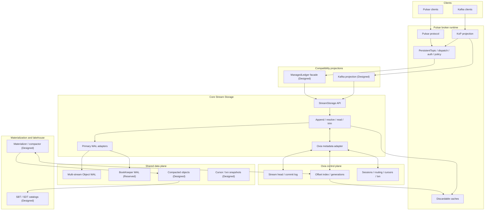
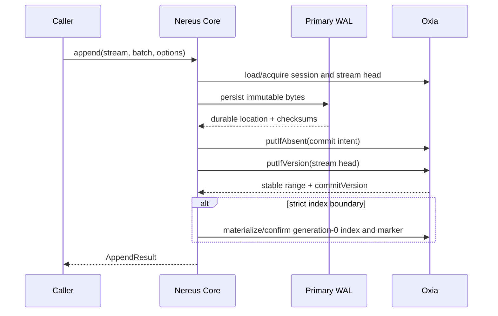

# Nereus 总体架构设计

> 状态：North-star design，Future 1 / Phase 1 正在实现
> 最近重整：2026-07-10
> 当前代码只实现本文的一部分；精确状态见 `nereus-design-index.md`

## 1. 摘要

Nereus 是 Pulsar-native shared-storage streaming engine。它保留 Pulsar broker 的协议和运行时
能力，把 durable stream storage 重构为：

```text
one logical coordinate: streamId + offset
one metadata/coordination authority: Oxia
selectable primary WAL: Object WAL or BookKeeper WAL
repairable read-index materialization
optional higher-generation object materialization
Pulsar and Kafka protocol projections
```

核心不是“把 BookKeeper 换成 S3”，也不是为 Pulsar、Kafka、lakehouse 分别维护日志。Nereus
把逻辑提交、物理 bytes、读索引和后台物化分开：

- **逻辑提交**由单 stream 的 Oxia stream-head CAS 线性化；
- **提交身份**由 head 可达的 immutable commit-log record 描述；
- **物理 durability**由所选 primary WAL 提供；
- **generation-0 read index**从 committed record 物化并可 repair；
- **higher generation**由 materialization/compaction 发布，只切换读目标；
- **Pulsar/Kafka/lakehouse**都是同一 committed offset 的投影。

## 2. 当前状态与目标边界

### 2.1 已实现

截至 2026-07-10：

- protocol-neutral `nereus-api` values、validation、errors、key/hash helpers；
- `StorageProfile` / `DurabilityLevel` names and helpers；
- Oxia keyspace、metadata records、binary-v1 codec、partition-aware client boundary；
- stream-head CAS + reachable commit-log 的 fake metadata implementation 和 repair tests；
- Object WAL v1 writer/reader、multi-slice layout、entry index、checksums、local test object store；
- M0-M3 tests and dependency gates。

### 2.2 正在实现

Future 1 / Phase 1 的剩余顺序：

```text
M4 DefaultStreamStorage append
  -> M5 resolve/read
  -> M6 trim/recovery/close boundaries
```

Phase 1 只交付 `OBJECT_WAL_SYNC_OBJECT` execution path。`OBJECT_WAL` 是该 profile 的 deprecated
alias。

### 2.3 仅设计或占位

- BookKeeper primary WAL execution；
- `WAL_DURABLE` fast boundary 和 async materialization workers；
- generic primary-WAL read-target API；
- ManagedLedger facade、cursor、KoP、routing、compaction、lakehouse、advanced Pulsar semantics。

目标架构章节描述这些能力时使用 `Designed`，不代表当前代码已支持。

## 3. 架构原则

1. **逻辑坐标唯一。** 排序、cursor、trim、replication、compaction 和 catalog lineage 都使用
   `streamId + offset`。
2. **Oxia 决定逻辑状态。** Object store 和 BookKeeper 证明 bytes durable，但不能自行推进
   `committedEndOffset`。
3. **一个成功 append 必须有 stable offset。** 任何 durability profile 都必须完成 stream-head
   CAS；不允许仅凭 broker-local reservation ack。
4. **单 stream 串行化，跨 stream 不要求原子。** Multi-stream object 的每个 slice 独立 commit。
5. **索引可物化、可修复。** 当前 public Oxia Java API 不提供设计所需的 conditional multi-key
   write，因此 generation-0 offset index 不是 append 线性化 key。
6. **Broker 无 durable ownership。** Preferred broker 和 append session 改善 locality/fencing，
   不保存不可替代的 truth。
7. **对象不可变。** 更新通过新 object、新 metadata version 或 higher generation 表达。
8. **Watch/list 不参与 correctness。** Watch 可丢失；object list 只用于 audit 和 GC。
9. **协议层不污染 L0。** `Position`、Kafka group、subscription、catalog snapshot 只能通过
   projection/reference 连接 L0。
10. **状态必须标明实现级别。** Enum/API 预留不等于端到端支持。

## 4. Truth hierarchy

### 4.1 Stream append truth

```text
StreamHeadRecord
  committedEndOffset
  cumulativeSize
  commitVersion
  lastCommitId
  trimOffset
  appendSession snapshot
          |
          v
reachable immutable StreamCommitRecord chain
```

规则：

- commit-log intent 在 head CAS 前 `putIfAbsent`；单独存在时不可见；
- `putIfVersion(stream-head)` 成功是 append 线性化点；
- head 中的 `lastCommitId` 把新 record 接入 committed chain；
- `commitVersion` 在 head、commit record、derived index 和 marker 中保持一致；
- stale epoch/token 在 CAS 前被拒绝；
- timeout/cancellation 在 head CAS 发出后可能是 unknown final state。

### 4.2 Read-resolution truth

正常读从 generation-aware offset index 或 validated positive cache 开始：

```text
offset -> highest valid generation covering the offset -> physical read target
```

Phase 1 generation 0 是 reachable commit 的派生记录。如果 head 已推进而 index 缺失，resolver
必须在预算/timeout 内从 commit-log repair 后重试，不能把 committed bytes 当成未提交，也不能从
object list 猜测。

Future 4 的 higher generation 是 physical selection truth：发布后 reader 优先选择它，但 logical
append truth 和 offsets 不变。

### 4.3 Physical truth

| State | Owner | Visibility meaning |
| --- | --- | --- |
| Primary WAL bytes | BookKeeper or object store | durable proof only |
| Object manifest | Oxia | precondition/audit/format/reference information |
| Object bytes | object store | immutable physical payload |
| Generation index | Oxia | current physical read selection |
| Catalog snapshot | external catalog + Oxia lineage | table visibility only |

## 5. Storage profile model

Profile 由两个决策组成：primary WAL 和 object publication mode。

| Profile | Primary WAL | Producer success boundary | Secondary publication | Current status |
| --- | --- | --- | --- | --- |
| `BOOKKEEPER_WAL_ONLY` | BookKeeper | WAL durable + stable head commit | disabled | Reserved |
| `BOOKKEEPER_WAL_SYNC_OBJECT` | BookKeeper | stable commit + required object/read index | synchronous | Reserved |
| `BOOKKEEPER_WAL_ASYNC_OBJECT` | BookKeeper | WAL durable + stable head commit | background | Reserved |
| `OBJECT_WAL_SYNC_OBJECT` | object store | object WAL durable + stable head + generation-0 indexes | generation 0 on append path | Phase 1 target |
| `OBJECT_WAL_ASYNC_OBJECT` | object store | object WAL durable + stable head commit | read-optimized generation background | Reserved |

`StorageProfile.OBJECT_WAL` canonicalizes to `OBJECT_WAL_SYNC_OBJECT`。

### 5.1 Durability levels

`DurabilityLevel` 不改变逻辑提交要求：

| Level | 必须完成 | 可以延后 |
| --- | --- | --- |
| `WAL_DURABLE` | primary WAL durable、commit intent、stream-head CAS、stable result | generation-0 derived index confirmation、secondary object generation |
| `WAL_DURABLE_AND_INDEX_COMMITTED` | 上述全部 + generation-0 offset index/committed-slice marker confirmed | higher-generation compaction/lakehouse work |

如果 `WAL_DURABLE` 返回后 generation-0 index 尚未就绪，read-after-ack 必须能够从 reachable commit
repair；“数据已 ack 但没有任何可恢复 read target”是非法状态。

### 5.2 Profile changes

Profile 是 durable stream metadata。目标规则：

- create 时 canonicalize 并持久化；
- unsupported execution profile 必须在 core append/open 时以 `UNSUPPORTED_STORAGE_PROFILE` 显式拒绝；
- profile 迁移只影响新 commits，旧 ranges 保留原 physical target type；
- 跨 WAL 类型迁移需要 barrier/checkpoint，不能原地改写既有 commit identity；
- remote storage/offload policy 必须由 adapter 映射，不能产生第二套 remote truth。

## 6. 总体组件



## 7. 分层边界

| Layer | Owns | Must not own |
| --- | --- | --- |
| L0 Core Stream Storage | stream lifecycle、offsets、sessions、WAL、head/commit、read index、resolve、trim | Pulsar/Kafka group/cursor semantics |
| L1 Pulsar Projection | ManagedLedger、Position/MessageId、cursor/subscription、system-topic semantics | L0 offset allocation |
| L2 Kafka Projection | KoP produce/fetch/group/txn/leader mapping | independent Kafka durable log |
| L3 Materialization/Lakehouse | higher generations、compaction、SBT/SDT | producer append truth |
| L4 Routing/Operations | membership、preferred brokers、brown-out、metrics/backpressure | durable partition ownership |

## 8. Repository module boundary

| Module | Target responsibility | 2026-07-10 status |
| --- | --- | --- |
| `nereus-api` | stable protocol-neutral L0 surface | Implemented for Phase 1 |
| `nereus-core` | coordinators and state machines | M4-M6 pending |
| `nereus-metadata-oxia` | durable key/record/codec and Oxia client | Phase 1 fake/contract implemented；real adapter pending |
| `nereus-object-store` | object IO and Object WAL | M3 implemented |
| `nereus-managed-ledger` | ManagedLedger facade | marker only |
| `nereus-pulsar-adapter` | broker integration/config/policy | marker only |
| `nereus-kop-adapter` | Kafka projection | marker only |

Future generic primary-WAL API 需要在实现 BookKeeper profile 前解决当前 object-shaped
`AppendResult` / `ResolvedObjectRange` 边界；不得用伪造 `ObjectKey` 表示 BK ledger range。

## 9. Metadata model

### 9.1 Current L0 keys

当前 Phase 1 的 canonical key builder 是 `OxiaKeyspace`：

```text
/nereus/clusters/{cluster}/streams/{streamId}/head
/nereus/clusters/{cluster}/streams/{streamId}/commit-log/{commitId}
/nereus/clusters/{cluster}/streams/{streamId}/offset-index/{offsetEnd19}/{generation19}
/nereus/clusters/{cluster}/streams/{streamId}/committed-slices/{objectId}/{sliceHash}
/nereus/clusters/{cluster}/objects/{objectId}/manifest
/nereus/clusters/{cluster}/objects/{objectId}/references
/nereus/clusters/{cluster}/objects/{objectId}/gc
```

实际 path components 经过 `KeyComponentCodec`；上面的可读形式不是裸字符串拼接许可。

### 9.2 Future metadata families

Future 2-8 会增加 projection/cursor/task/routing/catalog keys，但必须满足：

- correctness-critical same-stream state尽量使用 `PartitionKey(streamId)`；
- 不假设 public Oxia client 提供跨 key/shard transaction；
- large state 写 immutable snapshot object，Oxia 只 CAS small authoritative ref；
- every derived record has repair source and bounded repair policy；
- notifications never replace a linearizable re-read。

## 10. Write path

### 10.1 Common append protocol



Protocol details：

1. per-stream sequencer preserves same-writer commit order；
2. manifest/location is validated before the head CAS；
3. commit identity contains every durable replay field；
4. head CAS verifies session epoch/token and expected start offset；
5. post-head object reference audit cannot roll back logical commit；
6. same physical slice replay reuses commit identity and repairs missing derived records；
7. producer-level dedup remains an upper-layer responsibility until explicitly designed。

### 10.2 Multi-stream object

One object can contain slices A/B/C. Each stream performs its own commit intent + head CAS. A committed
slice remains visible even if B is fenced and C times out. GC protects the object while any committed or
active repair/task reference remains.

## 11. Read path

```text
protocol coordinate
  -> streamId + offset
  -> validate trim/head committed end
  -> scan generation-aware offset index or positive cache
  -> repair missing generation-0 entries from reachable commit log
  -> choose highest valid generation
  -> range-read physical target and validate checksums
  -> clip by record and byte limits
  -> protocol projection
```

Rules：

- EOF/negative lookup is not cached as durable truth；
- cache invalidation may use watch, but cache validation uses version/generation；
- zero-byte records still consume offsets and record budget；
- first positive record larger than `maxBytes` returns `READ_LIMIT_TOO_SMALL`；
- checksum failure never falls through to object list；
- fallback to a lower generation is allowed only while that generation remains visible and valid。

## 12. Pulsar and Kafka projections

### 12.1 Pulsar

ManagedLedger is an L1 compatibility facade：

```text
Topic partition -> Stream
Virtual ledger -> committed range projection
Position -> entry offset range
MessageId + batchIndex -> record offset
ManagedCursor -> Oxia cursor state + optional snapshot
```

The current Phase 1 payload contract is one opaque record per entry. Batched MessageId semantics require
Future 2 projection metadata and must not be inferred by L0.

### 12.2 Kafka / KoP

```text
Kafka offset == Nereus record offset
high watermark == stream-head committedEndOffset
leader/coordinator == routing projection, not durable owner
group offset != Pulsar cursor
```

Produce success uses stable append result. Record-batch base-offset rewrite/checksum handling belongs to
Future 5.

## 13. Materialization, compaction and lakehouse

### 13.1 Generation model

- generation 0: primary WAL read target derived from append truth；
- generation > 0: materialized/compacted alternative target；
- publish is conditional on source identity/checksum；
- highest valid visible generation wins；
- old targets remain protected until readers、cursors、tasks、catalogs and retention allow GC。

### 13.2 SBT and SDT

- SBT is a Nereus-managed table view；
- SDT is idempotent external delivery；
- catalog snapshot can lag but cannot refer to logically uncommitted ranges；
- catalog failure never changes producer success or stream read truth；
- lineage records stream range + generation + object/checksum + schema snapshot。

## 14. Routing and broker lifecycle

Preferred broker improves cache、batching and zone locality. It is not a durable leader：

```text
routing choice -> preferred broker
write authority -> append session epoch/token
logical commit -> stream-head CAS
data location -> shared WAL/object target
```

Brown-out removes a broker from preferred routing and stops new session acquisition. Already sent head CAS
operations are resolved by replay/refresh; routing changes never move durable data.

## 15. Failure and recovery model

| Failure point | Logical outcome | Recovery |
| --- | --- | --- |
| before WAL durable | not committed | caller retry |
| WAL durable, before intent | not committed；possible orphan bytes | deterministic reuse or GC |
| intent written, before head CAS | intent invisible | replay same commit id or GC intent |
| head CAS sent, response unknown | unknown final state | read head/reachable chain, replay same identity |
| head committed, generation-0 index missing | committed | bounded repair from commit log |
| higher-generation upload before publish | old generation stays active | retry/reuse or orphan GC |
| higher-generation publish before checkpoint | new target active | repair task/checkpoint |
| catalog commit partial | stream unaffected | idempotent catalog/Oxia repair |
| watch lost/duplicated | cache may be stale | linearizable re-read |

## 16. Backpressure and observability

Minimum signal families：

- append latency split by WAL、head CAS、index materialization；
- fenced sessions、head CAS conflicts、unknown-final retries；
- derived-index repair attempts/records/budget exhaustion；
- object WAL size、slice count、upload/checksum failures；
- read amplification、read buffer/concurrency rejection、cache hit ratio；
- materialization lag records/bytes/age and WAL retention blocked；
- routing changes、brown-out、cross-zone bytes；
- cursor/group/catalog lag。

Backpressure decisions must distinguish object-store outage、Oxia commit latency、derived-index repair lag
and secondary materialization lag；这些故障的 correctness 和恢复路径不同。

## 17. Security and tenancy

- stream authorization is checked before metadata/object access；
- cluster/tenant/namespace identities never enter paths without canonical encoding；
- credentials are scoped to cluster bucket/prefix；
- object and sensitive metadata support encryption-at-rest；
- readers verify format version and checksums before trusting offsets；
- GC validates cluster ownership and all active references before delete；
- local filesystem object store is test-only and rejects traversal/symlink escape。

## 18. Delivery tracks

| Track | Scope | Status |
| --- | --- | --- |
| F1 | L0 API、Object WAL、Oxia commit、resolve/read/trim | In progress / Phase 1 |
| F2 | ManagedLedger facade and virtual positions | Designed |
| F3 | Cursor/subscription durable state | Designed |
| F4 | Materialization/compaction/generation/GC | Designed |
| F5 | KoP/Kafka projection | Designed |
| F6 | SBT/SDT lakehouse | Designed |
| F7 | Routing/brown-out/elasticity | Designed |
| F8 | Advanced Pulsar semantics | Designed |

Dependencies and implementation gates live in `nereus-futures.md`。Future numbers are capability IDs, not
claims that all work is unstarted.

## 19. Explicit open decisions

| Decision | Must be closed before |
| --- | --- |
| Generic primary read-target API for BookKeeper ranges | BookKeeper profile implementation |
| `WAL_DURABLE` read-after-ack repair SLA/error surface | async profile implementation |
| Profile migration barrier and mixed historical ranges | runtime profile change |
| Virtual ledger id/projection persistence | Future 2 implementation |
| Inline/footer/index-object policy | enabling non-footer indexes |
| Higher-generation conditional publish schema | Future 4 implementation |
| Cursor snapshot encoding | Future 3 implementation |
| Cross-stream transaction protocol | Future 5/8 transaction implementation |
| System-topic bootstrap mode | Future 8 implementation |

## 20. References

Repository design sources：

- `nereus-design-index.md`
- `nereus-terminology.md`
- `nereus-commit-protocol.md`
- `nereus-storage-object-format.md`
- `nereus-futures.md`
- `../phase-1-core-stream-storage/README.md`

External background：

- Oxia documentation: <https://oxia-db.github.io/docs/what-is-oxia>
- Pulsar metadata store documentation: <https://pulsar.apache.org/docs/next/administration-zk-bk/>
- StreamNative Ursa public preview: <https://streamnative.io/blog/announcing-the-ursa-engine-public-preview-for-streamnative-byoc-clusters>
- Ursa VLDB paper: <https://www.vldb.org/pvldb/vol18/p5184-guo.pdf>

External material is architectural background；current repository behavior is determined by local code、tests and
the authority order in `nereus-design-index.md`。
