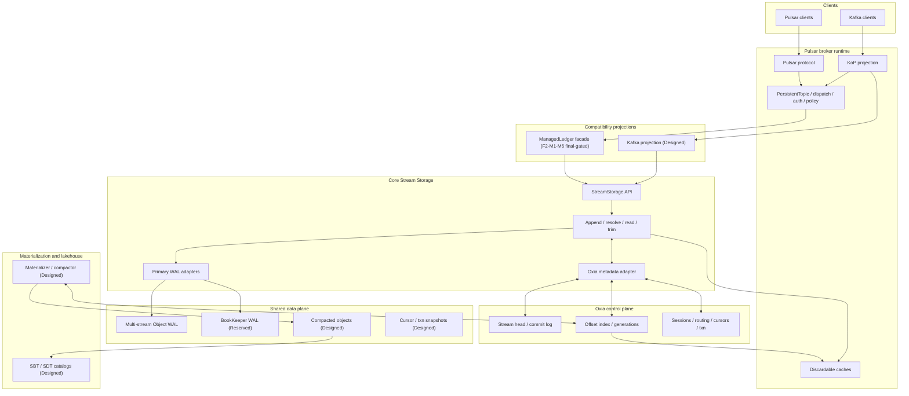
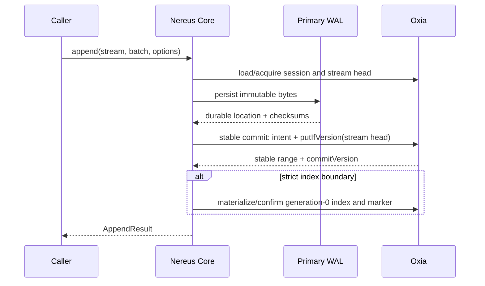

# Nereus 总体架构设计

> 状态：North-star design；Future 1 / Phase 1 + Phase 1.5、Future 2、Future 3 与 Future 4 F4-M1–M3 complete/final-gated；F4-M3 format + planner/recovery + exact-source worker + protection/checkpoint/service + Pulsar Entry/NCP1 exact-byte round trip + topic-compaction SPI/COMMITTED-source bootstrap/tagged-key/sorted-spill engine-worker-publication + terminal workflow-metadata retirement passed deterministic and real Oxia/LocalStack gates；F4-M4 through checkpoint BC and F4-M5 through checkpoint AI are in progress，F4-M6 pending
> 最近设计/实现同步：2026-07-19
> 当前代码只实现本文的一部分；精确状态见 `nereus-design-index.md`

## 1. 摘要

Nereus 是 Pulsar-native shared-storage streaming engine。它保留 Pulsar broker 的协议和运行时
能力，把 durable stream storage 重构为：

```text
one logical coordinate: streamId + offset
one Nereus stream metadata/coordination authority: Oxia
one broker-integration storage-class binding: selection only, never offset truth
selectable primary WAL: Object WAL or BookKeeper WAL
repairable read-index materialization
optional higher-generation object materialization
Pulsar and Kafka protocol projections
```

核心不是“把 BookKeeper 换成 S3”，也不是为 Pulsar、Kafka、lakehouse 分别维护日志。Nereus
把逻辑提交、物理 bytes、读索引和后台物化分开：

- **逻辑提交**由单 stream 的 Oxia stream-head CAS 线性化；
- **提交身份**由 head 可达的 immutable commit-log record 描述；
- **物理 durability**由所选 primary WAL 提供；
- **generation-0 read index**从 committed record 物化并可 repair；
- **higher generation**由 materialization/compaction 发布，只切换读目标；
- **Pulsar/Kafka/lakehouse**都是同一 committed offset truth 的投影；但每种 payload
  mapping version 必须声明一个 L0 offset 代表 entry 还是 protocol record，不得在同一 stream
  上隐式混用。

## 2. 当前状态与目标边界

### 2.1 已实现

截至 2026-07-15：

- protocol-neutral `nereus-api` values、validation、structured `AppendOutcome` errors、key/hash helpers；
- `StorageProfile` / `DurabilityLevel` names and helpers；
- Oxia keyspace、metadata records、binary-v1 codec、partition-aware client boundary、shared Phase 1
  manifest validator；
- stream-head CAS + reachable commit-log 的 fake metadata implementation，bounded replay classification，
  head-derived orphan-intent validation，dense chain validation，tuple-bound continuation repair and tests；
- Object WAL v1 writer/reader、multi-slice layout、entry index、checksums、local test object store；
- F4-M1–M3 final-gated API/metadata/codecs、conditional metadata delete、slash-aware fixed-depth Oxia scans、
  replayable/guarded object IO、physical reference proof values、durable reader-pin/protection handshakes、
  authoritative committed-generation resolve/read、same-view fallback/quarantine 和 restart-safe publication；
  M3 compacted format、exact-source worker、checkpoint/service、Pulsar Entry/NCP1 byte round trip、topic-compaction
  SPI/COMMITTED-source bootstrap/tagged-key/sorted-spill engine-worker-publication 与 terminal workflow-metadata
  retirement 已通过 ordinary/real-service gates；M4 retirement/GC 尚未完成；
- M4 append、M5 resolve/read、M6 trim/recovery/close、M7 production Oxia adapter and M8 final
  Oxia/Object-WAL restart/failure acceptance；
- one-head metadata snapshots、bounded Oxia range scan、separate request/watch executors and bounded resident
  cache/session/watch state from the post-M8 review；
- repository namespace `com.nereusstream` and ordinary/Docker-backed Phase 1 gates。

### 2.2 当前交付边界

Future 1 / Phase 1 M0-M8 和 Phase 1.5 P15-M0-M6 已完成。F2-M0/M0R/M0R2 设计/API review 锁定的共享
L0 前置已经实现并通过普通与 Docker-backed final gates，包括 M0R2 新发现的窄 P15-M6
cumulative-result handoff。F2-M1-M6 已完成；F2-M5 已实现 product-side runtime/S3 provider，以及 Pulsar
fork 的 hybrid storage、durable binding、feature/operation admission、cluster capability convergence 和
namespace/topic storage-policy serialization。Generation-safe broker write-fence handoff 也已实现并通过
facade/fork race gates；shared-store conflicting first-create and peer lifecycle resume 也已有真实 CAS gate。
真实双 Broker gate 进一步通过 real Oxia、pinned LocalStack Community S3 `4.14.0` 和 stock BookKeeper
验证 ownership failover、broker process restart、unload/reload、exact bytes/Position 与 hybrid coexistence。
`phase2Check` 与 Docker-backed `phase2FinalCheck --rerun-tasks` 已存在并通过。F2-M6 场景 3–8 的跨层证据包括：
head-CAS 后响应丢失只产生一个恢复 callback/Position，
真实 Oxia 重启后从 authority 修复两条派生索引，以及 facade close/trim/reopen/terminate/delete/recreate 保持
Position namespace 与旧 Object-WAL bytes 合同。场景 10–19 进一步通过真实 BookKeeper ledger 枚举、禁用
watch 的跨 runtime polling、stock topic admission/write-fence、ack/capability/policy、failure recovery、
LocalStack 与 production storage-isolation gates，以及跨 unload、owner failover、runtime restart 的保存
`MessageIdAdv` 普通/批内起点回归。Future 2 is complete。

Phase 3 已完成 design-only F3-M0/M0R：锁定 local Pulsar master 的 API/call paths，并冻结 one-root
cursor CAS、generation/tombstone、destructive `ackStateEpoch`、remaining-bit partial batch ack、immutable snapshot bytes、local-only normal
read position、per-writable-open owner-session claim/fencing 和 recoverable retention/trim barrier。F3-M1 的
metadata/snapshot 基础生产代码、focused/golden tests、真实 Oxia 和 LocalStack final gate 已完成；F3-M2 的
durable CursorStorage、retention/protection/trim state machines、owner fencing、snapshot hydration、failure/
concurrency model 与真实 Oxia + LocalStack S3 跨 runtime final gate 也已完成。F3-M3 的 complete dual-mode
ManagedCursor facade、writable claim/hydration/publication boundary 和 runtime resource lifecycle 已通过
`phase3M3Check`；F3-M4 的 independent cursor capability、typed config/context、topic/ack/admin admission、
durable ack ordering 与 hydrated subscription reconstruction 已在锁定的本地 Pulsar fork 通过
`phase3M4Check`。The broker-supplied ownership checker gates claim/publication，but durable root session/version
remains the cursor CAS fence。F3-M5 deterministic crash cuts、exact 10,000-root scale and real Oxia/S3/two-broker/
BookKeeper recovery gates pass `phase3M5Check` and `phase3M5FinalCheck`。F3-M6 preserves ordinary/middle-batch
MessageIds、cursor internal properties and fresh topic incarnation across compatibility cuts，closes reset/limit/
rollout/callback-rejection boundaries，publishes the F4 snapshot inventory handoff and audits loaded/unloaded/
namespace admin routes。`phase3M6Check`、`phase3M6FinalCheck` and aggregate Phase 3 gates pass；Future 3 is complete。

Phase 4 F4-M0 已完成本地 Nereus/Pulsar source audit 和代码级设计门禁。它冻结了
`PREPARED -> COMMITTED` generation publish CAS、content-verified/attempt-unique `NCP1/NTC1` 与 immutable
`NRC1` object families、64-shard stream-work discovery、task/recovery state machines、durable reader
lease/protection、recovery checkpoint、physical GC、
guarded object PUT 与双 HEAD/owner proof 的 DELETED-root audit retirement、
`OBJECT_WAL_ASYNC_OBJECT` 与 Pulsar rollout 边界。F4-M1–M3 已完成 API/metadata/object IO、core
reader/protection、authoritative generation resolve/read 和 restart-safe publication，并于 2026-07-15 通过
ordinary/Docker-backed final gates；M3 的 Parquet writer/strict-reader/full verifier、NTC1 facade、core adapter、
planner/recovery、exact-source claim-to-output-ready worker、protection/checkpoint reconciliation 以及 bounded
service lifecycle、Pulsar Entry/NCP1 exact-byte round trip、topic-compaction neutral SPI/registry 以及 terminal
workflow-metadata retirement，以及 topic COMMITTED-source bootstrap、tagged-v1 unkeyed 表示、
sorted-spill two-pass engine/worker/isolated publication 已实现并于 2026-07-15 通过 ordinary/真实
Oxia/LocalStack final gates。M4 through checkpoint BC 已实现 NRC1 protocol、protected generation-zero append、
recovery-root/replay/index repair、bounded GC plan/root/journal fence、root-authenticated destructive skeleton、typed
generation-zero source retirement，以及 completed-trim/COMMITTED/TOPIC_COMPACTED source eligibility 和
grace-fenced higher-generation pre-drain/reproof，并增加 durable generation-activation authority、future sentinel
与五个 ownerless-global domains、dual-absence DELETED-root/Phase 1 audit retirement，以及 guarded/pending/
permanent/pinned cursor-snapshot new-write/read frontier，以及 strict NPR1 projection identity 和 all-shard
physical/cursor live-reference backfill；checkpoint AJ further adds complete bounded cursor-snapshot candidate
inventory and the single central GC fence's post-drain revalidation callback，while checkpoint AK makes evidence
restart-reconstructable and installs exact drift rollback plus the cursor execution/six-domain runtime lifecycle.
Checkpoint AL further adds strict inverses for all current V1 object writers plus exact old missing-root registration；
checkpoint AM adds exact deleted-stream/F3 authority and registration-last workflow/root retirement with response-loss
convergence。Checkpoint AN composes complete metadata-first root/registration/inventory passes, total root-lifecycle
routing and restart-safe ownerless execution；checkpoint AO maps the complete typed broker physical-GC configuration
and removes provider-local protection/lease/orphan timing constants. Safe defaults do not start the service and still
disable deletion。Checkpoint AP adds a configured-scope guarded PUT/exact HEAD/complete LIST/ETag-bound exact DELETE
probe and deterministic non-secret V1 capability digest；the probe itself does not persist the digest or enable
deletion. Checkpoint AQ composes exact readiness/domain/registration/coverage/capability authority and atomically
installs the digest with both V1 delete bits. Checkpoint AR installs provider/runtime/factory and locked Pulsar
sequencing, then fences mutating startup/recovery by that exact local digest. Checkpoint AS unifies the operation
guard and GC registry behind one registered-stream/global projection-domain assembly and proves publication-only
deferral、wrong-scope restart rejection、empty-inventory MARKED recovery and lost successful DELETE response
convergence against real Oxia/LocalStack；safe defaults still keep production deletion disabled and the remaining
destructive/scale matrix is pending. Checkpoint AT additionally proves a new runtime completes durable DELETING after
the real object DELETE but before the old process's DELETED-root CAS. Checkpoint AU proves an applied real Oxia
DELETED-root CAS with a lost response converges through exact replacement reload, with one LocalStack DELETE before
and zero after an independent restart. Checkpoint AV further proves two independent worker runtimes contend on one
MARKED root, converge through one durable DELETING intent and safely execute idempotent exact-delete recovery.
Checkpoint AW then proves a fresh runtime recovers mixed MARKED/DELETING roots from all 256 Oxia shards with empty
object inventory, and fixes discovery pagination to follow only changing opaque tokens rather than cross-page logical
key order. Checkpoint AX then persists 1,001 roots in one physical shard plus one in every other shard through real
four-shard Oxia, closes the writer and proves a fresh scanner covers all 1,256 identities exactly once with bounded
64-entry pages. Checkpoint AY then drives 10,000 DELETED roots through the durable first-absence and separate orphan
windows with 32-entry pages、one-at-a-time production coordination、Phase 1 audit cleanup/root-last deletion and no
retained cancelled deadline timers. Checkpoint AZ then proves stack-bounded sequential visitation for 10,000 cursor
snapshot candidates and runs 10,000 durable cursor roots plus 10,000 objects through exact live/current、old、expired
CAS-lost and deleted-cursor classification；only the three historical candidates reach restart-reconstructed central
GC deletion while every current object/root/protection remains live. Checkpoint BA then proves source/protection
retirement remains restart-safe after each journaled destructive cut：a fresh coordinator/runtime accepts only the
exact planned absence under the same DELETING root and sealed journal. Its real Oxia/LocalStack fixture also loses the
response after an applied protection delete, reauthenticates exact absence and completes two object deletes without
inheriting setup-process memory. Checkpoint BB then makes the remaining late-write contract executable：Object-WAL
provider attempts revalidate the durable session before/after the physical-root read, DELETED roots fence retries
before bytes, audit-delete cuts rediscover exact late bytes, and real post-root external reappearance returns through
missing-root registration plus another full ownerless grace. Checkpoint BC further adds product-owned atomic
deletion-active readiness rollover：the physical/cursor scan publishes no partial proofs, and one activation CAS
preserves both delete bits while replacing the new epoch、three proofs and scope digest. Old-epoch GC remains fenced；
the locked broker deadline/concurrency handoff and real two-broker final fixture are still pending. M5
checkpoint X 又实现 exact durable registration create/refresh/final
revalidation、topic open/recreate return barrier，以及 shared generation-store production ownership。Checkpoint Y
又在 Pulsar fork 实现 reserved generation lookup capability、binding/cursor/generation three-property barrier、
broker-incarnation-aware deterministic readiness epoch/full digest 和 registry-notification invalidation。
Checkpoint Z 又实现 exact unloaded projection candidate、canonical bounded cold-topic registration
traversal/report、final binding/readiness revalidation 和 frozen coverage digest。Checkpoint AA 又实现
product-neutral full-readiness handoff、零失败 proof admission、response-loss-safe durable
`streamRegistrationBackfill` CAS、same-epoch coverage immutability 和 newer-epoch dependent-proof invalidation。
Checkpoint AB 又实现 product-owned activation guard、frozen six-domain proof、strict
projection/L0/registration authority、response-loss-safe monotonic marker 和 mutation 前 proof revalidation，并把
默认关闭的 Pulsar first-marker switch 接到 runtime。Checkpoint AC 又实现 product-owned publication
coordinator、proof-gated publication-only `PREPARED -> ACTIVE` CAS、bounded conflict/lost-response recovery、final
readiness revalidation 和 broker zero-failure backfill sequencing。Checkpoint AD–AE 随后实现 protected async Object-WAL acknowledgement、generation-zero
restart/read repair 和 per-stream pre-I/O proof/lag admission；checkpoint AF 已把 resolver、generation-aware
read/repair、NRC1 replay、source repair 和 materialization service 原子装配进 production provider，并映射 exact
Pulsar sync/async profile 与 materialization config。Checkpoint AG 又实现 product-neutral exact retention
policy/config/evidence values、source-index-verified stable candidate planner 和 ownership-safe F3 logical-trim
service。Checkpoint AH 继续实现 shared bounded/coalescing plan lane、whole-operation timeout/close、managed-ledger
production installation/facade route 与 exact typed Pulsar config mapping。Checkpoint AI 又实现 exact effective
retention/backlog snapshot、generation/marker-gated policy install 与 loaded/unloaded/partition-child logical trim
admission。Cursor snapshot candidate/execution、current-writer object inventory、registration retirement and the
metadata-first lifecycle now have checkpoints AJ–AO；coverage/capability proof、destructive activation 和 M6
仍是 target；production deletion 继续关闭。

Phase 1 只交付 `OBJECT_WAL_SYNC_OBJECT` execution path。`OBJECT_WAL` 是该 profile 的 deprecated
alias。

### 2.3 仅设计或占位

- BookKeeper primary WAL execution；
- BookKeeper-backed `WAL_DURABLE` fast boundary、`BOOKKEEPER_WAL_ASYNC_OBJECT` writer/reader and mixed-primary
  resolver；Object-WAL async execution/runtime 已由 checkpoint AD–AF 实现但仍受 generation activation proof；
- KoP、routing、production topic-compaction admission、lakehouse、advanced Pulsar semantics；
- Future 4 production physical retirement/GC and async materialization remain unavailable until F4-M4–M6 are implemented；
  the in-progress M4 checkpoints alone do not enable them. Later tracks remain north-star designs；Future 3 and
  F4-M1–M3 are implemented/final-gated。

目标架构章节描述这些能力时使用 `Designed`，不代表当前代码已支持。

## 3. 架构原则

1. **逻辑坐标唯一。** 排序、cursor、trim、replication、compaction 和 catalog lineage 都使用
   `streamId + offset`。
2. **Oxia 决定 Nereus stream 逻辑状态。** Object store 和 BookKeeper 证明 bytes durable，但不能自行推进
   `committedEndOffset`。
3. **一个成功 append 必须有 stable offset。** 任何 durability profile 都必须完成 stream-head
   CAS；不允许仅凭 broker-local reservation ack。
4. **单 stream 串行化，跨 stream 不要求原子。** Multi-stream object 的每个 slice 独立 commit。
5. **索引可物化、可修复。** 当前 public Oxia Java API 不提供设计所需的 conditional multi-key
   write，因此 generation-0 offset index 不是 append 线性化 key。
6. **Broker 无 durable ownership。** Preferred broker 和 append session 改善 locality/fencing，
   不保存不可替代的 truth。
7. **对象不可变。** 更新通过新 object、新 metadata version 或 higher generation 表达。
8. **Watch/list 不参与 correctness。** Watch 可丢失；object list 只用于 audit 和 GC。
9. **协议层不污染 L0。** `Position`、Kafka group、subscription、catalog snapshot 只能通过
   projection/reference 连接 L0。
10. **状态必须标明实现级别。** Enum/API 预留不等于端到端支持。

## 4. Truth hierarchy

### 4.0 Broker storage-class selection

Future 2 hybrid mode adds one broker-metadata binding per topic lifetime. Its only durable decision is
`bookkeeper` or `nereus` and its create/delete generation. It serializes cross-class selection before either factory
creates state. It contains no stream offset, payload, cursor or visibility field. Once `nereus` is selected, the Oxia
projection and L0 records below remain authoritative; once `bookkeeper` is selected, stock BookKeeper metadata remains
authoritative. Policy text alone never migrates an active binding. A missing binding may adopt pre-existing
BookKeeper metadata for compatibility, but a Nereus projection can never be adopted because it embeds the binding
generation and the binding tombstone is never removed. Capability protocol `1` plus namespace first-create
serialization is required before a policy can create Nereus state.

### 4.1 Stream append truth

```text
StreamHeadRecord
  committedEndOffset
  cumulativeSize
  commitVersion
  lastCommitId
  trimOffset
  appendSession snapshot
          |
          v
reachable immutable StreamCommitRecord chain
```

规则：

- commit-log intent 在 head CAS 前 `putIfAbsent`；单独存在时不可见；
- `putIfVersion(stream-head)` 成功是 append 线性化点；
- head 中的 `lastCommitId` 把新 record 接入 committed chain；
- `commitVersion` 在 head、commit record、derived index 和 marker 中保持一致；
- stale epoch/token 在 CAS 前被拒绝；
- exceptional append carries machine-readable certainty：CAS 前 `KNOWN_NOT_COMMITTED`，未确认的 CAS
  response `MAY_HAVE_COMMITTED`，确认 head 后的 index/result failure `KNOWN_COMMITTED`。

### 4.2 Read-resolution truth

正常读从 generation-aware offset index 或 validated positive cache 开始：

```text
offset + requested read view
  -> highest valid generation covering the offset within that view
  -> physical read target
```

Phase 1 generation 0 是 reachable commit 的派生记录。如果 head 已推进而 index 缺失，resolver
必须在预算/timeout 内从 commit-log repair 后重试，不能把 committed bytes 当成未提交，也不能从
object list 猜测。

Future 4 的 `COMMITTED` higher generation 是 ordinary physical selection truth：发布后 ordinary reader 优先选择
同 view 的最高 generation，但 logical append truth 和 offsets 不变。Lossy topic compaction publishes into a
separate `TOPIC_COMPACTED` view and can never outrank or backstop an ordinary committed read。

### 4.3 Physical truth

| State | Owner | Visibility meaning |
| --- | --- | --- |
| Primary WAL bytes | BookKeeper or object store | durable proof only |
| Object manifest | Oxia | precondition/audit/format/reference information |
| Object bytes | object store | immutable physical payload |
| Generation index | Oxia | current physical read selection |
| Catalog snapshot | external catalog + Oxia lineage | table visibility only |

## 5. Storage profile model

Profile 由两个决策组成：primary WAL 和 object publication mode。

| Profile | Primary WAL | Producer success boundary | Secondary publication | Current status |
| --- | --- | --- | --- | --- |
| `BOOKKEEPER_WAL_ONLY` | BookKeeper | WAL durable + stable head commit | disabled | Reserved |
| `BOOKKEEPER_WAL_SYNC_OBJECT` | BookKeeper | stable commit + required object/read index | synchronous | Reserved |
| `BOOKKEEPER_WAL_ASYNC_OBJECT` | BookKeeper | WAL durable + stable head commit | background | Reserved |
| `OBJECT_WAL_SYNC_OBJECT` | object store | object WAL durable + stable head + generation-0 indexes | generation 0 on append path | Phase 1 target |
| `OBJECT_WAL_ASYNC_OBJECT` | object store | object WAL durable + stable head commit | read-optimized generation background | Reserved |

`StorageProfile.OBJECT_WAL` canonicalizes to `OBJECT_WAL_SYNC_OBJECT`。

### 5.1 Durability levels

`DurabilityLevel` 不改变逻辑提交要求：

| Level | 必须完成 | 可以延后 |
| --- | --- | --- |
| `WAL_DURABLE` | primary WAL durable、commit intent、stream-head CAS、stable result | generation-0 derived index confirmation、secondary object generation |
| `WAL_DURABLE_AND_INDEX_COMMITTED` | 上述全部 + generation-0 offset index and version-matched replay marker confirmed | higher-generation compaction/lakehouse work |

如果 `WAL_DURABLE` 返回后 generation-0 index 尚未就绪，read-after-ack 必须能够从 reachable commit
repair；“数据已 ack 但没有任何可恢复 read target”是非法状态。

### 5.2 Profile changes

Profile 是 durable stream metadata。目标规则：

- create 时 canonicalize 并持久化；
- unsupported execution profile 必须在 core append/open 时以 `UNSUPPORTED_STORAGE_PROFILE` 显式拒绝；
- profile 迁移只影响新 commits，旧 ranges 保留原 physical target type；
- 跨 WAL 类型迁移需要 barrier/checkpoint，不能原地改写既有 commit identity；
- remote storage/offload policy 必须由 adapter 映射，不能产生第二套 remote truth。

## 6. 总体组件



## 7. 分层边界

| Layer | Owns | Must not own |
| --- | --- | --- |
| L0 Core Stream Storage | stream lifecycle、offsets、sessions、WAL、head/commit、read index、resolve、trim | Pulsar/Kafka group/cursor semantics |
| L1 Pulsar Projection | ManagedLedger、Position/MessageId、cursor/subscription、system-topic semantics | L0 offset allocation |
| L2 Kafka Projection | KoP produce/fetch/group/txn/leader mapping | independent Kafka durable log |
| L3 Materialization/Lakehouse | higher generations、compaction、SBT/SDT | producer append truth |
| L4 Routing/Operations | membership、preferred brokers、brown-out、metrics/backpressure | durable partition ownership |

## 8. Repository module boundary

| Module | Target responsibility | Current status (2026-07-18) |
| --- | --- | --- |
| `nereus-api` | stable protocol-neutral L0 surface | Phase 1 + Phase 1.5 generic/recovery/lifecycle API implemented |
| `nereus-core` | coordinators and state machines | primary-WAL adapters、protected prepare/head/materialize、exact recovery、seal/delete、F4 physical lease/protection/reference SPI、protocol-neutral global reference scope、projection/stream-retirement authority capture contracts and public generation-zero protection identities implemented；M4 recovery/root/GC consumers are in progress through checkpoint AO |
| `nereus-metadata-oxia` | durable key/record/codec and Oxia client | legacy/new dual-read、generic new-write、mixed repair/replay、F4-M1–M3 metadata/publication gates、M4 protected-append/activation foundations and checkpoint-X canonical projection-ref encoder implemented |
| `nereus-object-store` | object IO and Object WAL | M3 plus F4-M4 checkpoint AP configured-scope destructive-capability probe implemented/tested；probe is not activation authority |
| `nereus-materialization` | planner/task/worker/publication/checkpoint/recovery/GC orchestration | module present；M1–M3 final-gated；M4 implements NRC1/recovery、root/journal fences、typed source retirement、completed-trim/COMMITTED/TOPIC_COMPACTED eligibility、future sentinel、ownerless-global storage domains、dual-absence DELETED-root retirement、the managed-ledger cursor protection frontier、all-shard physical/cursor live-reference backfill、cursor/ownerless post-drain/restart execution、current-writer missing-root inventory、proof-driven registration retirement and metadata-first fixed-delay lifecycle；checkpoint BC adds exact-old-wrapper non-publishing rollover scans；checkpoint AF composes source repair plus the non-destructive production materialization lifecycle，while AR composes this module's backfill through the adapter；depends on core, never the reverse |
| `nereus-managed-ledger` | ManagedLedger facade | F2-M1-M4 plus F3-M1-M6 implemented/tested；F4 snapshot inventory/NPR1 authority、restart-reconstructable cursor candidates、durable registration/proof/activation、AR exact-scope deletion guard and typed factory/runtime activation surface、BC bounded atomic readiness-rollover handoff、pre-I/O async admission、checkpoint-AF materialization ownership、checkpoint-AN physical-GC lifecycle ownership and checkpoints AG–AI retention planner/F3 trim/shared-lane/per-ledger facade/policy admission complete；safe defaults keep physical deletion disabled |
| `nereus-pulsar-adapter` | broker integration/config/policy | product runtime/S3 provider、fork binding/admission/capability/policy/admin paths、shared generation/registration/proof/activation ownership、checkpoint-AF coupled Object-WAL composition、checkpoint-AH retention runtime/config mapping、checkpoint-AI exact policy/admin mapping、checkpoint-AN metadata-first GC lifecycle、checkpoint-AO exact physical-GC config、checkpoint-AQ atomic activation、checkpoint-AR provider/Pulsar/restart-scope composition and checkpoint-BC atomic deletion-active readiness rollover implemented；safe defaults keep destructive execution disabled |
| `nereus-kop-adapter` | Kafka projection | marker only |

Phase 1.5 已实现 tagged `ReadTarget`、generic `AppendResult/ResolvedRange`、primary-WAL registry、
generic durable target records、exact recovery 和 lifecycle。BookKeeper profile 在其真实 writer/reader 注册前
仍被拒绝；不得用伪造 `ObjectKey` 表示 BK ledger range。

## 9. Metadata model

### 9.1 Current L0 keys

当前 Phase 1 的 canonical key builder 是 `OxiaKeyspace`：

```text
/nereus/clusters/{cluster}/streams/{streamId}/head
/nereus/clusters/{cluster}/streams/{streamId}/commit-log/{commitId}
/nereus/clusters/{cluster}/streams/{streamId}/offset-index/{offsetEnd19}/{generation19}
/nereus/clusters/{cluster}/streams/{streamId}/committed-slices/{objectId}/{sliceHash}
/nereus/clusters/{cluster}/objects/{objectId}/manifest
/nereus/clusters/{cluster}/objects/{objectId}/references
/nereus/clusters/{cluster}/objects/{objectId}/gc
```

The Phase 1.5 target adds `/streams/{streamId}/committed-appends/{commitId}` for generic replay markers and allows the existing
commit-log/offset-index keys to contain either frozen legacy object records or new generic-target record types。The
head/key ordering remains unchanged；adapter dispatches by envelope record type and hydrates both into one canonical
model。Exact records/rollout rules are in
`../phase-1.5-core-storage-foundation/02-metadata-schema-and-compatibility.md`。

实际 path components 经过 `KeyComponentCodec`；上面的可读形式不是裸字符串拼接许可。

### 9.2 Future metadata families

Future 2-8 会增加 projection/cursor/task/routing/catalog keys，但必须满足：

- correctness-critical same-stream state尽量使用 `PartitionKey(streamId)`；
- 不假设 public Oxia client 提供跨 key/shard transaction；
- large state 写 immutable snapshot object，Oxia 只 CAS small authoritative ref；
- every derived record has repair source and bounded repair policy；
- notifications never replace a linearizable re-read。

## 10. Write path

### 10.1 Common append protocol



Protocol details：

1. per-stream sequencer preserves same-writer commit order；
2. manifest/location is validated before the head CAS；
3. commit identity contains every durable replay field；
4. head CAS verifies session epoch/token and expected start offset；
5. post-head object reference audit cannot roll back logical commit；
6. same physical slice replay reuses commit identity and repairs missing derived records；
7. producer-level dedup remains an upper-layer responsibility until explicitly designed。

Phase 1.5 P15-M2/M3 make stable commit and generation-zero materialization separate idempotent operations while
retaining strict public success。P15-M4 also retains an exact process-local attempt after any post-head non-known result；recovery resumes
that identity across bounded chain pages and never prepares a second target。

Phase 4's designed deletion/async boundary further splits stable intent preparation from the head CAS. The new-write
path registers the physical root and acquires commit-intent-owned `REACHABLE_APPEND` before head visibility；after
generation-zero index materialization it acquires index-owned `VISIBLE_GENERATION` before strict success. Async
`WAL_DURABLE` skips only the secondary index wait. Historical backfill is required for pre-F4 objects but cannot
substitute for this ordering on concurrent new writes.

### 10.2 Multi-stream object

One object can contain slices A/B/C. Each stream performs its own commit intent + head CAS. A committed
slice remains visible even if B is fenced and C times out. GC protects the object while any committed or
active repair/task reference remains.

## 11. Read path

```text
protocol coordinate
  -> streamId + offset
  -> validate trim/head committed end
  -> scan generation-aware offset index or positive cache
  -> repair missing generation-0 entries from reachable commit log
  -> choose highest valid generation within the requested read view
  -> dispatch tagged ReadTarget to its registered reader and validate checksums
  -> clip by record and byte limits
  -> protocol projection
```

Rules：

- EOF/negative lookup is not cached as durable truth；
- cache invalidation may use watch, but cache validation uses version/generation；
- zero-byte records still consume offsets and record budget；
- first positive record larger than `maxBytes` returns `READ_LIMIT_TOO_SMALL`；
- checksum failure never falls through to object list；
- fallback to a lower generation is allowed only while that generation remains visible and valid。

## 12. Pulsar and Kafka projections

### 12.1 Pulsar

ManagedLedger is an L1 compatibility facade：

```text
Topic partition incarnation -> Stream
Virtual ledger -> committed range projection
Position -> entry offset range
MessageId + batchIndex -> entry offset + in-entry sub-index
ManagedCursor -> claimed owner session + one Oxia cursor-generation CAS root + optional immutable snapshot；normal read position stays local
```

The F2 `PULSAR_ENTRY_V1` mapping writes one opaque Pulsar entry as one L0 record, so `Position.entryId`
equals the stream offset and `batchIndex` never advances that offset. Batched MessageId semantics are decoded
inside the returned entry and must not be inferred by L0. A future mapping that assigns one L0 offset per
protocol message requires a new mapping version and explicit migration/mixed-range rules.

Every writable Nereus ledger open claims the stream retention root and every ACTIVE cursor root under one fresh owner
session before `PersistentTopic` can rebuild subscriptions or dispatch。Topic ownership determines who may initiate
that open，but only the durable root protocol fences a crash-delayed operation from the previous broker：existing-root
CAS either precedes its claim or loses，while an already-pending CREATE/RECREATE target race is recovered and claimed
before publication。The owner ID never changes Position/MessageId or immutable snapshot identity。

### 12.2 Kafka / KoP

```text
Kafka offset == Nereus record offset
high watermark == stream-head committedEndOffset
leader/coordinator == routing projection, not durable owner
group offset != Pulsar cursor
```

Produce success uses stable append result. Record-batch base-offset rewrite/checksum handling belongs to
Future 5. This equality applies only to a Kafka-compatible/canonical payload mapping in which every Kafka
record consumes one L0 record offset. An F2 `PULSAR_ENTRY_V1` stream containing a multi-message Pulsar batch
is not automatically a Kafka-compatible stream; mixed-protocol access is rejected until Future 5 freezes a
mapping and migration contract.

## 13. Materialization, compaction and lakehouse

### 13.1 Generation model

- generation 0: primary WAL read target derived from append truth；
- generation > 0: materialized/compacted alternative target；
- generation is unique within `(streamId, readView)` and allocated by one same-key CAS counter；gaps are valid and
  reuse is forbidden；
- output object identity contains content SHA-256 plus a durable worker-attempt id, is generation-neutral, and never
  reuses a physically deleted key；
- a fixed 64-shard stream registration lets process-shared workers rediscover unloaded streams, but it is only a
  liveness hint；the scanner reloads authoritative projection/head/index/task state；
- physical-object roots use 256 deterministic shards for authoritative lifecycle recovery；object-store listing is
  needed only for missing-root orphan/audit discovery；
- after a long cross-validated grace, a DELETED root is audit-retired only after two exact HEAD-absence windows and
  unchanged owner/domain proofs；every provider transmission is owner/root guarded and later attempts use fresh keys；
- publish revalidates source identity/checksum and becomes visible only at the final generation-index key's
  same-key `PREPARED -> COMMITTED` CAS；task/checkpoint/object upload are never visibility truth；
- highest valid visible generation wins only within its closed read view；ordinary `COMMITTED` physical replacement is
  lossless, while lossy `TOPIC_COMPACTED` output uses a separate index namespace；
- resolve acquires a durable object/process reader lease and revalidates exact index/root identity before IO；
- old targets remain protected until readers、cursors、tasks、catalogs and retention allow GC；primary
  commit/index/source history additionally requires a verified recovery checkpoint before retirement。

### 13.2 SBT and SDT

- SBT is a Nereus-managed table view；
- SDT is idempotent external delivery；
- catalog snapshot can lag but cannot refer to logically uncommitted ranges；
- catalog failure never changes producer success or stream read truth；
- lineage records stream range + generation + object/checksum + schema snapshot。

## 14. Routing and broker lifecycle

Preferred broker improves cache、batching and zone locality. It is not a durable leader：

```text
routing choice -> preferred broker
write authority -> append session epoch/token
logical commit -> stream-head CAS
data location -> shared WAL/object target
```

Brown-out removes a broker from preferred routing and stops new session acquisition. Already sent head CAS
operations are resolved by replay/refresh; routing changes never move durable data.

## 15. Failure and recovery model

| Failure point | Logical outcome | Recovery |
| --- | --- | --- |
| before WAL durable | not committed | caller retry |
| WAL durable, before intent | not committed；possible orphan bytes | deterministic reuse or GC |
| intent written, before head CAS | intent invisible | replay same commit id or GC intent |
| head CAS sent, response unknown | `MAY_HAVE_COMMITTED` + `AppendAttemptId` | quiesce original runner, page from anchored head and replay same identity |
| head committed, generation-0 index missing | `KNOWN_COMMITTED` | bounded continuation repair from commit log |
| higher-generation upload before publish | old generation stays active | retry/reuse or orphan GC |
| higher-generation publish before checkpoint | new target active | repair task/checkpoint |
| catalog commit partial | stream unaffected | idempotent catalog/Oxia repair |
| watch lost/duplicated | cache may be stale | linearizable re-read |

## 16. Backpressure and observability

Minimum signal families：

- append latency split by WAL、head CAS、index materialization；
- fenced sessions、head CAS conflicts、append outcomes by certainty；
- derived-index repair attempts/scanned/repaired records/continuation/budget exhaustion；
- object WAL size、slice count、upload/checksum failures；
- read amplification、read buffer/concurrency rejection、cache hit ratio；
- materialization lag records/bytes/age and WAL retention blocked；
- routing changes、brown-out、cross-zone bytes；
- cursor/group/catalog lag。

Backpressure decisions must distinguish object-store outage、Oxia commit latency、derived-index repair lag
and secondary materialization lag；这些故障的 correctness 和恢复路径不同。

## 17. Security and tenancy

- stream authorization is checked before metadata/object access；
- cluster/tenant/namespace identities never enter paths without canonical encoding；
- credentials are scoped to cluster bucket/prefix；
- object and sensitive metadata support encryption-at-rest；
- readers verify format version and checksums before trusting offsets；
- GC validates cluster ownership and all active references before delete；
- local filesystem object store is test-only and rejects traversal/symlink escape。

## 18. Delivery tracks

| Track | Scope | Status |
| --- | --- | --- |
| F1 | L0 API、Object WAL、Oxia commit、resolve/read/trim | Phase 1 + Phase 1.5 implemented/final-gated |
| F2 | ManagedLedger facade and virtual positions | Implemented/final-gated（M0/M0R/M0R2 + P15-M6 + F2-M1-M6） |
| F3 | Cursor/subscription durable state | Implemented/final-gated（M0/M0R + M1-M6） |
| F4 | Materialization/compaction/generation/GC | In progress；F4-M1–M3 final-gated；Parquet read/write + planner/recovery + exact-source worker + protection/checkpoint/service + Pulsar exact-byte round trip + topic SPI/registry + terminal workflow retirement + COMMITTED-source/tagged-v1/sorted-spill topic engine/worker/publication implemented；F4 milestones 4–6 pending |
| F5 | KoP/Kafka projection | Designed |
| F6 | SBT/SDT lakehouse | Designed |
| F7 | Routing/brown-out/elasticity | Designed |
| F8 | Advanced Pulsar semantics | Designed |

Dependencies and implementation gates live in `nereus-futures.md`。Future numbers are capability IDs, not
claims that all work is unstarted.

## 19. Explicit open decisions

| Decision | Must be closed before |
| --- | --- |
| Phase 1.5 non-rolling old-binary cutoff execution | first production deployment using generic new-write |
| BookKeeper client/ledger/retention configuration over the generic target | BookKeeper profile implementation |
| Profile migration barrier and mixed historical ranges | runtime profile change |
| Inline/footer/index-object policy | enabling non-footer indexes |
| Canonical Kafka record mapping and Pulsar/Kafka mixed-access admission | Future 5 implementation |
| Cross-stream transaction protocol | Future 5/8 transaction implementation |
| System-topic bootstrap mode | Future 8 implementation |

F4-M0 已关闭此表原有的 higher-generation conditional publish、`WAL_DURABLE`
read-after-ack repair 与 cursor-snapshot physical-GC/read-reference-grace 协议选型；详细合同见
`../phase-4-compaction-generation/`。它们的实现和可执行证据仍属于 F4-M1–M6，不因从本表
移除而变成已支持能力。

## 20. References

Repository design sources：

- `nereus-design-index.md`
- `nereus-terminology.md`
- `nereus-commit-protocol.md`
- `nereus-storage-object-format.md`
- `nereus-futures.md`
- `../phase-1-core-stream-storage/README.md`
- `../phase-1.5-core-storage-foundation/README.md`
- `../phase-2-managed-ledger-facade/README.md`
- `../phase-3-cursor-subscription/README.md`
- `../decisions/0004-insert-phase-1-5-generic-storage-foundation.md`

External background：

- Oxia documentation: <https://oxia-db.github.io/docs/what-is-oxia>
- Pulsar metadata store documentation: <https://pulsar.apache.org/docs/next/administration-zk-bk/>
- StreamNative Ursa public preview: <https://streamnative.io/blog/announcing-the-ursa-engine-public-preview-for-streamnative-byoc-clusters>
- Ursa VLDB paper: <https://www.vldb.org/pvldb/vol18/p5184-guo.pdf>

External material is architectural background；current repository behavior is determined by local code、tests and
the authority order in `nereus-design-index.md`。
