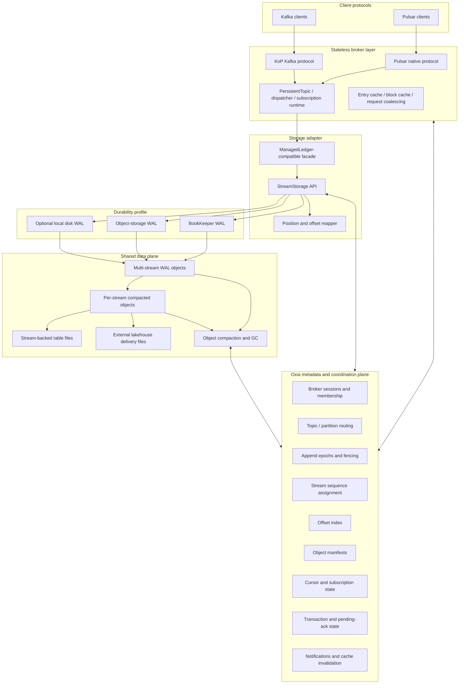
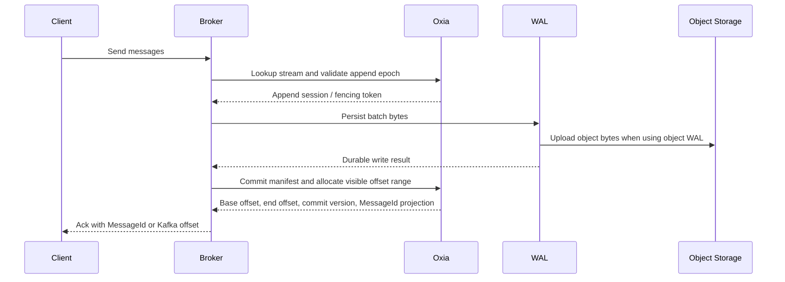
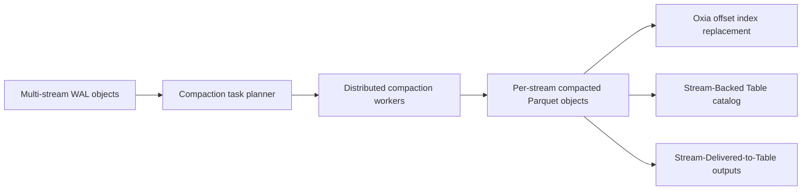

# Nereus 总体架构设计：基于 Oxia 的 Pulsar-native 共享存储引擎

> 这是内部总体架构设计文档，不是已经编号的 Apache Pulsar PIP。
> Nereus 是我们对标 Ursa 的商业化产品方向：Pulsar 协议层 + KoP Kafka 兼容 +
> Oxia 元数据/协调层 + 共享存储数据面 + lakehouse-native stream-table duality。
> 文档入口见 `pip/Nereus/nereus-design-index.md`，术语边界见 `pip/Nereus/nereus-terminology.md`。

## 1. 摘要

Nereus 不是简单的 "Pulsar + 对象存储"，也不是只把 BookKeeper 换成
S3。真正的目标是一个 Pulsar-native、Ursa-parity 的共享存储流引擎：

- Pulsar broker 继续承载协议、鉴权、策略、批处理、缓存、dispatch、
  subscription、schema、replication 等运行时能力。
- Kafka 协议兼容通过 KoP 进入同一套 topic/storage 运行时。
- Oxia 成为元数据和协调平面，负责 stream sequence、offset/position 映射、
  append epoch/fencing、broker membership、topic/partition routing、offset index、
  object manifest、cursor state、transaction state、cache invalidation。
- 对象存储成为共享数据面，承载 multi-stream WAL object、read-optimized compacted
  object、stream-backed table file 和 external lakehouse delivery file。
- Broker 尽量无持久状态。broker 可以是 preferred broker，用于缓存命中和减少
  append session 抖动，但正确性不依赖 broker ownership，而依赖 Oxia 的
  epoch、CAS、sequence 和 offset index commit。

这个设计是一步到位的目标架构。所谓 latency optimized 和 cost optimized 只是同一
架构下的部署 profile，不是分阶段产品路线：

| Profile | WAL 形态 | 元数据/协调 | 主要场景 |
| --- | --- | --- | --- |
| Latency optimized | BookKeeper WAL，可选 local WAL，对象存储做 segment/长期保存 | Oxia | 原生 Pulsar 低延迟、迁移敏感、强兼容场景 |
| Cost optimized | Multi-stream object WAL + compacted lakehouse object | Oxia | 大规模低成本、Kafka/Pulsar 混合、lakehouse 集成 |

核心定位：

> Nereus is a Pulsar-native shared-storage streaming engine, with Oxia as the
> metadata and coordination plane, object storage as the durable data plane,
> ManagedLedger as the Pulsar compatibility facade, KoP for Kafka protocol
> compatibility, and lakehouse-native stream-table duality as a first-class
> product capability.

## 2. 关键判断

1. **Oxia 不是普通 metadata store。**
   它要承接原先分散在 broker、BookKeeper、ZooKeeper/metadata store 中的流级协调
   和索引状态，包括 offset/sequence、partition routing、append fencing、
   offset index、object manifest、cursor、txn、notification。

2. **对象存储不是全部答案。**
   对象存储只负责存 bytes。是否可见、offset 如何分配、谁能提交、cursor 走到哪、
   哪些对象可读、哪些对象可 GC，都由 Oxia 控制。

3. **Oxia 不存 per-message metadata。**
   Oxia 只存 stream/range/object/control-state 粒度的数据。消息级元数据留在
   entry payload、record batch、broker entry metadata 或对象 block 内部索引中。

4. **Broker 可以 leaderless，但不是无序并发写。**
   任意 broker 可以服务 produce/fetch；但同一个 stream 的可见提交必须被 Oxia
   的 append epoch、fencing token 和 manifest CAS 串行化。

5. **StreamStorage 是核心存储模型，ManagedLedger 是兼容适配层。**
   内部正确性以 `streamId + offset`、Oxia sequence、append epoch 和 manifest
   commit 为准。Pulsar `ManagedLedger` / `Position` / `MessageId` 只是对外兼容
   contract，不能反过来限制底层设计。

6. **LedgerOffloader 不是主路径。**
   Offloader 适合 classic BookKeeper ledger 的冷数据搬迁，但不能把 broker/BK/ZK
   中的协调、offset、cursor、txn、manifest 状态统一到 Oxia，也不能消除
   BookKeeper 写路径。

## 3. 目标与非目标

### 目标

- 基于 Pulsar 构建商业化共享存储产品。
- 使用 Oxia 作为强一致 metadata + coordination plane。
- 原生支持 Pulsar protocol，通过 KoP 支持 Kafka protocol。
- 支持 BookKeeper WAL 和 Object WAL 两种部署 profile。
- 支持 broker 无持久状态、preferred routing、leaderless correctness。
- 保留 Pulsar MessageId/Position、subscription、cursor、transaction 等语义。
- 为 lakehouse 文件生成和查询集成预留一等路径。

### 非目标

- 不把本文包装成正式 Apache PIP 编号。
- 不复制 AutoMQ 或 Ursa 的实现代码。
- 不依赖对象存储 list 结果做正确性判断。
- 不要求 Oxia 提供跨所有 shard 的全局事务。
- 不承诺把所有 Pulsar 特性无成本迁移；难点需要在兼容性矩阵中显式处理。

## 4. 参考结论

### 4.1 Ursa 方向

公开资料中，Ursa 的关键不是 "S3"，而是：

- 用 Oxia 承接 scalable metadata 和协调能力。
- 提供 BookKeeper-based WAL 与 S3/object WAL 两种 profile。
- broker 更接近 stateless / leaderless。
- 对象存储承担低成本持久化和 lakehouse integration。
- 用 metadata service 维护 offset index，定位某个 stream offset 对应的 WAL object
  或 compacted object。
- 用 multi-stream WAL object 合并多个 topic-partition 的写入，降低小文件数量。
- 用 compaction service 把 row-based WAL object 转成 per-stream Parquet compacted
  object，并原子替换 offset index。

所以我们的设计应学习的是：**Oxia 控制面 + 共享数据面 + 无状态 broker**，而不是只做
一个 offload 插件。

### 4.2 Oxia 能力边界

Oxia 适合：

- linearizable key update；
- CAS / conditional update；
- session 和 ephemeral key；
- watch/notification；
- sequence assignment；
- leader election / fencing / service discovery / cache coherence。

但 Oxia 不是全局事务数据库。设计上要保证一个 stream 的关键状态尽量落在同一 shard
或同一 key group 中；跨 stream、跨 shard 的 transaction 要在上层显式建模。

### 4.3 AutoMQ 启发

AutoMQ 的 OSS 代码展示了 diskless Kafka 的几个关键模式：

- Kafka log API 适配到 S3-backed stream。
- stream 抽象包含 `streamId`、`streamEpoch`、start/confirm/next offset、
  append、fetch、trim、close、destroy。
- 写路径围绕 WAL、log cache、object upload、metadata commit 展开。
- controller metadata 在提交对象前校验 node epoch 和 stream continuity。
- table/lakehouse worker 可以从已提交 stream 数据异步构建。

对 Pulsar 来说，等价路径不是改 Kafka log，而是建立 `StreamStorage`，再用
ManagedLedger-compatible facade 承接现有 broker。

### 4.4 Pulsar 当前可用接入点

当前 Pulsar broker 已经有这些有利入口：

- `ManagedLedgerStorage` 从 broker 配置加载。
- `ManagedLedgerStorageClass` 暴露具名 `ManagedLedgerFactory`。
- `PersistencePolicies` 包含 `managedLedgerStorageClassName`。
- `BrokerService` 打开 persistent topic 时会按 storage class 选择
  `ManagedLedgerFactory`。
- 默认实现只注册 BookKeeper storage class。

因此新引擎建议注册一个新的 storage class，例如：

```properties
managedLedgerStorageClassName=nereus
```

## 5. 总体架构



### 5.1 分层架构

Nereus 的总体设计按五层组织。分层的目的不是把产品拆成多个阶段，而是让底层
Ursa-parity 能力、Pulsar 语义、Kafka 兼容、lakehouse 和弹性运维各自有清晰边界。

| 层级 | 名称 | 主要职责 | 不应该承担 |
| --- | --- | --- | --- |
| L0 | Core Stream Storage | `StreamStorage`、stream offset、Object/BK WAL、Oxia offset index、object manifest、read resolver、GC 引用模型 | Pulsar/Kafka 协议语义 |
| L1 | Pulsar Compatibility Projection | ManagedLedger facade、MessageId/Position projection、ManagedCursor、subscription、system topic/schema bootstrap | 改变 L0 的 offset truth |
| L2 | KoP/Kafka Compatibility Projection | Kafka offset、Produce/Fetch、group offset、transaction marker、leader epoch projection | 第二套 durable log |
| L3 | Compaction + Lakehouse | WAL 到 compacted object、generation replacement、SBT/SDT、Iceberg/Delta/Hudi catalog | producer ack 主路径依赖 catalog |
| L4 | Routing / Elasticity / Operations | stateless broker、preferred broker、append session、zone-aware routing、brown-out、cache invalidation、ops plane | broker durable ownership |

核心约束：

- L0 只认识 `streamId + offset`、Oxia sequence/epoch、WAL/object bytes 和 offset index。
- L1/L2 是 protocol projection，不能把 `ledgerId/entryId` 或 Kafka replica model 带回 L0。
- L3 消费 L0 已提交的 offset ranges，不能阻塞 producer ack。
- L4 提供 locality、cache 和弹性，不成为 correctness owner。
- 每个 future 都必须能映射到一个或多个层级，避免跨层状态互相污染。

## 6. 组件设计

### 6.1 Protocol Layer

职责：

- Pulsar native protocol 作为一等协议继续存在。
- Kafka protocol 通过 KoP 进入同一套 topic runtime。
- Kafka offset 和 Pulsar MessageId 是同一个内部 stream offset 的不同外部视图。
- 存储层不为 Kafka 和 Pulsar 各做一套 durable log。

### 6.2 Broker Runtime

Broker 仍负责：

- 鉴权、认证、tenant/namespace/topic policy；
- producer/consumer/reader 生命周期；
- batching、compression、dedup；
- dispatch、flow control、backpressure；
- entry cache / block cache；
- delayed delivery timer；
- schema、system topic、replicator；
- metrics 和 admin runtime。

Broker 不再是 durable owner。broker 可以持有 append session，也可以作为 preferred
broker 被 lookup 返回，但 stale broker 的 commit 会被 Oxia fencing 拒绝。

### 6.3 ManagedLedger-compatible Facade

新引擎的核心 API 是 `StreamStorage`。Pulsar broker 侧通过
ManagedLedger-compatible facade 暴露给 `PersistentTopic`、dispatcher、
subscription 和 admin runtime。这个 facade 负责协议兼容和语义投影，不拥有内部
offset 真相。

在 Pulsar 中可以用新的 storage class 暴露这个 facade：

```properties
managedLedgerStorageClassName=nereus
```

这个 storage class 返回新的 `ManagedLedgerFactory`，它打开的不是
BookKeeper-backed `ManagedLedgerImpl`，而是基于 `StreamStorage` 的
ManagedLedger-compatible runtime。

映射关系：

| Pulsar 概念 | Stream engine 概念 |
| --- | --- |
| Topic partition | Stream |
| Ledger | Virtual ledger projection over stream ranges |
| Entry | Pulsar entry projection over one or more stream offsets |
| `Position(ledgerId, entryId)` | Virtual position mapped to an entry offset range |
| Cursor mark-delete | Cursor committed offset |
| Individual ack ranges | Oxia 小状态 + object snapshot |
| ManagedLedger metadata | Oxia stream metadata + offset index |

`PersistentTopic`、dispatcher、subscription 可以继续调用 ManagedLedger API，但这
只是 broker 兼容边界。内部读写、cursor、trim、replication、compaction 都以
stream offset 为准。

### 6.4 StreamStorage API

内部抽象建议保持小而稳定：

```java
interface StreamStorage {
    CompletableFuture<AppendResult> append(
            StreamId streamId, AppendBatch batch, AppendOptions options);

    CompletableFuture<ReadResult> read(
            StreamId streamId, Offset startOffset, int maxEntries, long maxBytes);

    CompletableFuture<StreamMetadata> lookup(StreamId streamId);

    CompletableFuture<Void> trim(StreamId streamId, Offset beforeOffset);

    CompletableFuture<CursorState> readCursor(StreamId streamId, String cursorName);

    CompletableFuture<Void> updateCursor(
            StreamId streamId, String cursorName, CursorUpdate update);
}
```

要求：

- 全异步；返回 `CompletableFuture` 的方法不能同步抛异常。
- 不把对象存储实现细节暴露给 broker。
- append/read/trim/cursor 都以 stream offset 为内部坐标。
- MessageId/Position 只在 facade 层做兼容映射。

### 6.5 WAL Layer

WAL 是可插拔实现，但 WAL 只负责 bytes durable，不负责决定可见顺序。

| WAL | 用途 | producer ack 条件 |
| --- | --- | --- |
| `BookKeeperWalStorage` | 低延迟、迁移友好、Pulsar-native profile | BK quorum 写成功 + Oxia offset index commit 成功 |
| `ObjectWalStorage` | 低成本、stateless broker、对象存储优先 | Object WAL 写成功 + Oxia offset index commit 成功 |
| `LocalDiskWalStorage` | 可选边缘/单 AZ 优化 | local durable 成功，再按配置完成 object checkpoint 或复制 |

BookKeeper 在新架构里退化为一种 WAL profile，不再拥有完整 ManagedLedger 元数据和
cursor 真相。

### 6.6 Object Data Plane

对象存储中主要有五类对象：

- Multi-stream WAL object：最近写入的 row-based durable log，允许一个 object 包含
  多个 stream 的 batch。
- Per-stream compacted object：由 compaction service 生成的 read-optimized object，
  通常使用 Parquet，覆盖某个 stream 的连续 offset range。
- Stream-backed table file：同一份 compacted object 同时注册到 Iceberg/Delta/Hudi，
  作为内建 lakehouse table 的数据文件。
- External delivery file：向外部 catalog/table 交付的数据文件，用于 SDT 模式。
- Index object：当 entry index 或 offset index 太大时，承载 object-local index。

建议默认值：

| 项 | 默认值 | 说明 |
| --- | --- | --- |
| Block size | 4 MiB 或 8 MiB | 读缓存、checksum、range read 单位 |
| WAL object flush size | 4 MiB | cost profile 下聚合多 stream 写入，减少小文件 |
| WAL object flush interval | 200 ms | cost profile 默认值，可按 latency/cost 调节 |
| Low-latency WAL flush size | 512 KiB | latency profile 下更小批次 |
| Low-latency WAL flush interval | 5 ms | latency profile 下更低等待 |
| Compacted object size | 64 MiB 或 128 MiB | read-optimized range、manifest、GC 单位 |
| Object key | cluster/object-type/date/object-id | 逻辑归属由 Oxia offset index 决定 |
| Checksum | block 级 + object 级 | commit 前校验 |

对象提交后不可变。上传成功但未被 Oxia manifest 引用的对象是 orphan，只能由 GC 根据
Oxia manifest 和创建时间清理。

WAL object 的物理布局建议：

```text
WALObjectHeader
  objectId
  writerBrokerId
  writerEpoch
  createdAt
  checksum

StreamSlice[0..N]
  streamId
  relativeBaseOffset
  entryCount
  recordCount
  objectOffset
  length
  entryIndexRef

Payload blocks

WALObjectFooter
  streamSliceIndex
  checksum
```

一个 WAL object 可以包含多个 stream 的 slices。每个 slice 只有在对应 stream 的 Oxia
offset index entry 提交后才对读者可见。这样既保留 Ursa-style multi-stream WAL
object 的写入效率，又避免跨 shard 全局事务成为正确性前提。

## 7. Oxia 元数据模型

Oxia 只存控制面状态。建议 key 布局：

```text
/clusters/{cluster}/brokers/{brokerId}/session
/clusters/{cluster}/brokers/{brokerId}/load

/topics/{tenant}/{namespace}/{topic}/partitions/{partition}/stream
/topics/{tenant}/{namespace}/{topic}/partitions/{partition}/routing

/streams/{streamId}/meta
/streams/{streamId}/epoch
/streams/{streamId}/append-session
/streams/{streamId}/sequence
/streams/{streamId}/committed-end-offset
/streams/{streamId}/offset-index/{offsetEnd}
/streams/{streamId}/trim

/streams/{streamId}/cursors/{subscription}/state
/streams/{streamId}/cursors/{subscription}/ack-ranges

/transactions/{coordinatorId}/{txnId}/state
/transactions/{coordinatorId}/{txnId}/pending-ack/{streamId}/{subscription}

/wal-objects/{objectId}/manifest
/wal-objects/{objectId}/slices/{streamId}
/compaction/tasks/{taskId}
/compaction/streams/{streamId}/checkpoint

/objects/{objectId}/prepared
/objects/{objectId}/committed
/objects/{objectId}/gc
```

一个 Ursa-style offset index entry 示例：

```json
{
  "streamId": "s-123",
  "offsetStart": 1048576,
  "offsetEnd": 1114112,
  "cumulativeSize": 9876543210,
  "objectId": "wo-20260703-000001",
  "objectKey": "prod-a/wal/2026/07/03/wo-20260703-000001",
  "objectOffset": 8388608,
  "objectLength": 67108864,
  "recordCount": 65536,
  "entryCount": 4096,
  "physicalFormat": "ROW_WAL",
  "logicalFormat": "PULSAR_ENTRY_BATCH",
  "entryIndexRef": "object-footer:offset=67000000,length=8192,checksum=crc32c:...",
  "virtualLedgerId": 9007199254740993,
  "entryBaseId": 0,
  "commitVersion": 17,
  "createdBy": "broker-7"
}
```

读 `offset=x` 时，broker 查询该 stream 下第一个 `offsetEnd > x` 的 index entry，再用
`objectOffset`、`entryIndexRef` 和 `x - offsetStart` 定位对象内数据。`cumulativeSize`
用于 backlog size、retention、compaction window、cost accounting 和 quota。

一个 WAL object manifest 示例：

```json
{
  "objectId": "wo-20260703-000001",
  "objectKey": "prod-a/wal/2026/07/03/wo-20260703-000001",
  "objectLength": 268435456,
  "checksum": "crc32c:...",
  "format": "MULTI_STREAM_WAL_OBJECT",
  "writerBrokerId": "broker-7",
  "writerEpoch": 42,
  "streamSliceCount": 128,
  "createdAt": 1783036800000,
  "commitState": "COMMITTED"
}
```

`format` 可选：

- `BK_WAL_RANGE`
- `MULTI_STREAM_WAL_OBJECT`
- `STREAM_COMPACTED_OBJECT`
- `STREAM_BACKED_TABLE_FILE`
- `STREAM_DELIVERED_TABLE_FILE`
- `ICEBERG_FILE`
- `DELTA_FILE`
- `HUDI_FILE`

设计约束：

- 一个 stream 的 correctness-critical keys 尽量 colocate 到同一 Oxia shard。
- offset index commit 使用 CAS 或 sequence-plus-put，并在同一次提交中推进
  `committedEndOffset`。
- offset index entry 是读路径、cursor、retention、compaction 和 lakehouse commit
  的共同索引，不允许绕开 Oxia 直接从 object list 推断可见数据。
- notification 用于 broker cache invalidation、routing refresh、cursor refresh。
- 不做 per-message Oxia 写入。

### 7.1 Metadata Ownership

Nereus 必须先定义状态归属，避免实现时把 correctness 状态散落到 broker 本地文件、
BookKeeper ledger metadata、对象存储 list 结果或 lakehouse catalog 中。

| 状态 | 归属 | 是否可重建 | 说明 |
| --- | --- | --- | --- |
| Cluster/broker membership | Oxia | 可由 session 重建 | broker session、load、zone、capability |
| Topic to stream mapping | Oxia | 不可丢 | tenant/namespace/topic/partition 到 `streamId` 的绑定 |
| Stream metadata | Oxia | 不可丢 | stream lifecycle、profile、policy、schema reference |
| Append session / epoch / fencing token | Oxia | 可重建但必须单调 | 保护 stale broker，串行化 visible commit |
| `committedEndOffset` | Oxia | 不可丢 | stream offset authority |
| Offset index | Oxia | 不可丢 | read、cursor、retention、compaction、lakehouse 的共同索引 |
| Object bytes | Object store | 不可由 metadata 重建 | WAL/compacted/index/snapshot/table files |
| Object manifest | Oxia | 可由 audit 辅助修复，但 truth 在 Oxia | object visibility、checksum、format、引用状态 |
| Virtual ledger projection | Oxia + object-local entry index | 可由 offset index 和 entry index 重放 | Pulsar `MessageId`/`Position` 映射 |
| Cursor small state | Oxia | 不可丢 | mark-delete、read-position、小 ack ranges |
| Cursor large snapshot | Object store + Oxia ref | object 不可丢，ref 在 Oxia | 大 individual ack holes |
| Transaction state | Oxia | 不可丢 | coordinator state、commit/abort state、visibility |
| Pending ack snapshot | Object store + Oxia ref | object 不可丢，ref 在 Oxia | 大 pending ack state |
| Routing ring | Oxia | 可重建 | preferred broker、zone-aware assignment、ring version |
| Broker cache | Broker memory/local ephemeral cache | 可丢 | entry/block cache、offset index cache、routing cache |
| Compaction output | Object store + Oxia generation index | object 不可丢，index 在 Oxia | replacement 只改变 offset index 指向 |
| Lakehouse catalog | External catalog + Oxia SBT/SDT state | 可 repair | 不参与 stream visibility truth |

约束：

- Broker 不能依赖本地 RocksDB、磁盘文件或进程内状态保证数据可见性、cursor 进度或
  transaction 结果。
- Object store list 只用于 audit/GC 辅助，不参与读路径和 recovery 的正确性判断。
- Lakehouse catalog 可以落后或需要 repair，但不能领先于 Oxia visible offset。
- 所有可对外观察的 stream 状态最终必须能从 Oxia + object store manifest 解释。

## 8. Position 与 Offset 模型

### 8.1 统一内部坐标

内部只有一个真实坐标：

```text
streamId + offset
```

这里的 `offset` 是 stream 内单调递增、dense、可比较的逻辑 record offset。它是
Oxia 分配和提交的结果，也是 storage、cursor、trim、replication、compaction、
lakehouse 的共同坐标。

外部协议坐标只是投影：

```text
Pulsar MessageId / Position = ledgerId + entryId + batchIndex
Kafka offset = offset
```

设计原则：

- Oxia 是 offset authority。
- WAL/object 只证明 bytes durable，不自行决定最终可见 offset。
- 同一个 stream 的 visible offset range 只能通过 Oxia append epoch + CAS/sequence
  commit 发布。
- Pulsar MessageId 不参与内部排序，只负责外部兼容。
- Kafka offset 直接等于 stream record offset。

### 8.2 Nereus Commit-time Offset Assignment

Object WAL 写入时，broker 可以先写带相对 offset 的 WAL block。最终 offset 在 Oxia
offset index commit 时分配：

```text
commitProposal = {
  streamId,
  epoch,
  fencingToken,
  objectKey,
  objectLength,
  checksum,
  entryCount,
  recordCount,
  entryIndex,
  expectedStartOffset
}
```

Oxia 在同一次原子更新中完成：

1. 校验 append epoch 和 fencing token。
2. 校验 `expectedStartOffset == stream.committedEndOffset`。
3. 为本次 append 分配 `[baseOffset, endOffset)`。
4. 写入 offset index entry。
5. 写入 virtual ledger projection。
6. 推进 `stream.committedEndOffset = endOffset`。
7. 发布 notification。

因此 producer ack 返回的 MessageId/Kafka offset 一定来自 Oxia 已提交的 offset
range，而不是 broker 本地预分配的临时编号。

### 8.3 Pulsar MessageId Projection

Pulsar 的 `ledgerId + entryId + batchIndex` 不能作为内部真相，但必须稳定可查。
目标设计是 **virtual ledger projection**：

1. 每个 committed stream range 生成一个 virtual ledger projection。
2. `virtualLedgerId` 可以由 Oxia 分配，也可以由 `streamId + segmentStartOffset +
   epoch` 稳定编码，但必须记录在 manifest 中。
3. `entryId` 是该 virtual ledger 内的 Pulsar entry ordinal。
4. 每个 entry 对应一个 record offset range：
   `[entryBaseOffset, entryBaseOffset + entryRecordCount)`。
5. `batchIndex` 映射到 entry 内的第 N 条消息。

示例：

```text
virtualLedgerId = 9007199254740993
segment.startOffset = 1048576
segment.endOffset = 1114112

entryId 10:
  entryBaseOffset = 1048610
  entryRecordCount = 20

MessageId(9007199254740993, 10, batchIndex=0)  -> stream offset 1048610
MessageId(9007199254740993, 10, batchIndex=19) -> stream offset 1048629
Kafka offset 1048629                           -> stream offset 1048629
```

对非 batch entry，`entryRecordCount = 1`，此时 `entryId` 和 offset delta 看起来近似
一一对应。对 batch entry，`entryId` 不等于 record offset；必须通过 entry index 计算。

### 8.4 Entry Index

为了避免 Oxia 存 per-message metadata，object-local index 内需要保存 entry index：

```json
{
  "virtualLedgerId": 9007199254740993,
  "segmentStartOffset": 1048576,
  "segmentEndOffset": 1114112,
  "entryBaseId": 0,
  "entryCount": 4096,
  "entryIndexRef": "inline-or-object-local",
  "entries": [
    {
      "entryId": 10,
      "relativeBaseOffset": 34,
      "recordCount": 20,
      "objectOffset": 8192,
      "entryLength": 16384
    }
  ]
}
```

小 entry index 可以内联在 Oxia block manifest；大 index 放在 object block footer 或
独立 index object 中，Oxia 只存引用、checksum 和版本。

### 8.5 Cursor Offset

Cursor 的内部状态也使用 stream offset：

- `markDeleteOffset` 表示已经连续确认的下一条 record offset。
- `readPositionOffset` 表示下一次 dispatch 起点。
- individual ack holes 表示 record offset ranges。
- Pulsar 需要返回 `Position` 时，通过 virtual ledger projection 找到对应 entry。

这使 Shared、Key_Shared、batch ack、KoP offset commit 都落在同一套 offset 模型上。

## 9. 写路径

### 9.1 通用 produce 流程



关键规则：

- 数据 bytes durable 不等于对消费者可见。
- offset 分配和可见性只由 Oxia offset index commit 决定。
- producer ack 必须等待 WAL durable 和 Oxia commit 都成功。
- stale epoch 的 broker commit 必须失败。

### 9.2 Object WAL 写路径

1. Broker 解析 topic policy，得到每个 request 对应的 `streamId`。
2. Broker 按 stream 获取或刷新 append session：
   `(streamId, brokerId, epoch, fencingToken)`。
3. Broker 在内存中聚合多个 stream 的 entries，达到 flush size 或 flush interval 后生成
   一个 multi-stream WAL object。
4. WAL object 内部按 `streamId` 排序写入 stream slices，每个 slice 保存相对 offset、
   entry index、object offset、length、checksum。
5. Broker 上传 WAL object，并写入 `/wal-objects/{objectId}/manifest`。
6. Broker 对每个 stream slice 分别向 Oxia 提交 offset index entry。每个 stream 的
   commit 操作需要：
   - 校验 append epoch；
   - 校验 `expectedStartOffset == committedEndOffset`；
   - 分配 visible offset range；
   - 写入 `/streams/{streamId}/offset-index/{offsetEnd}`；
   - 发布 virtual ledger projection 和 entry index 引用；
   - 推进 `committedEndOffset`；
   - 触发 notification。
7. 某个 produce request 只有在其 stream slice 的 offset index entry 提交成功后才 ack。

如果 broker 在 object upload 后、Oxia commit 前崩溃，该 object 不可见，由 GC 清理。
如果 broker 在 Oxia commit 后、ack 前崩溃，数据已可见；producer retry 依赖 Pulsar
producer sequence / dedup 处理重复。

multi-stream WAL object 不要求跨 stream 的全局原子提交。物理 object 可以已经存在，
但每个 stream slice 的可见性独立由 Oxia offset index 控制。若一个 WAL object 中只有
部分 slices 成功提交，未提交 slices 仍不可见，后续由 recovery 或 compaction/GC 处理。

### 9.3 BookKeeper WAL 写路径

1. Broker 通过 `BookKeeperWalStorage` 写 BK。
2. BK quorum 成功后，bytes durable。
3. Broker 把 BK ledger range 和 visible offset range commit 到 Oxia。
4. 后台 compactor 可以把 BK range 转成 object stream segment，并更新 manifest。

这不是 classic ManagedLedger：BK 是 WAL 实现，Oxia 才是 stream visibility、epoch、
cursor、manifest 的 source of truth。

### 9.4 Offset 分配时机

Object WAL 的 offset 分配采用 Nereus 的 Oxia commit-time assignment：

```text
object WAL durable + Oxia offset index commit -> final visible offset range
```

这意味着：

- broker 不在本地生成最终 offset；
- WAL block 可以先保存相对 offset；
- Oxia commit 原子分配 `[baseOffset, endOffset)` 并推进 committed end offset；
- producer ack 返回的 MessageId/Kafka offset 必须来自 Oxia commit result；
- 未 commit 的 object 永远不可见，只能被 recovery/GC 处理。

这样可以避免 broker 上传后崩溃造成可见 offset gap，也避免多个 broker 并发写同一
stream 时出现本地 offset 分配冲突。

代价是 object block format 必须支持相对 offset 和 entry index。KoP 侧如果需要
Kafka record batch header 中的 base offset，可以在 final segment 中写入已确定的
base offset，或在读出时由 adapter 根据 manifest 修正。

upload 前预留 provisional range 只能作为特殊优化模型。它会引入 range 过期、
empty range sealing、gap 语义和 retry 后复用问题，不能作为总体架构默认语义。

## 10. 读路径

读路径统一按 stream offset 解析：

1. Kafka offset 直接解析为 `streamId + offset`。
2. Pulsar `MessageId/Position` 先定位 virtual ledger projection，再通过 entry index
   解析为 entry offset range；如果带 `batchIndex`，再定位具体 record offset。
3. 查 broker entry cache / block cache。
4. 从 Oxia 查询 `/streams/{streamId}/offset-index/{offsetEnd}`，找到第一个
   `offsetEnd > offset` 的 index entry。
5. 如果 index entry 指向最近 WAL object，按 `objectOffset + relativeOffset` 做 range
   read，并用 entry index 解析 Pulsar entry。
6. 如果 index entry 指向 compacted object，读取对应 Parquet row group / column chunk，
   再投影回 Pulsar entry 或 Kafka record。
7. 解码 entry，处理 batchIndex、事务可见性、compaction/filter，再交给现有 dispatch。

优化点：

- preferred broker 提高 hot partition cache 命中。
- block 级 read coalescing。
- historical read 可以路由到 cheaper read broker。
- object read-ahead 基于 Oxia offset index，不基于 object list。
- lagging consumer 优先读 compacted object，避免对 multi-stream WAL object 做大量
  非连续 range read。

## 11. Routing 与 Ownership

目标模型：

| 概念 | 含义 |
| --- | --- |
| Preferred broker | lookup 推荐给 client 的 broker，用于缓存和减少 session 抖动 |
| Append session | Oxia-fenced 的 stream append 权限 |
| Fencing token | 单调 epoch/version，每次 commit 都校验 |
| Routing notification | Oxia 通知 broker/lookup 刷新 preferred broker |

正确性不依赖 preferred broker。任意 broker 收到 produce 后，可以获取或竞争 append
session；Oxia 通过 epoch/CAS 串行化 visible commit。

为了兼容和性能，运行时可以启用 strict preferred-broker mode，减少 append session
切换。这是同一架构的运行模式，不是产品分阶段。

## 12. Cursor 与 Subscription

Cursor 由 Oxia + object snapshot 承载，不再由 BookKeeper cursor ledger 决定真相。

Cursor state 示例：

```json
{
  "streamId": "s-123",
  "subscription": "sub-a",
  "type": "Shared",
  "markDeleteOffset": 1048576,
  "readPositionOffset": 1052672,
  "individualAckRangesRef": "cursor-snapshots/s-123/sub-a/epoch-9.snap",
  "pendingAckTxnHighWatermark": 8192,
  "version": 88
}
```

设计：

- mark-delete 和 read-position 使用 Oxia CAS 更新。
- 小的 individual ack holes 以压缩 range 存 Oxia。
- 大的 ack holes 快照到对象存储，Oxia 只存引用和版本。
- Shared / Key_Shared 的 dispatch 逻辑继续在 broker，durable progress 在 Oxia。
- cursor notification 用于跨 broker cache invalidation。

难点：

- Shared subscription 下大量 individual ack holes。
- Key_Shared rebalance 后顺序性。
- cursor update 与 retention/trim/GC 的安全关系。

## 13. Transaction 与 Pending Ack

Pulsar transaction 涉及 transaction coordinator、transaction buffer、pending ack。

设计：

- transaction coordinator state 存：
  `/transactions/{coordinatorId}/{txnId}/state`
- pending ack state 按 stream/subscription/txn 组织。
- commit/abort 是 Oxia state transition + 必要的 stream marker。
- 大 transaction buffer snapshot 可以落对象存储，Oxia 存引用。

约束：

- committed transaction 只有在 transaction state 和 stream offset index 一致后才可见。
- aborted range 必须可被 reader/dispatcher 识别并跳过。
- 不能假设 Oxia 支持任意跨 shard 事务；跨 stream transaction 需要显式协议。

## 14. Compaction 与 Lakehouse

Committed stream offset index 是 source of truth。WAL object、compacted object、
stream-backed table file 都是 offset index 指向的物理表示。Lakehouse 不是事后
offload，而是同一份 stream 数据的表视图。



### 14.1 Stream-Backed Table (SBT)

SBT 是内建表视图。每个 stream 都可以直接作为 Iceberg/Delta/Hudi 表暴露：

- compacted object 是 stream offset range 的 read-optimized 表示；
- 同一个 compacted object 同时被 Oxia offset index 和 lakehouse catalog 引用；
- streaming reader 和 analytical query 读取同一份对象，减少重复数据；
- table metadata commit 和 Oxia offset-index replacement 必须具备一致的版本关联；
- 外部查询引擎以 read-only 方式访问 SBT，写入仍通过 stream append 路径进入。

### 14.2 Stream-Delivered-to-Table (SDT)

SDT 是向外部 catalog/table 交付的模式：

- 源 stream offset index 仍是 truth；
- compaction worker 生成外部表文件并提交到外部 catalog；
- SDT commit lag 作为可观测指标；
- SDT 失败不影响 stream 可见性；
- SDT 可以支持 Databricks Unity Catalog、Snowflake Open Catalog 或用户自有 Iceberg
  catalog。

### 14.3 Distributed Compaction Service

Compaction service 是核心组件，不是后台优化项。它解决两个问题：

1. multi-stream WAL object 适合高吞吐写，但 lagging consumer 会遇到非连续 range read；
2. lakehouse 查询需要 per-stream、columnar、schema-aware 的文件布局。

工作流：

1. Task planner 从 Oxia 读取每个 stream 的 offset index 和吞吐指标，生成
   `[startOffset, endOffset)` compaction tasks。
2. Worker 读取涉及的 WAL objects，只抽取目标 stream slices。
3. Worker 使用 entry 中的 schema id，把 row-based entries 转成 per-stream Parquet
   compacted object。
4. Worker 输出 compacted object metadata：object key、offset bounds、record count、
   min/max event time、schema id、checksum、table file metadata。
5. Planner/committer 原子更新 Oxia offset index：把原先多个 WAL index entries 替换
   为覆盖同一 offset range 的 compacted object entries。
6. Committer 同步提交 SBT catalog metadata；SDT metadata 按目标 catalog 独立提交。
7. 旧 WAL objects 只有在 offset index 不再引用、active readers/cursors 不再需要、
   且 retention 条件满足后才能 GC。

Topic compaction 也复用该框架：worker 对每个 key 保留最高 offset 的 record，把结果
写成新的 compacted object；旧 compacted object 在新 offset index 发布前保持可读，
从而实现 zero-downtime compaction。

## 15. Failure Model

| 故障 | 期望行为 |
| --- | --- |
| Broker 在 WAL write 前崩溃 | 无可见数据，client retry |
| Broker 在 WAL write 后、Oxia commit 前崩溃 | bytes 是 orphan/uncommitted，不可见，由 recovery/GC 处理 |
| Broker 在 Oxia commit 后、ack 前崩溃 | 数据已可见，producer retry 走 sequence/dedup |
| Multi-stream WAL object 部分 slice commit 成功 | 已提交 slices 可见，未提交 slices 不可见，object 由引用计数和 GC 处理 |
| 旧 epoch broker 尝试 commit | Oxia fencing/CAS 拒绝 |
| Object upload 成功但 checksum 不匹配 | object manifest 或 offset index commit 拒绝，对象进 GC |
| Oxia shard leader 切换 | session/watch 恢复，append session renew 或被 fence |
| Object store list 延迟/不一致 | 不影响正确性，manifest 从 Oxia 读 |
| Compaction object 写入成功但 offset index 替换失败 | 新 compacted object 不可见，旧 WAL/compacted entries 继续服务读 |
| SBT catalog commit 成功但 Oxia 版本不匹配 | catalog commit 回滚或登记为 pending repair，不影响 stream read truth |
| Object read 临时失败 | broker retry、换 read broker，必要时对 client backpressure/error |
| Cursor update 冲突 | CAS retry，并通过 notification refresh |

Recovery 以 Oxia manifest 为准，不以对象存储 list 为准。object list 只能用于 GC audit。

## 16. 性能与背压

核心原则：Oxia 不在 per-message 数据路径上。

策略：

- 多条消息合并为一个 append commit。
- 多个 stream 的 append 合并到一个 WAL object，按 stream slice 建索引。
- offset range 按 batch/block 分配，不按 message 分配。
- offset index 按 stream slice / compacted range 粒度 commit。
- hot read 走 broker cache，historical read 走 object block cache。
- tail read 优先从 WAL object slice 读取，catch-up read 优先从 compacted object 读取。
- preferred routing 降低 cache miss。
- segment size 按写入速率自适应。
- 当 Oxia commit latency、object upload latency、WAL queue depth、cursor CAS retry
  超阈值时对 producer backpressure。

建议初始目标：

| 指标 | 目标 |
| --- | --- |
| Object WAL ack latency | subsecond，可通过 batch/flush policy 调节 |
| BookKeeper WAL ack latency | 单位毫秒到几十毫秒，取决于 quorum 和网络 |
| Oxia writes per stream | O(stream-slice commits + cursor commits)，不是 O(messages) |
| WAL object size | 4 MiB 起，按吞吐和延迟自适应 |
| Compacted object size | 64-128 MiB |
| Block size | 4-8 MiB |

## 17. Pulsar 特性兼容矩阵

| 特性 | 设计处理 | 主要风险 |
| --- | --- | --- |
| Exclusive/Failover subscription | broker dispatch + Oxia cursor | failover cursor 正确性 |
| Shared subscription | mark-delete + individual ack ranges | ack holes 过大 |
| Key_Shared subscription | 复用现有 key-hash dispatch | rebalance 后顺序性 |
| Batch message | payload/batchIndex 保持不变 | KoP offset 映射 |
| Delayed delivery | broker timer + durable delayed index/snapshot | timer recovery 和规模 |
| Topic compaction | compaction service 发布 compacted object 并替换 offset index | retention/cursor 交互 |
| Transaction | Oxia txn state + stream marker | 跨 stream 协调 |
| Replication | replicator 读 committed offset 写目标 stream | offset translation / exactly-once |
| Schema | schema metadata 纳入 Oxia-backed metadata/system namespace | bootstrap 和权限边界 |
| System topic | system topic 使用同一 `nereus` 存储模型 | 自举顺序和故障恢复 |
| Retention/backlog | cursor low-watermark + trim state | GC 安全性 |
| Tiered storage | 重新定义为 native compacted object / SBT | 与旧工具兼容 |

## 18. 配置面

示例：

```properties
managedLedgerStorageClassName=nereus

nereus.metadataStoreUrl=oxia://oxia-1:6648,oxia-2:6648,oxia-3:6648
nereus.clusterId=prod-a

nereus.wal.type=object
nereus.object.provider=s3
nereus.object.bucket=pulsar-streams-prod-a
nereus.object.prefix=streams
nereus.object.blockSizeBytes=4194304
nereus.object.walObjectFlushSizeBytes=4194304
nereus.object.walObjectFlushIntervalMs=200
nereus.object.compactedObjectSizeBytes=134217728

nereus.append.preferredBrokerMode=enabled
nereus.append.sessionTtlMs=30000
nereus.append.maxInflightBytesPerStream=67108864

nereus.cursor.snapshotThresholdBytes=1048576
nereus.cache.blockCacheSizeBytes=34359738368
```

namespace/topic 级别继续复用 persistence policy 中的
`managedLedgerStorageClassName`。

## 19. Metrics 与可观测性

新增指标建议：

| Metric | 含义 |
| --- | --- |
| `pulsar_nereus_append_latency_seconds` | producer append 端到端耗时 |
| `pulsar_nereus_wal_write_latency_seconds` | WAL durable 耗时 |
| `pulsar_nereus_manifest_commit_latency_seconds` | object manifest commit 耗时 |
| `pulsar_nereus_manifest_commit_conflicts_total` | CAS/fencing 冲突次数 |
| `pulsar_nereus_append_session_fenced_total` | stale session commit 次数 |
| `pulsar_nereus_object_orphan_bytes` | 未被 manifest 引用的对象字节数 |
| `pulsar_nereus_wal_object_stream_slices` | 每个 WAL object 聚合的 stream slice 数 |
| `pulsar_nereus_offset_index_commit_latency_seconds` | offset index entry commit 耗时 |
| `pulsar_nereus_offset_index_replacement_total` | compaction 替换 offset index 次数 |
| `pulsar_nereus_block_cache_hit_ratio` | block cache 命中率 |
| `pulsar_nereus_cursor_update_latency_seconds` | cursor update 耗时 |
| `pulsar_nereus_cursor_cas_retries_total` | cursor CAS retry 次数 |
| `pulsar_nereus_segment_compaction_lag_bytes` | 待 compaction 字节数 |
| `pulsar_nereus_compaction_read_amplification` | catch-up read 在 WAL/compacted object 上的读放大 |
| `pulsar_nereus_sbt_catalog_commit_latency_seconds` | SBT catalog commit 耗时 |
| `pulsar_nereus_lakehouse_commit_lag_seconds` | lakehouse materialization 延迟 |

运维视图应展示：

- 每个 stream 的 committed end offset；
- preferred broker 与 append epoch；
- uncommitted append sessions；
- offset index entry 数量、manifest 数量、object bytes、orphan bytes；
- WAL object 中 stream slice 分布；
- compacted object 覆盖率和 compaction lag；
- SBT/SDT catalog commit 状态；
- cursor low-watermark、backlog；
- Oxia shard/key 分布。

## 20. 安全与多租户

要求：

- object key 或内部 namespace id 必须隔离 tenant/namespace。
- object store 凭证限定 bucket/prefix/cluster 范围。
- broker 在 stream lookup 和 object read 前必须完成授权。
- Oxia admin/API 不允许跨 tenant 泄漏元数据。
- object data 和敏感 Oxia metadata 支持 at-rest encryption。
- GC/compaction 删除对象前必须校验 manifest ownership。

## 21. 模块划分建议

一种模块划分：

```text
pulsar-nereus/
  pulsar-nereus-api/
  pulsar-nereus-managed-ledger/
  pulsar-nereus-metadata/
  pulsar-nereus-wal/
  pulsar-nereus-object/
  pulsar-nereus-cache/
  pulsar-nereus-lakehouse/
  pulsar-nereus-tests/
```

模块边界以 `StreamStorage` 为核心，ManagedLedger-compatible runtime 是 broker 兼容
adapter。技术细节文档可以把这些模块拆成多个子步骤实施，但总体架构不再拆
产品阶段。

## 22. Future 拆分

Nereus 的总体设计一步到位，但后续技术细节文档和工程推进按 future 拆分。这里的
future 是模块边界和推进顺序，不是产品能力的阶段性缩水；每个 future 都必须服从
L0-L4 的分层边界。

| Future | 名称 | Scope | Non-scope | 设计出口 |
| --- | --- | --- | --- | --- |
| Future 1 | Core StreamStorage + Object WAL | `StreamStorage` API、object WAL writer、object manifest、Oxia offset index、commit-time offset assignment、read resolver、basic MessageId projection | cursor 复杂语义、KoP、lakehouse catalog | L0 设计闭环 |
| Future 2 | ManagedLedger Facade | `ManagedLedgerFactory`、ManagedLedger-compatible runtime、Position projection、Entry projection、topic load/unload、basic cursor | 改写 Pulsar topic runtime | L1 Pulsar 接入闭环 |
| Future 3 | Cursor / Subscription State | mark-delete offset、individual ack range、cursor CAS、cursor snapshot object、Exclusive/Failover/Shared cursor recovery | Key_Shared 全量优化、复杂 delayed delivery | L1 cursor 状态闭环 |
| Future 4 | Compaction + Generation Replacement | WAL reader、compaction planner、compacted object writer、generation overlay、highest-generation read resolver、old generation fallback、GC protection | 外部 catalog 的完整交付语义 | L3 compaction 闭环 |
| Future 5 | KoP Compatibility | Kafka offset、ProduceResponse base offset、Fetch mapping、group offset in Oxia、transaction visibility、Kafka compaction、leader epoch projection | 新 Kafka 协议栈 | L2 Kafka projection 闭环 |
| Future 6 | Lakehouse SBT / SDT | SBT table files、Iceberg catalog commit、catalog snapshot、catalog repair、SDT external delivery、delivery idempotence | producer ack 依赖 catalog | L3 stream-table duality 闭环 |
| Future 7 | Routing / Brown-out / Elasticity | broker session、zone-aware routing、preferred broker、append session transfer、client retry、warmup、cross-zone fallback、cache invalidation | broker durable ownership | L4 elastic serving 闭环 |
| Future 8 | Advanced Pulsar Semantics | delayed delivery、Key_Shared、transaction pending ack、replicated subscription、schema/system topic bootstrap、topic compaction compatibility、geo-replication | 改变 L0 offset truth | L1/L4 高级语义闭环 |

每个 future 的技术细节文档都应包含：

- motivation；
- scope / non-scope；
- API 和 broker 接入点；
- Oxia metadata schema；
- object format 或 snapshot format；
- state transition；
- failure model；
- compatibility impact；
- future gate。

当前阶段只要求完成总体设计和 future 边界。benchmark、chaos、compatibility suite 和
model checking 放到各 future 设计冻结之后作为验证阶段工作。

## 23. 关键技术细节

1. **Virtual ledger id 编码**
   - 每个 committed segment 一个 virtual ledger；
   - 每个 append epoch 一个 virtual ledger；
   - 每个 retention/rollover interval 一个 virtual ledger。

   三种方式都不能改变内部 stream offset 真相，只影响 Pulsar MessageId projection
   的编码、压缩和查询效率。

2. **Offset index entry 形态**
   - 主 key 使用 `{streamId, offsetEnd}`；
   - value 包含 `offsetStart`、`cumulativeSize`、object location、physical format、
     entry index reference；
   - compaction 通过版本化 replacement 保证旧对象和新对象切换时读不中断。

3. **Entry index 存放位置**
   - 小 index 内联在 Oxia block manifest；
   - 大 index 放在 object footer；
   - 超大 index 使用独立 index object。

4. **Multi-stream WAL object commit**
   - 一个物理 object 可包含多个 stream slices；
   - 每个 slice 的可见性由自己的 offset index entry 决定；
   - 不要求跨 stream 全局原子提交。

5. **Individual ack holes 存储**
   - 小 range 直接存 Oxia；
   - 大 range snapshot 到 object；
   - 定义 snapshot compaction 和删除规则。

6. **Transaction colocating**
   - 尽量把 transaction coordinator state 与相关 stream colocate；
   - 跨 shard 时使用显式 transaction protocol，不假设 Oxia 全局事务。

7. **Lakehouse 格式**
   - Iceberg 作为默认优先级最高；
   - Delta/Hudi 做可选 adapter。

8. **System topic bootstrap**
   - 全部 system topic 使用 `nereus`；
   - metadata namespace、schema registry、transaction coordinator 的自举顺序要显式
     定义。

## 24. 产品表达

建议对外表达：

- Nereus: Pulsar-native shared-storage engine。
- Oxia-backed metadata and coordination plane。
- Object-storage-first durable data plane。
- KoP-compatible Kafka protocol access。
- Lakehouse-native stream-table duality。

避免表达：

- 不是 "Pulsar tiered storage"。
- 不是 "BookKeeper replacement only"。
- 不是 "AutoMQ for Pulsar"。
- 不是 "Kafka-compatible object storage broker"。

真正差异化在于：Pulsar 原生语义 + Oxia 控制面 + 共享对象数据面 + lakehouse-native。

## 25. Nereus 与 Ursa 的产品级对齐

Nereus 的目标不是复制 Ursa 代码或复刻单一 Kafka 产品，而是直接对标 Ursa 的架构范式：

```text
Oxia metadata/coordination plane
+ shared object data plane
+ stateless/leaderless serving
+ stream offset index
+ multi-stream WAL object
+ compaction/lakehouse
+ protocol projection
```

Nereus 与 Ursa 的关系：

- Ursa 是参照对象，尤其是 Oxia 控制面、对象 WAL、stateless broker、offset index、
  lakehouse-native storage 和 latency/cost profile。
- Nereus 的差异化是 Pulsar-native：Pulsar MessageId、ManagedCursor、subscription、
  schema、transaction pending ack、system topic、replication 都是目标架构的一等能力。
- Kafka 兼容通过 KoP 进入同一套 `StreamStorage`，而不是为 Kafka 维护第二套 durable log。
- 当前阶段只冻结总体设计和 future 边界；验证、benchmark、chaos 和兼容性认证在 future
  设计冻结后执行。

### 25.1 Ursa Parity Matrix

| Ursa 能力 | Ursa 公开设计方向 | Nereus 设计 | 层级 / Future |
| --- | --- | --- | --- |
| Metadata service | Oxia / scalable metadata store | Oxia 承接 stream metadata、offset index、fencing、routing、cursor、txn、manifest | L0/L4, Future 1/7 |
| Stateless / leaderless broker | 任意 broker 可服务 produce/fetch，preferred routing 只做 locality | Pulsar broker 不再是 durable owner；preferred broker 只影响 cache/batching/session 抖动 | L4, Future 7 |
| Object WAL | 直接写 object storage，降低 inter-AZ replication | multi-stream WAL object，多个 stream slices 独立提交 visible offset | L0, Future 1 |
| Offset index | metadata service 维护 offset 到 object 的映射 | Oxia key `{streamId, offsetEnd}`，value 包含 physical object、entry index ref、cumulative size | L0, Future 1 |
| Commit-time offset assignment | offset 由 metadata authority 分配 | producer ack 必须等待 WAL durable + Oxia offset index commit；final offset 来自 Oxia | L0, Future 1 |
| Compaction | WAL object 转 read-optimized/lakehouse object | generation replacement：不改 offset，只改 offset index 指向 | L3, Future 4 |
| Lakehouse | open table formats / stream-table duality | SBT 内建表视图 + SDT 外部交付；catalog 不参与 producer ack | L3, Future 6 |
| Cost profile | object WAL + Oxia + object storage | Object WAL profile，面向低成本、大吞吐、lakehouse workloads | L0/L3, Future 1/4/6 |
| Latency profile | disk/BK/local WAL + metadata plane | BookKeeper WAL 或 local WAL profile 进入同一 `StreamStorage` truth | L0, Future 1/2 |
| Kafka protocol | Kafka-compatible / native Kafka profile | KoP projection：Kafka offset 等于 stream record offset | L2, Future 5 |
| Zone-aware routing | broker degraded 后 remap，无数据搬迁 | routing ring、append session fencing、readmission warmup、cross-zone fallback | L4, Future 7 |

### 25.2 Nereus 的 Pulsar-native 增强

| Pulsar 能力 | Nereus 设计 | 层级 / Future | 设计原则 |
| --- | --- | --- | --- |
| MessageId / Position | virtual ledger projection 映射到 `streamId + offset` | L1, Future 2 | MessageId 稳定，但不是内部 truth |
| ManagedLedger | ManagedLedger-compatible facade | L1, Future 2 | facade 兼容 broker，不反向限制 L0 |
| ManagedCursor | Oxia cursor state + object snapshot | L1, Future 3 | mark-delete/read-position 用 stream offset |
| Shared subscription | mark-delete + individual ack ranges | L1, Future 3 | ack holes 小状态在 Oxia，大状态进 snapshot |
| Key_Shared | broker dispatch + durable cursor/order state | L1/L4, Future 8 | 顺序性由 dispatch state 和 cursor state 共同保证 |
| Delayed delivery | broker timer + durable delayed index/snapshot | L1/L4, Future 8 | timer 可重建，durable state 不在 broker 本地 |
| Transaction pending ack | Oxia txn state + pending ack snapshot | L1, Future 8 | commit/abort visibility 与 offset index 对齐 |
| Topic compaction | 复用 compaction service 和 generation replacement | L3, Future 4/8 | Kafka/Pulsar compaction 共享底层机制 |
| Schema | broker runtime 保持 schema 语义，metadata 进入 Oxia-backed namespace | L1, Future 8 | schema 不进入 L0 per-message metadata path |
| System topic | 使用 `nereus` storage class bootstrap | L1, Future 2/8 | 明确 bootstrap 顺序和故障恢复 |
| Geo-replication | replicator 读 committed offsets 写目标 stream | L1, Future 8 | offset translation 显式建模 |

### 25.3 Nereus 的优势、缺点和弱项

设计优势：

- 比 Ursa 公开的 cost-optimized Pulsar 当前形态更 Pulsar-native：Nereus 的目标架构直接把
  native Pulsar 协议和高级 subscription/cursor/txn 语义纳入 cost/object profile。
- 比传统 Pulsar offload 更彻底：Oxia 是 offset authority 和 visibility authority，
  对象存储只存 bytes，不由 BookKeeper/ZooKeeper/ManagedLedger 分散决定真相。
- 比“Kafka-compatible object broker”更适合 Pulsar 商业产品：Pulsar 客户不用迁移到 Kafka
  心智，Kafka 只是 KoP projection。
- `streamId + offset` 统一 Pulsar、Kafka、cursor、retention、compaction、lakehouse，
  避免双日志、双 offset truth 和跨系统数据复制。
- SBT/SDT 把 lakehouse 作为一等产品能力，而不是事后 offload。

设计代价：

- Pulsar-native 语义比 Kafka-only 模型复杂，尤其是 Shared/Key_Shared、batch ack、
  delayed delivery、pending ack transaction、system topic bootstrap 和 geo-replication。
- ManagedLedger facade 必须足够兼容现有 broker runtime，同时不能让旧 ledger 模型污染
  L0 的 stream offset truth。
- KoP 依赖现有 KoP 协议实现，Kafka client ecosystem 的完整兼容性需要单独 future 处理。
- Oxia key colocating、cross-shard transaction、cursor large snapshot、catalog repair 和
  GC safety 都需要在 future 细节文档中显式状态机化。
- 迁移路径需要保留 BookKeeper WAL profile，否则现有低延迟 Pulsar workload 难以一步切换。

相比 Ursa 更弱或风险更高的地方：

- Ursa 围绕 Kafka-compatible storage engine 设计，协议和 offset 模型更单一；Nereus 同时承担
  Pulsar native、ManagedLedger facade、ManagedCursor、KoP、schema、system topic 和高级
  subscription 语义，状态空间更大。
- Ursa 的 Kafka path 可以原生控制 produce/fetch/group/txn 全链路；Nereus 的 Kafka 兼容
  依赖 KoP projection，KoP coordinator state、leader epoch、record batch rewrite 和错误码
  需要单独收敛。
- Nereus 为了兼容 Pulsar 低延迟和存量 workload，保留 BookKeeper WAL/local WAL profile 的
  可能性；这提升迁移弹性，但也会增加产品配置面、运维面和测试矩阵。
- Pulsar Shared/Key_Shared、batch ack、delayed delivery、pending ack transaction、
  replicated subscription 比 Kafka consumer group offset 更复杂，cursor snapshot、ack holes
  和 transaction pending ack 会成为实现高风险区。
- System topic/bootstrap 是 Pulsar-native 产品必须解决的问题；Ursa-like Kafka engine 通常不需要
  在同一存储层里承载这些 Pulsar 内部 topic 依赖。
- 当前 Nereus 处于设计冻结阶段，本文只定义架构和 future 边界；真实 workload profile、
  compatibility suite、failure injection 和 benchmark 需要在 future 设计冻结后再进入验收。

当前设计阶段的未决点：

| 未决点 | 候选方案 | 需要在 future 中确定 |
| --- | --- | --- |
| Virtual ledger id 编码 | Oxia 分配、`streamId + segmentStartOffset` 编码、epoch 编码 | MessageId 稳定性、seek 性能、metadata 大小 |
| Entry index 位置 | Oxia 小 index、object footer、独立 index object | batch seek、read amplification、Oxia value size |
| Cursor large snapshot 格式 | range bitmap、Roaring bitmap、delta snapshot | Shared ack holes 规模和 recovery 成本 |
| Transaction colocating | coordinator colocate、stream colocate、显式跨 shard txn | 跨 stream transaction 的可见性和 fencing |
| System topic bootstrap | classic storage bootstrap、Nereus self-hosted bootstrap、hybrid bootstrap | schema/txn/system topic 的启动顺序 |
| Lakehouse catalog 默认 | Iceberg first、Delta optional、Hudi optional | catalog repair 和商业集成优先级 |
| Latency profile WAL | BookKeeper only、local WAL、hybrid WAL | 低延迟 SLA 和运维复杂度 |

## 26. Nereus Future 技术文档计划

后续技术细节文档按 future 拆分，每篇文档只解决一个模块边界，不再把验证结果混入总体设计。

| 文档 | 对应 Future | 内容 |
| --- | --- | --- |
| `pip/Nereus/nereus-future1-core-stream-storage.md` | Future 1 | `StreamStorage` API、object WAL、Oxia offset assignment、offset index、read resolver |
| `pip/Nereus/nereus-future2-managed-ledger-facade.md` | Future 2 | ManagedLedger/ManagedCursor facade、Position/MessageId projection、topic open/load/unload |
| `pip/Nereus/nereus-future3-cursor-subscription.md` | Future 3 | cursor state、ack holes、snapshot object、Shared/Failover/Exclusive recovery |
| `pip/Nereus/nereus-future4-compaction-generation.md` | Future 4 | compaction planner/worker、generation replacement、fallback、GC protection |
| `pip/Nereus/nereus-future5-kop-compatibility.md` | Future 5 | Kafka produce/fetch/group/txn/compaction/leader epoch projection |
| `pip/Nereus/nereus-future6-lakehouse-sbt-sdt.md` | Future 6 | SBT、SDT、Iceberg/Delta/Hudi catalog commit、repair、delivery idempotence |
| `pip/Nereus/nereus-future7-routing-brownout-elasticity.md` | Future 7 | preferred broker、zone-aware routing、brown-out、append session transfer、cache invalidation |
| `pip/Nereus/nereus-future8-advanced-pulsar-semantics.md` | Future 8 | delayed delivery、Key_Shared、pending ack txn、replication、schema/system topic bootstrap |

每篇 future 文档的固定结构：

```text
1. Motivation
2. Scope / Non-scope
3. Layer boundary
4. Public and internal APIs
5. Oxia metadata schema
6. Object/snapshot format
7. State transition
8. Failure model
9. Compatibility impact
10. Future gate
```

`future gate` 只定义该 future 何时可以进入实现或验证阶段，不在总体设计阶段要求产出
benchmark 或真实环境结果。

## 27. 参考资料

- Oxia documentation: <https://oxia-db.github.io/docs/what-is-oxia>
- Pulsar metadata store documentation:
  <https://pulsar.apache.org/docs/next/administration-zk-bk/>
- StreamNative Ursa public preview:
  <https://streamnative.io/blog/announcing-the-ursa-engine-public-preview-for-streamnative-byoc-clusters>
- StreamNative data streaming engine overview:
  <https://docs.streamnative.io/cloud/overview/data-streaming-engine>
- StreamNative Lakestream architecture:
  <https://docs.streamnative.io/cloud/overview/lakestream-overview>
- Ursa VLDB paper:
  <https://www.vldb.org/pvldb/vol18/p5184-guo.pdf>
- Nereus design index: `pip/Nereus/nereus-design-index.md`
- Nereus terminology: `pip/Nereus/nereus-terminology.md`
- Nereus future split: `pip/Nereus/nereus-futures.md`
- Object format 技术细节草案: `pip/Nereus/nereus-storage-object-format.md`
- Commit protocol 技术细节草案: `pip/Nereus/nereus-commit-protocol.md`
- KoP/Kafka compatibility 技术细节草案: `pip/Nereus/nereus-future5-kop-compatibility.md`
- Routing/brown-out 技术细节草案: `pip/Nereus/nereus-future7-routing-brownout-elasticity.md`
- 验证、benchmark、simulation、TLA+ 和真实证据材料已在工作区暂存，后续进入验证阶段再恢复为主线。
- Pulsar PIP-454 metadata migration framework: `pip/pip-454.md`
- 当前 Pulsar storage hooks:
  - `pulsar-broker/src/main/java/org/apache/pulsar/broker/storage/ManagedLedgerStorage.java`
  - `pulsar-broker/src/main/java/org/apache/pulsar/broker/storage/ManagedLedgerStorageClass.java`
  - `pulsar-broker/src/main/java/org/apache/pulsar/broker/ManagedLedgerClientFactory.java`
  - `pulsar-broker/src/main/java/org/apache/pulsar/broker/service/BrokerService.java`
  - `pulsar-client-admin-api/src/main/java/org/apache/pulsar/common/policies/data/PersistencePolicies.java`
- ManagedLedger API 与元数据:
  - `managed-ledger/src/main/java/org/apache/bookkeeper/mledger/ManagedLedger.java`
  - `managed-ledger/src/main/proto/MLDataFormats.proto`
- AutoMQ OSS code observation:
  - 本地查看 commit `79b7618 feat: parallelize list offset handling (#3445) (#3447)`
  - 重点参考 stream API、S3 WAL/object commit、controller metadata continuity check、
    table/lakehouse worker 的架构形态。
