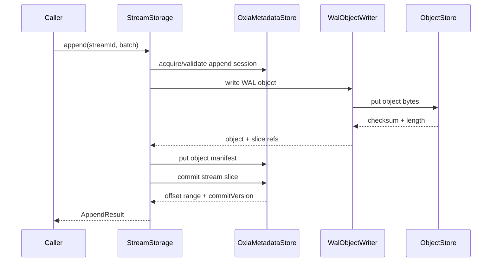
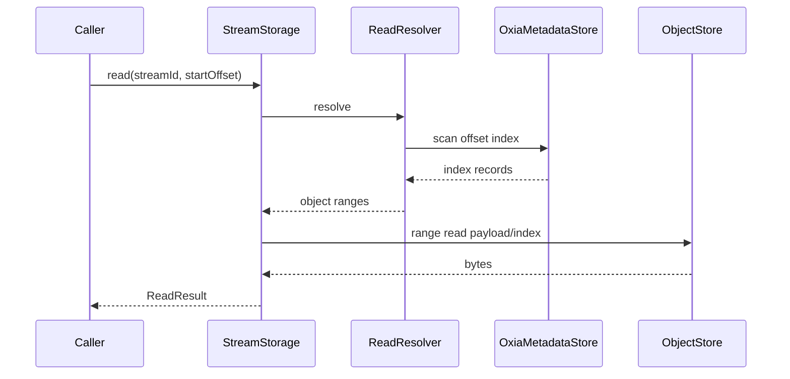

# 04 Core State Machines

本文定义 `nereus-core` 的 append、resolve/read、trim 和 recovery 状态机。

M0.5 status: the append state machine now uses the redesigned Oxia-compatible commit protocol from
`02-oxia-metadata-and-commit.md`: one stream-head conditional put is the append linearization point, and
offset-index plus committed-slice records are materialized indexes that can be repaired from the committed
head chain.

## 1. Core Components

Package plan:

```text
io.nereus.core
  DefaultStreamStorage

io.nereus.core.append
  AppendCoordinator
  AppendSessionManager
  WalFlushPlanner

io.nereus.core.read
  ReadResolver
  OffsetIndexCache
  ReadResourceLimiter
  ReadResourceReservation

io.nereus.core.trim
  TrimCoordinator

io.nereus.core.recovery
  OrphanObjectScanner
```

`DefaultStreamStorage` should be thin orchestration:

```text
createOrGetStream -> metadataStore
acquireAppendSession -> appendSessionManager
append -> appendCoordinator
resolve -> readResolver
read -> readResolver + walObjectReader
trim -> trimCoordinator
getStreamMetadata -> metadataStore + committed offset + trim
```

`AppendCoordinator` owns a per-stream append sequencer. Phase 1 may serialize the whole append operation
per stream for simplicity. A later optimization may upload WAL bytes concurrently, but visible
`commitStreamSlice` calls for the same stream must still enter Oxia in sequencer order.

Append work item shape inside `nereus-core`:

```java
record AppendWorkItem(
        StreamId streamId,
        AppendBatch batch,
        AppendOptions options,
        CompletableFuture<AppendResult> resultFuture) {
}
```

This internal type lets a future `WalFlushPlanner` group multiple stream slices into one physical WAL
object while still completing one caller future per stream append. Phase 1 can start with one
`AppendWorkItem` per WAL object, using `WalWriteOptions.forceSingleStreamObject=true`. This is a core
planner simplification only; `WalObjectWriter` still has to support multi-slice WAL objects and direct
multi-slice tests.

## 2. Append State Machine

High-level state:

```text
IDLE
  -> ENSURE_SESSION
  -> BUILD_WAL_OBJECT
  -> UPLOAD_WAL_OBJECT
  -> PUT_OBJECT_MANIFEST
  -> COMMIT_STREAM_HEAD
  -> MATERIALIZE_OFFSET_INDEX
  -> ACK_RESULT
```

### `ENSURE_SESSION`

Inputs:

- `streamId`
- `AppendOptions.appendSession`
- writer identity from `StreamStorageConfig`

Rules:

- read stream metadata and reject non-`ACTIVE` states before acquiring or using an append session；
- if options contains a non-expired session, first verify `session.streamId == streamId` and
  `session.writerId == config.writerId`；
- if missing and `autoAcquireSession=true`, acquire or reuse cached session；
- if missing and auto-acquire disabled, fail with `APPEND_SESSION_EXPIRED`；
- before starting WAL upload, ensure the session has at least
  `StreamStorageConfig.appendSessionMinCommitRemaining` remaining, otherwise renew first；
- session cache is an optimization only。

### `BUILD_WAL_OBJECT`

Input:

```text
streamId
append batch
session epoch
```

Output:

```text
WalWriteRequest
```

Rules:

- validate batch record count；
- compute `logicalBytes` as the sum of caller-visible payload bytes；
- assign relative offsets only；
- do not assign final stream offsets；
- include writer epoch and `writerRunIdHash` in WAL header/slice descriptor；
- carry canonicalized `AppendBatch.schemaRefs` into the slice descriptor。

### `UPLOAD_WAL_OBJECT`

Call:

```text
WalObjectWriter.write(WalWriteRequest)
```

Output:

```text
WalWriteResult(objectId, objectKey, objectChecksum, storageChecksum, written slices)
```

Rules:

- no metadata visibility yet；
- if upload fails, append fails before any stream-head commit；
- object may exist after timeout, but without offset index it is invisible。

### `PUT_OBJECT_MANIFEST`

Call:

```text
metadataStore.putObjectManifest(manifest.state=UPLOADED)
```

Rules:

- idempotent for same object id, WAL canonical object checksum, storage checksum, object length, and slice
  manifest；
- still no producer ack；
- if manifest fails, no stream-head commit。

### `COMMIT_STREAM_HEAD`

Call:

```text
metadataStore.commitStreamSlice(CommitSliceRequest)
```

The expected start offset is supplied by the per-stream append sequencer:

```text
initialExpectedStartOffset = metadataStore.getCommittedEndOffset(streamId)
expectedStartOffset = appendSequencer.nextOffset(streamId)
```

Rules:

- the sequencer initializes from `getCommittedEndOffset(streamId)`；
- after each successful commit, the sequencer advances its local expected offset to `offsetEnd`；
- if commit is not sent, no local expected offset may be consumed；
- if commit is sent and returns `OFFSET_CONFLICT`, refresh from `getCommittedEndOffset(streamId)` before
  accepting the next append for that stream；
- if commit is sent and final state is unknown, suspend new appends for that stream until a metadata
  refresh either discovers the same physical slice marker or observes the current committed end；
- the Oxia stream-head condition remains mandatory and rejects stale or competing writers；
- if head CAS loses only because same-writer renew, trim, or another compatible non-append head update
  changed the Oxia key version, `commitStreamSlice` retries internally with the latest head and preserves
  the updated session/trim fields；
- if a competing writer commits first, the sequencer must refresh metadata and either retry the local
  append with a fresh expected offset only when an explicit future retry policy allows it. Phase 1 default
  is to fail with retriable `OFFSET_CONFLICT`。

Commit success returns:

```text
offsetStart
offsetEnd
committedEndOffset
commitVersion
projectionRef
```

The stream-head CAS inside `commitStreamSlice` is the linearization point.

`commitStreamSlice` must also materialize the offset-index and committed-slice marker before returning a
successful `CommitSliceResult`. If the head CAS succeeds but this materialization cannot be confirmed
before timeout/cancellation, the append result is unknown final state and the same physical slice retry
must finish materialization from the commit-log chain.

Only the stream-head key is part of the append linearization point. Object reference and manifest
slice-state updates run after the stream commit as repairable metadata updates. A failure there cannot make
committed data logically uncommitted and cannot roll back the stream head.

### `MATERIALIZE_OFFSET_INDEX`

This is usually completed inside `metadataStore.commitStreamSlice`, before it returns success. It is
listed as a separate state because failure injection and recovery tests must cover the boundary after head
CAS and before read-index materialization.

Materialized records:

```text
/streams/{streamId}/offset-index/{offsetEnd}/0
/streams/{streamId}/committed-slices/{objectIdComponent}/{sliceIdComponent}
```

Rules:

- idempotently confirm an existing record has the same bytes as the committed `StreamCommitRecord`；
- conflicting bytes are `METADATA_INVARIANT_VIOLATION`；
- timeout here has unknown final state because the stream head may already be committed；
- read resolver may repair missing materialized records from the head commit chain before declaring a gap。

### `ACK_RESULT`

Build `AppendResult` from:

- commit result；
- written object slice, including `sliceId`, payload format, record/entry counts, logical bytes, and
  slice checksum；
- canonical schema refs copied through the written slice and offset index；
- entry index ref；
- object key and WAL canonical object checksum；
- generation and commit version。

If response is lost after this state, data remains visible.

`CommitSliceRequest.writerRunIdHash` is copied from the `DefaultStreamStorage` process incarnation that
created the `WalWriteRequest`; the metadata layer validates it against the object manifest before committing
visibility.

## 3. Append Conflict Handling

### Stale epoch or token

```text
commitStreamSlice -> FENCED_APPEND
```

Behavior:

- invalidate local session cache；
- do not ack；
- caller can retry after reacquire。

### Offset conflict

```text
commitStreamSlice -> OFFSET_CONFLICT
```

Possible reasons:

- another writer committed first；
- retry after lost ack without upper-layer dedup；
- stale committed-end cache。

Phase 1 behavior:

- for appends from the same `DefaultStreamStorage` instance, the per-stream sequencer should normally
  avoid surfacing conflicts；
- for conflicts caused by another writer/session, fail append as retriable；
- do not automatically rebase the already-uploaded slice to a later offset in Phase 1；
- do not try to infer dedup；
- future protocol projections handle producer sequence/dedup。

### Timeout

Append timeout and cancellation must be classified by the last irreversible boundary reached:

| Boundary | Timeout result | Visibility guarantee |
| --- | --- | --- |
| before WAL upload starts | `TIMEOUT` or `CANCELLED` | no object and no offset index |
| during WAL upload | `TIMEOUT`; upload may later succeed | object may become orphan, but no stream-head commit may be started by the timed-out attempt |
| after upload before manifest commit starts | `TIMEOUT` | object may exist, but no visibility |
| during manifest commit | `TIMEOUT` | manifest may exist, but no visibility unless a later explicit retry commits the slice |
| after stream-head CAS is sent | `TIMEOUT` with unknown final state | stream head may or may not have committed |
| after head CAS before index materialization confirms | `TIMEOUT` with unknown final state | stream head committed; offset index may lag until repair |

If timeout or cancellation fires after `commitStreamSlice` has been sent, the implementation must not report
success without the commit result. A retry that still has the same in-memory `objectId/sliceId` attempt can
use the stream-head commit chain or committed-slice marker to discover success. A caller-level retry after
losing that context may append duplicate data because Phase 1 has no producer dedup.

This boundary must surface as `TIMEOUT` or `CANCELLED` with unknown final state semantics. It must not be
collapsed into `OFFSET_CONFLICT`, `OBJECT_UPLOAD_FAILED`, `METADATA_CONDITION_FAILED`, or a generic retry
wrapper, because those errors would incorrectly suggest the append is known not to be visible.

### Idempotent slice replay

If `commitStreamSlice` finds an existing committed-slice marker for the same stream/object/slice, it should
return the original commit result instead of creating a second range. If the marker is missing, it must
search the stream-head commit chain for the same `commitId` before treating the attempt as a new commit.
This is only idempotency for the same physical slice commit; it is not producer-level dedup.

If the first marker read is missing and the head CAS fails or times out, the metadata layer must re-read
the head and search the committed chain before surfacing `OFFSET_CONFLICT` or a generic condition failure.
A reachable matching commit means the same physical slice already committed and should return the original
result after any missing derived records are materialized.

Retry scope:

- retry inside the same append attempt may reuse the same `WalWriteResult`, `sliceId`, and
  `CommitSliceRequest`；
- retry after the caller loses the append future result but still has the same in-memory attempt context
  can get the original result through the stream-head commit chain or committed-slice marker；
- retry after process crash or caller-level resubmission normally creates a new physical slice and may
  append duplicate data because Phase 1 has no producer sequence dedup。
- a new physical WAL object attempt must allocate a fresh object sequence. It must not reuse a sequence
  value from a timed-out, cancelled, or failed attempt whose object upload may have reached the object
  store.

### Partial slice commit

When one WAL object contains multiple slices:

```text
for each slice:
  commitStreamSlice(slice)
```

Rules:

- each slice produces independent append result；
- failure for one slice does not roll back successful slices；
- manifest/object references protect the object while any slice is visible。
- a multi-stream flush must gather each slice's own append session epoch/token before upload；
- object manifest is written once for all uploaded slices, then each stream slice is committed
  independently through that stream's sequencer；
- if `forceSingleStreamObject=true`, a request containing slices from multiple streams is invalid before
  upload. The writer must not split a request into several objects implicitly。

## 4. Resolve State Machine

Input:

```text
streamId
startOffset
ResolveOptions
```

Validation:

- `startOffset < 0` fails with `INVALID_ARGUMENT` before cache lookup or metadata scan。

State:

```text
CHECK_TRIM
  -> CHECK_CACHE
  -> SCAN_OFFSET_INDEX
  -> SELECT_GENERATION
  -> BUILD_RESOLVED_RANGES
```

### `CHECK_TRIM`

Read stream metadata first. `ACTIVE` and `SEALED` streams are readable; `CREATING`, `DELETING`, and
`DELETED` follow the API state table in `01-api-and-domain-model.md`.

Read trim low-watermark:

```text
trimOffset = metadataStore.getTrim(streamId)
```

If:

```text
startOffset < trimOffset
```

fail with `OFFSET_TRIMMED`.

### `CHECK_CACHE`

`OffsetIndexCache` key:

```text
streamId + offset bucket
```

Cache value:

```text
ordered OffsetIndexRecord list with metadataVersion
trimOffset observed before the scan
createdAtMillis
```

Cache can be used only when:

- `ResolveOptions.allowCache=true`；
- cached range covers `startOffset`；
- not older than configured TTL or not invalidated by watch。
- `startOffset >= cached trimOffset`。

Cache must not store negative lookups or EOF results. A scan that returns no candidate may be immediately
followed by an append commit; caching that empty result would turn a transient EOF into a stale read bug.

### `SCAN_OFFSET_INDEX`

Metadata query:

```text
scan first offset-index entries where offsetEnd > startOffset
```

If no candidate:

- get `committedEndOffset`；
- if `startOffset >= committedEndOffset`, return empty resolve result；
- otherwise call `metadataStore.repairDerivedStreamIndexes(streamId, startOffset, maxRanges)` and retry
  the bounded offset-index scan；
- if repair returns `repairBudgetExhausted=true` without covering `startOffset`, continue bounded repair
  attempts only while the read timeout and configured metadata repair budget allow；exhausting that local
  budget returns retriable `READ_RESOLUTION_FAILED`, not metadata corruption；
- if repair cannot materialize a covering committed record, fail `METADATA_INVARIANT_VIOLATION` because
  stream head and commit-log truth cannot be projected into the read index。

### `SELECT_GENERATION`

For all scanned candidates covering target offset:

```text
offsetStart <= startOffset < offsetEnd
```

choose:

```text
max(generation) where tombstoned=false
```

Phase 1 only expects generation `0`, but code should not hard-code that assumption in resolver.

Lookahead rule:

- Phase 1 append entries are non-overlapping, so the first covering generation-0 entry is enough；
- the resolver API and cache should still allow a bounded lookahead；
- Future 4 must define the exact coverage lookup strategy for larger compacted ranges before generation
  replacement is enabled。

### `BUILD_RESOLVED_RANGES`

Return as many contiguous records as allowed by:

- `ResolveOptions.maxRanges`
- `ReadOptions.maxRecords` when called by read；
- object/index entry boundaries。

Do not cross a metadata gap. A gap below `committedEndOffset` is a correctness error.
Each `ResolvedObjectRange` must carry the slice checksum copied from the selected offset index record.
Each `ResolvedObjectRange` must also carry the slice-level schema refs copied from the selected offset
index record.
The resolver must not require object manifest reads to provide checksum data for committed reads.

Iterative range-building algorithm:

```text
cursor = startOffset
remainingRecords = ReadOptions.maxRecords when called by read, otherwise Long.MAX_VALUE
while ranges.size < maxRanges and remainingRecords > 0:
  candidates = scan offset-index where offsetEnd > cursor
  selected = highest non-tombstoned generation covering cursor
  if no selected:
    committedEnd = getCommittedEndOffset(streamId)
    if cursor >= committedEnd: break
    repairDerivedStreamIndexes(streamId, cursor, remainingRepairBudget)
    retry scan once within the read budget
    if repair budget is exhausted without covering cursor: fail READ_RESOLUTION_FAILED as retriable
    if still no selected: fail METADATA_INVARIANT_VIOLATION
  if selected.offsetStart > cursor: fail METADATA_INVARIANT_VIOLATION
  append range clipped to remainingRecords
  cursor = min(selected.offsetEnd, cursor + remainingRecords)
```

Phase 1 generation `0` ranges are non-overlapping, so the selected range normally has
`selected.offsetStart <= cursor` and `selected.offsetEnd > cursor`. Future compaction can add larger
overlapping higher-generation ranges, but must preserve this resolver contract.

## 5. Read State Machine

Input:

```text
streamId
startOffset
ReadOptions
```

State:

```text
RESOLVE
  -> RANGE_READ_OBJECT
  -> DECODE_ENTRY_INDEX
  -> CLIP_TO_REQUEST
  -> BUILD_READ_RESULT
```

### `RESOLVE`

Call:

```text
resolve(streamId, startOffset, toResolveOptions(readOptions))
walObjectReader.read(startOffset, resolveResult.ranges, readOptions)
```

Empty resolve result:

```text
ReadResult(endOfStream=true, nextOffset=startOffset, batches=[])
```

### `RANGE_READ_OBJECT`

For each `ResolvedObjectRange`:

```text
objectStore.readRange(objectKey, objectOffset, objectLength)
```

Rules:

- Phase 1 reads the full resolved slice payload before clipping so it can verify the slice checksum；
- before the first object read for each resolved range, reserve one read permit and the checked sum of
  `ResolvedObjectRange.objectLength` plus the referenced entry-index byte length from the read buffer
  budget；
- if a read permit or buffer reservation is unavailable, fail the read before object IO with retriable
  `BACKPRESSURE_REJECTED`；
- release read permit and buffer reservation on success, object read failure, decode failure, checksum
  failure, timeout, cancellation, and close；
- the expected slice checksum comes from `ResolvedObjectRange.sliceChecksum`, not from object manifest；
- object read failure is retriable unless checksum proves corruption；
- no object list；
- no manifest-only read path；
- emit read amplification metrics using full slice payload plus entry-index bytes downloaded and clipped
  payload bytes returned。

### `DECODE_ENTRY_INDEX`

If entry index is in footer:

```text
readRange(objectKey, entryIndexOffset, entryIndexLength)
```

If inline:

```text
fail UNSUPPORTED_FORMAT in Phase 1
```

If index object:

```text
fail UNSUPPORTED_FORMAT in Phase 1
```

Phase 1 implements footer-only and fails fast for unsupported locations while keeping the enum values.

### `CLIP_TO_REQUEST`

Clip records to:

```text
startOffset
maxRecords
maxBytes
```

For `OPAQUE_RECORD_BATCH`, Phase 1 only supports `recordCount=1` per entry. Therefore clipping is
entry-aligned and exact by offset in standalone tests. If a future payload format allows
`recordCount>1`, the WAL reader must use that format's decoder or projection metadata before returning a
partial batch.

For Phase 1 opaque reads, each returned `ReadBatch` represents exactly one `EntryIndexItem` and therefore
exactly one logical record. The reader must not merge adjacent opaque entries into one payload even when
their physical bytes are contiguous.

Zero-byte entries are allowed. They count against `maxRecords`, advance `nextOffset`, and may produce a
`ReadBatch` with zero payload bytes. The read loop must advance by returned records, not only by returned
payload bytes, to avoid infinite loops when `maxBytes` does not decrease.

Byte-limit loop rule:

- keep scanning entry-index items while `returnedRecords < maxRecords`；
- if the next entry has positive payload length and `returnedBytes + entryLength > maxBytes`, stop before
  that entry；
- if no record has been returned yet, that stop condition is `READ_LIMIT_TOO_SMALL`；
- if the next entry has zero payload length, it may be returned even when `returnedBytes == maxBytes`；
- never use `remainingBytes > 0` as the only loop condition, because that drops valid zero-byte records.

When clipping to entry boundaries, physical entry reads use:

```text
entryObjectOffset = resolvedRange.objectOffset + entryIndexItem.payloadOffset
```

where `entryIndexItem.payloadOffset` is relative to the resolved stream slice payload.

`ReadBatch.sourceObjectOffset/sourceObjectLength` must describe the exact physical payload bytes returned
after clipping, while `ResolvedObjectRange.objectOffset/objectLength` describes the full committed stream
slice payload range.
This exact physical byte reporting is a Phase 1 `CompressionType.NONE` rule. Future compression support
must update this contract before enabling compressed WAL objects.
`ReadBatch.schemaRefs` is copied from the resolved range, not decoded from payload bytes.

The result `nextOffset` is:

```text
lastReturnedReadBatch.range.endOffset
```

If no records returned because `maxBytes` is too small for the first entry, fail with a validation-style
read error rather than looping forever.

## 6. Trim State Machine

Input:

```text
streamId
beforeOffset
TrimOptions
```

State:

```text
READ_STREAM_METADATA
  -> VALIDATE_BOUNDS
  -> UPDATE_TRIM
  -> INVALIDATE_CACHE
```

Rules:

- `beforeOffset` must not decrease current trim offset；
- `beforeOffset` must not exceed committed end offset；
- offset index entries remain in Oxia；
- object bytes remain in object store；
- future GC uses trim plus cursor/reader references。

Read after trim:

- if `beforeOffset > 0`, `read(streamId, beforeOffset - 1)` fails with `OFFSET_TRIMMED`；
- negative read offsets fail with `INVALID_ARGUMENT`, not `OFFSET_TRIMMED`；
- `read(streamId, beforeOffset)` succeeds if committed。

## 7. Recovery Model

Phase 1 recovery is metadata-driven.

### Crash before object upload

No durable bytes. No metadata. Client retries.

### Crash after upload before manifest

Object may exist, but:

- no manifest；
- no offset index；
- not visible。

GC/orphan scanner can later remove by object-store operational scan, but correctness does not rely on it.

### Crash after manifest before offset commit

Object manifest exists:

```text
state = UPLOADED
no offset index reference
```

Recovery options:

- retry commit if writer still owns session and request context exists；
- otherwise leave for orphan TTL。

Phase 1 default: no autonomous recommit. Avoid acking data whose client result is unknown.

### Crash after offset commit before ack

Offset index exists and committed end offset advanced. Data is visible.

Phase 1 does not solve producer dedup. Future protocol layers will use producer sequence or idempotency.

## 8. `DefaultStreamStorage` Construction

```java
public final class DefaultStreamStorage implements StreamStorage {
    public DefaultStreamStorage(
            StreamStorageConfig config,
            OxiaMetadataStore metadataStore,
            WalObjectWriter walObjectWriter,
            WalObjectReader walObjectReader,
            Clock clock,
            Executor callbackExecutor) {
    }
}
```

Config:

```java
public record StreamStorageConfig(
        String cluster,
        String writerId,
        Duration appendSessionTtl,
        Duration appendSessionRenewBefore,
        Duration appendSessionMinCommitRemaining,
        Duration appendTimeout,
        Duration readTimeout,
        Duration shutdownGrace,
        int maxResolveRanges,
        int maxInFlightAppends,
        long maxBufferedBytes,
        int maxConcurrentObjectReads,
        long maxReadBufferBytes,
        int maxObjectBytes,
        int maxAppendBatchRecords,
        Duration offsetIndexCacheTtl,
        boolean autoAcquireAppendSession,
        boolean enableMetadataWatch,
        boolean enableOffsetIndexCache) {
}
```

`writerId` must be unique for each live `DefaultStreamStorage` process. Reusing it across live processes
turns an ownership conflict into ordinary offset CAS contention and weakens append-session fencing.
`DefaultStreamStorage` also generates a random key-safe `writerRunId` for object id/key construction. The
run id is not part of append-session ownership and must change on process restart. It must be generated
from at least 128 bits of cryptographically strong randomness and converted with
`DeterministicIds.randomRunIdHash`.

Threading:

- public methods should return quickly；
- blocking object store or metadata calls must run on dedicated clients/executors；
- completion callbacks should not run expensive decode on metadata IO thread。

Suggested initial defaults:

| Setting | Default |
| --- | --- |
| `appendSessionTtl` | 30 seconds |
| `appendSessionRenewBefore` | 10 seconds |
| `appendSessionMinCommitRemaining` | 5 seconds |
| `appendTimeout` | 30 seconds |
| `readTimeout` | 30 seconds |
| `shutdownGrace` | 30 seconds |
| `maxResolveRanges` | 64 |
| `maxInFlightAppends` | 1024 |
| `maxBufferedBytes` | 64 MiB |
| `maxConcurrentObjectReads` | 64 |
| `maxReadBufferBytes` | 128 MiB |
| `maxObjectBytes` | 16 MiB |
| `maxAppendBatchRecords` | 100000 |
| `offsetIndexCacheTtl` | 5 seconds |
| `enableMetadataWatch` | false |
| `enableOffsetIndexCache` | true |

These defaults are implementation starting points, not product SLA. Tests should override them with small
values to exercise timeout and backpressure paths.

Config validation:

- `cluster` and `writerId` must be non-blank；
- `cluster` is encoded with `KeyComponentCodec.encodeComponent(cluster)` before use in Oxia paths or
  object keys. The raw value must never be concatenated into a path；
- durations must be positive；
- `appendSessionRenewBefore < appendSessionTtl`；
- `appendSessionMinCommitRemaining < appendSessionTtl`；
- `maxResolveRanges > 0`；
- `maxInFlightAppends > 0`；
- `maxBufferedBytes > 0`；
- `maxConcurrentObjectReads > 0`；
- `maxReadBufferBytes > 0`；
- `maxObjectBytes > 0`；
- `maxAppendBatchRecords > 0`；
- `offsetIndexCacheTtl > 0` when `enableOffsetIndexCache=true`；
- `maxObjectBytes <= maxBufferedBytes` is required for the simple Phase 1 in-memory WAL writer；
- `maxObjectBytes <= maxReadBufferBytes` is required for the Phase 1 full-slice WAL reader；
- `appendSessionRenewBefore + appendSessionMinCommitRemaining <= appendSessionTtl` is recommended so a
  late renewal still leaves enough commit window for normal cases。

Session lease rules:

- background renewal should renew when remaining lease is at or below `appendSessionRenewBefore`；
- append should not start WAL upload unless the selected session has at least
  `appendSessionMinCommitRemaining` remaining；
- before sending `commitStreamSlice`, append should renew again if remaining lease is below
  `appendSessionMinCommitRemaining`；
- if renewal fails, the append must not send `commitStreamSlice` and should fail with
  `APPEND_SESSION_EXPIRED` or `FENCED_APPEND` depending on the metadata error；
- if `commitStreamSlice` has already sent or may send the stream-head CAS, the
  timeout/unknown-final-state rules still apply.

Lifecycle:

- `close()` transitions the instance to closing and rejects new public calls with `STORAGE_CLOSED`；
- in-flight appends that have not uploaded bytes may be completed with `STORAGE_CLOSED`；
- in-flight appends that already uploaded bytes but have not completed stream-head commit and index
  materialization should not be acked during close unless their normal commit path succeeds；
- in-flight appends that have already sent `commitStreamSlice` should be allowed to observe the
  commit/materialization result or timeout according to append timeout rules before owned clients are
  closed；
- in-flight reads may finish or fail with `STORAGE_CLOSED` depending on client shutdown ordering；
- close should first stop accepting work and stop background renew/watch tasks, then wait up to a
  configured shutdown grace for in-flight irreversible operations, then close owned clients；
- `close()` must close or release owned metadata/object clients only when `DefaultStreamStorage` created
  them. Injected clients owned by tests or embedding code should have explicit ownership flags。

## 9. Backpressure Boundary

Phase 1 can start simple, but append coordinator should have clear rejection points:

```text
maxInFlightAppends
maxBufferedBytes
maxObjectBytes
maxAppendBatchRecords
maxConcurrentObjectReads
maxReadBufferBytes
```

Accounting rules:

- `maxInFlightAppends` counts append work items accepted by `AppendCoordinator` and releases on every
  terminal future path；
- `maxAppendBatchRecords` is checked against `AppendBatch.recordCount()` before WAL layout；
- `maxBufferedBytes` accounts in-flight encoded WAL-object bytes, not committed stream size. The
  coordinator should reserve a conservative estimate before async WAL work starts and release it when the
  append reaches any terminal state；
- the estimate must include payload bytes plus deterministic metadata/index overhead. After the WAL writer
  sizing pass computes the exact encoded object length, the coordinator either adjusts the reservation
  atomically or fails before upload if the adjusted size would exceed `maxBufferedBytes`；
- `maxObjectBytes` is a hard cap on the final encoded WAL object length. The coordinator copies it into
  `WalWriteOptions.maxObjectBytes`; the writer rejects oversized objects before `putObject`；
- `WalWriteOptions.targetObjectSizeBytes` is a planning target for future grouping. With the initial
  one-work-item planner it may equal `maxObjectBytes` and must never be treated as the hard cap.
- `maxConcurrentObjectReads` counts resolved-range reads that have passed resolve and are about to call
  `ObjectStore.readRange` for slice payload or entry-index bytes；
- `maxReadBufferBytes` accounts the full resolved slice payload plus entry-index bytes that Phase 1 must
  download before clipping, not the clipped payload bytes returned to the caller；
- read reservations are acquired before object IO and released on every terminal path。

Failures:

- backpressure rejection should complete with retriable `BACKPRESSURE_REJECTED`；
- an append whose final encoded WAL object is larger than `maxObjectBytes` should fail with
  non-retriable `INVALID_ARGUMENT` before upload；
- rejected append must not upload object bytes；
- rejected read must not start object range IO。

## 10. Cache Rules

Offset index cache may cache only committed index records.
It may cache overlapping records for future generation support, but Phase 1 must cache only positive
records returned by `scanOffsetIndex`.

Invalidation triggers:

- trim update；
- offset index watch notification；
- session fencing only affects append, not committed reads；
- checksum/corruption read failure should evict the affected range；
- watch reconnect or watch error should invalidate all streams covered by that watcher, or mark them
  read-through-only until the next successful scan。

Cache stale behavior:

- if cached range points to object read missing/corrupt, refetch metadata before reporting final error；
- if refetched metadata matches cache and read still fails, report object read/corruption error；
- if a cached range does not cover `startOffset`, do not infer EOF from cache; scan Oxia。
- watch notifications must not populate positive cache entries. They only invalidate entries or mark the
  stream read-through-only until a scan refreshes it；
- an out-of-order watch notification whose `metadataVersion` is lower than the cached range's observed
  version may be ignored as stale.

## 11. Sequence Diagrams

Append:



Read:


