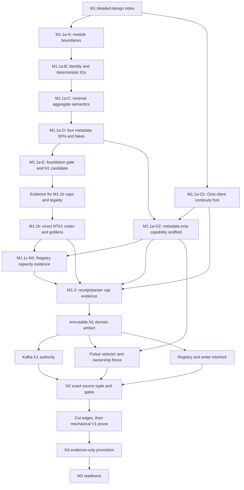

# M1 execution index

## Purpose and authority

M1 replaces the active V1 build/runtime graph with the first pure V2 metadata foundation. This file is the execution
index for that work: it orders reviewable slices, assigns prerequisites and gates, and prevents one implementation
target from crossing an OPEN contract. It does not restate the architecture.

Authority remains with accepted ADRs and the normative V2 contracts. In particular:

- [ADR 0081](../../../decisions/0081-v2-m1-pure-active-graph-and-promotion-boundary.md) owns the pure-graph,
  module, gate, and promotion boundary;
- [ADRs 0082 through 0085](../../../decisions/0082-v2-m1-domain-and-control-authority-contracts.md) own the domain,
  SPI, Kafka, Pulsar, Registry, continuity, and M1.1a readiness decisions;
- [the implementation plan](../../08-implementation-plan-and-gates.md) owns M1 scope and aggregate gates;
- [the scenario matrix](../../09-scenario-evidence-matrix.md) and
  [structured scenarios](../../v2-scenarios.json) own acceptance status;
- detailed designs in this directory own only code layout, call paths, threading, tests, and delivery order.

If a detailed design conflicts with an accepted ADR, the ADR wins and the slice stops until the detailed design is
corrected. A detailed-design status is not executable evidence.

## Baseline and completion boundary

The authoring baseline is the clean M0 split commit
`c8c1d0030ece7ce0ee4014544ce7f612e95fd394`. It is a repository milestone anchor, not a replacement for
`docs/v2/source-locks.json` or a promotion receipt.

M1 started from these facts; the first bullet is now superseded by the implementation record below:

- the M0 baseline had V2 implementation `NotStarted` and only documentation gates;
- the active Gradle/BOM/CI graph is still V1 residue, including KoP runtime;
- M1.1a is complete and M1.1b is exact-locally complete;
- P1 implementation is in progress: NPS1, closed transitions, the selector/aggregate coordinator, exact-key plus
  continuity invalidation, two source-locked real-Oxia lifecycle tests, Pulsar fork native witness/A-read-B/atomic
  ACTIVE-fence primitives through `09fe914e4a`, and the filtered deterministic P1 artifact builder are implemented.
  The immutable P1 adapter input from Nereus `23064b3b` is now locked and separately gated. Native capability
  admission, the combined source-qualified gate/receipt, R1, final exact-source aggregation,
  pure-V2 graph pruning, and final promotion remain OPEN or pending. K1 is focused-exact complete but non-promotable.
  M1.1c-R0 has
  closed only the Registry writer-count/canonical-capacity input to R1, and M1-2 has closed only the persisted-v1
  receipt/parser cap input to the later G1 production validator.

M1 completes only when `v2M1FinalCheck` validates the pure V2 active graph, exact-source results, and trusted receipts.
Passing an intermediate slice gate cannot change M1 or a scenario to `PASSED_CURRENT_SOURCE`.

## Slice DAG

The graph expresses correctness dependencies, not permission to run several repository-mutating targets together.
Each target owns one row below and must preserve unrelated worktree state.

## Slice inventory

| Slice | Deliverable | Prerequisite | Exit gate | Current state |
| --- | --- | --- | --- | --- |
| `M1.1a-A` | add `nereus-domain` and `nereus-metadata-spi`; enforce Java 17/JDK-only dependency direction | this index and accepted [M1.1a design](m1.1a-domain-spi-foundation.md) | module compile plus dependency-surface checks | implemented and foundation-gated |
| `M1.1a-B` | bootstrap IDs, `ProtocolKindV1`, NPC1/NTI1/NPN1 leaves, NTB1/NSE1 IDs, strict names and goldens | `M1.1a-A` | domain unit/golden tests | implemented and foundation-gated |
| `M1.1a-C` | minimal independent aggregate values and foundation-only validator | `M1.1a-B` | semantic/negative API tests; no NTA1 activation | implemented and foundation-gated |
| `M1.1a-D` | exactly four production capabilities, closed outcomes, snapshots, deterministic test fakes | `M1.1a-C` | SPI contract tests | implemented and foundation-gated |
| `M1.1a-E` | `v2M1FoundationCheck`, reproducible JAR/source-JAR/POM hashing, M1 `InProgress` handoff | `M1.1a-A..D` | foundation gate; never M1 PASS | local gate implemented; N1 promotion pending |
| `M1.1a-O1` | expose ready/loss lifecycle from the Oxia client dummy barrier, including assignment-stream gaps and cancelable notification attempts; no server wire/RPC | confirmed client `24b730d1` / server `37a17bef` bases | fork focused tests and clean fork state | focused target complete at client `091a42c`; [design and evidence](m1.1a-oxia-client-continuity.md); no scenario promotion |
| `M1.1a-O2` | V2 aggregate/selector/Registry adapter scaffolding and store-wide continuity capability | `M1.1a-D`, `M1.1a-O1` | local fake tests; exact-source conformance remains pending | locally verified at Nereus `050f908a`: 69 focused and 299 whole-module tests; [accepted design](m1.1a-oxia-capability-scaffold.md) and [local-only receipt](../../evidence/v2-m0/m1.1a-o2/README.md); no scenario promotion |
| `M1.1b-Q1` | collect NTA1 bounds, legality, pinned-name, checked-arithmetic, and candidate-wire evidence | `M1.1a-E`; O2 codec port remains fail closed | `v2M1Nta1ReadinessCheck`; readiness only | historical evidence complete at `94881e67`: 14 focused tests and immutable [non-promotable receipt](../../evidence/v2-m0/m1.1b-q1/README.md) |
| `M1.1b` | implement the accepted NTA1 encoder/parser/validator, exact caps/goldens, pure-input Pulsar inventory boundary, and O2 aggregate codec | accepted [M1.1b design](m1.1b-nta1-codec.md) plus Q1 evidence | `v2M1Nta1CodecCheck`; exact local only | exact-local implementation complete at `01a70f17`; 55 domain, 73 focused O2, 303 whole metadata-oxia tests; [non-promotable receipt](../../evidence/v2-m0/m1.1b/README.md) |
| `M1.1c-R0` | test/evidence-only Registry writer-cohort inventory and canonical-capacity accounting; no production authority | accepted [R0 design](m1.1c-registry-capacity-spike.md), `M1.1b`, and O2 fail-closed Registry port | `v2M1RegistryCapacityCheck`; readiness only | verified at Nereus `03d27256`: 18 focused tests and deterministic [non-promotable evidence](../../evidence/v2-m0/m1.1c-r0/README.md) accept 14 writers and 51,016 canonical bytes |
| `M1-2` | strict receipt/parser cap model, representative roots/attachments, path and symlink safety, stable errors, and deterministic non-promotable evidence | M1.1a O1/O2 receipts, `M1.1b`, and `M1.1c-R0` | `v2M1ReceiptCapsCheck`; readiness only | verified at Nereus `75593faf`: 36 focused tests and deterministic [non-promotable evidence](../../evidence/v2-m0/m1-2-receipt-caps/README.md); ADR 0084 owns the accepted cap table |
| `N1` | immutable, non-overwriteable domain/SPI artifact with source/JAR/source-JAR/POM/metadata identities | accepted M1-2 receipt caps | `v2M1N1ArtifactCheck` | verified immutable input from source `330aaec3`; manifest `9058ff01`; [design and receipt](n1-immutable-domain-artifact.md) |
| `K1` | complete Kafka feature-2/API-32000/CreateTopics/image/publication authority | immutable N1 domain artifact | `v2M1K1FocusedCheck` | verified at Kafka `8afbc42566`: 39 tests in 16 suites, exact N1/source/schema boundary, [non-promotable receipt](../../evidence/v2-m1/k1/README.md) |
| `P1` | selector CAS, authoritative ownership A/read/B, atomic ACTIVE fence and invalidation | immutable N1 artifact plus `M1.1a-O2` | Pulsar/Oxia focused source gate | [accepted code-level design](p1-pulsar-selector-and-ownership-fence.md); Nereus real-Oxia lifecycle, Pulsar native primitives, and immutable adapter artifact implemented; native admission/combined receipt pending |
| `R1` | compatibility-namespace Registry, writer commitment/interlock, derived views | immutable N1 artifact, accepted `M1.1c-R0`, and `M1.1a-O2` | `REGISTRY_CONFORMANCE` | capacity input accepted; production codec/store/interlock and conformance remain NotStarted |
| `G1` | fast/exact/final M1 gates and production receipt validators | K1/P1/R1 plus accepted M1-2 receipt caps | `v2M1Check`, `v2M1ExactSourceCheck`, `v2M1FinalCheck` | M1-2 input accepted; blocked on K1/P1/R1 and the separately reviewed production validator |
| `V1P` | cut settings/BOM/publication/CI edges, then remove V1 sources/tasks/scripts and KoP runtime | replacement graph and candidate M1 gates | active-graph/V1-absence checks | last mechanical implementation step |
| `N3` | receipts, attachments, exact scenario/index promotion only | trusted N2 execution | final receipt validation | evidence only |

## Codex target boundaries

Use one target per item below. A target must not silently absorb the next item because its tests happen to pass.

1. **Module boundary target**

   Add only the two projects, build/BOM entries, empty compile classpaths where required, and dependency/API-surface
   checks. Do not add identity or backend code.

2. **Identity/domain target**

   Add bootstrap identities, authority-leaf codecs, deterministic IDs, the minimal semantic aggregate model, validators,
   and unit/golden tests. Do not add NTA1 encoder/parser classes or a production backend.

3. **Metadata SPI target**

   Add exactly four capability interfaces, closed mutation results, versioned snapshots, deterministic in-memory test
   fixtures, and the intermediate foundation gate. Do not add generic metadata operations or Oxia dependencies.

4. **Oxia client continuity target**

   Work in the locked Oxia Java client fork only. Expose the existing first-dummy ready barrier and discontinuity/loss
   lifecycle; do not change the Oxia server protocol, add a durable cursor, or persist provider identities.

5. **Metadata-Oxia scaffold target**

   Consume the exact SPI, add capability adapters and store-wide continuity invalidation scaffolding, and keep all V2
   runtime activation fail-closed until exact-source conformance exists. Existing V1 best-effort watches do not satisfy
   this target.

Items 1 through 3 are implemented and locally gated as the M1.1a-A foundation described by
[M1.1a domain/SPI detailed design](m1.1a-domain-spi-foundation.md). Item 4 now has an
[accepted latest-source audit and component design](m1.1a-oxia-client-continuity.md), a pushed final fork, immutable
artifact/runtime identities, and focused current-source evidence. Item 5 now has a
[accepted, locally verified component design](m1.1a-oxia-capability-scaffold.md), immutable artifact bundle, corrected
aggregate reader, four single-key adapters, and local-only receipt. Runtime activation remains fail closed.

## Scenario ownership during M1.1a

M1.1a contributes executable local evidence but does not create a current-source PASS by itself.

| Scenario | M1.1a contribution | Still required after M1.1a |
| --- | --- | --- |
| `V2-META-002` | aggregate value/snapshot shape, four capability surfaces, closed fake outcomes | Kafka atomic authority, real Oxia exactness/response-loss, no child authority in the final graph |
| `V2-META-003` | non-zero IDs, protocol codes, NPC1/NTI1/NPN1/NTB1/NSE1 goldens, leaf/key cross-checks | accepted Pulsar maximum-name vectors and cross-repository artifact tests |
| `V2-META-004` | independent-field model and exclusion of derived/mutable facts | complete M1.1b field table, codec, caps, legality matrix, strict parser, Kafka/Oxia equality |
| `V2-PROFILE-001` | immutable selected profile/origin/catalog semantic values | complete creation authorities and runtime open/replay tests |
| `V2-MIGRATION-001` | ordinal-zero and second-epoch API absence in the domain/SPI | Kafka/Pulsar authority and process evidence |

`V2-META-003` is `IMPLEMENTED_NOT_RUN` because it now has a production owner and executable foundation gate, while its
full cross-repository/cap evidence has not run. All broader rows above remain `PLANNED`. A focused local unit test never
justifies `PASSED_CURRENT_SOURCE`.

## Commit and review order

The expected review sequence is:

1. this execution index and the first component design;
2. additive module/build boundary;
3. identity/domain implementation;
4. SPI/test-fixture implementation and foundation gate;
5. Oxia client fork in its repository;
6. metadata-oxia scaffolding;
7. historical [M1.1b-Q1 evidence collection](m1.1b-nta1-codec.md) and completed M1.1b grill;
8. accepted NTA1 production codec, goldens, inventory boundary, and O2 aggregate adapter;
9. bounded Registry writer-cohort/count/bytes evidence under the accepted
   [M1.1c-R0 design](m1.1c-registry-capacity-spike.md), followed by an accepted cap;
10. verified representative receipt/parser output evidence and accepted safety caps (complete at `75593faf`);
11. immutable, non-overwriteable N1 domain/SPI artifact publication with JAR/source-JAR/POM/Gradle-metadata hashes;
12. separate Kafka K1, Pulsar P1, and Registry R1 changes consuming exact N1 artifacts; K1 now has focused exact-source
    evidence at Kafka `8afbc42566`; P1 has an accepted [code-level design](p1-pulsar-selector-and-ownership-fence.md)
    and active implementation, while R1 and aggregate promotion remain pending;
13. M1 fast/exact/final gate and receipt-validator implementation without promotion;
14. settings/BOM/publication/CI cut;
15. independent mechanical V1/KoP-runtime deletion;
16. N2 candidate source lock plus fast/exact/final execution over the pruned graph;
17. evidence-only N3 promotion.

Architecture changes, cross-repository source changes, and mass deletion must remain separate commits. The V1 prune
must not start merely because the replacement modules compile.

## Gate ladder

| Gate | When it exists | What it proves | What it cannot prove |
| --- | --- | --- | --- |
| `v2DocumentationCheck` / `v2M0Check` | now | accepted documentation/source/scenario consistency | any M1 implementation |
| `v2M1FoundationCheck` | now | domain/SPI tests, dependency boundaries, forbidden API absence, reproducible JAR/source-JAR/POM hashes | complete NTA1, backend conformance, pure final graph, M1 PASS |
| `v2M1OxiaScaffoldCheck` | now | locked O1 dependency resolution, four single-key adapters, local response-loss/continuity/race tests; after M1.1b the focused namespace has 73 clean tests | selector/Registry codecs, real Oxia/Pulsar conformance, P1/R1, runtime activation, scenario promotion, M1 PASS |
| `v2M1Nta1CodecCheck` | now | production NTA1/validator, exact goldens, pure-input inventory boundary, O2 aggregate wiring, clean non-zero local tests, JDK-only and Q1 isolation | K1/P1/R1, real Oxia/Registry conformance, runtime activation, scenario promotion, M1 PASS/Final |
| `v2M1Nta1ReadinessCheck` | now | 14 evidence-only tests over real domain objects, candidate bounds/legality, strict UTF-8/EOF/overflow/allocation, and generated JSON equality | accepted caps/policy, production encoder/parser/goldens, backend/runtime conformance, scenario promotion, M1 PASS |
| `v2M1RegistryCapacityCheck` | now | deterministic writer topology, exact 120/184/192/256/65,536 accounting, overflow and lifecycle rejection, generated evidence equality, and non-promotion boundary | R1 production codec/Store/interlock, real Oxia, allocator mode, `REGISTRY_CONFORMANCE`, scenario promotion, M1 PASS |
| `v2M1ReceiptCapsCheck` | now | 36 clean focused tests over deterministic representative roots/attachments, JCS/parser/path/symlink boundaries, exact selected-cap formulas, committed/generated equality, and non-promotion boundary | production G1 validator, N1/K1/P1/R1, Final/N2/N3, scenario promotion, M1 PASS |
| `v2M1Check` | after K1/P1/R1 and graph cut | ordinary deterministic M1 fast suite and V1 absence | exact external source/artifact/runtime identity |
| `v2M1ExactSourceCheck` | N2 | clean exact forks, immutable artifacts, real Oxia, focused fork tests | evidence provenance without trusted workflow/N3 |
| `v2M1FinalCheck` | N2/N3 | referenced gate/receipt schema and aggregate result | work not explicitly referenced by the receipts |

The intermediate foundation task has a deliberately different name from `v2M1Check`. It must report
`InProgress`/foundation-only language and fail if a script or document calls it M1 Final or M1 PASS.

## Remaining M1 validation boundary

M1.1b-Q1 was readiness evidence used to freeze the production contract and is not rerun as a promotion suite. The
foundation/NTA1 local tests remain in ordinary CI as regression protection. M1 still requires K1/P1/R1 functional
tests, real-Oxia exact-source conformance, pure-V2 active-graph/V1-absence checks, N2 exact artifact/source validation,
and the receipt-only N3 promotion. `v2M1FinalCheck` aggregates referenced outcomes and does not rerun those suites.

Version 0.2 admits fresh deployments only. M1 tests the deterministic pure-input Pulsar name-inventory tool and its
failure boundary, but does not require execution against a customer or existing production cluster. Real
existing-cluster inventory is deferred migration evidence for a future import-capable release. The 10k/100k resource,
AutoMQ comparison, and chaos campaigns remain M2/M3/M7/M8 work rather than M1 promotion requirements.

## Stop conditions

Stop the active slice and return to design/evidence work if it would require any of the following:

- choosing a `FrameEncodingPolicy` kind/version/payload or an NTA1/Pulsar name cap;
- implementing an NTA1 encoder/parser or claiming canonical aggregate bytes before M1.1b;
- accepting any Registry writer-count/canonical-byte result before `v2M1RegistryCapacityCheck` reproduces the R0
  evidence, or treating R0 as a production Registry codec/capacity gate;
- changing the accepted M1-2 cap table without its deterministic evidence gate, implementing the production G1
  validator inside M1-2, or promoting an N3 receipt;
- adding an Oxia server RPC/wire change, durable notification cursor, or persisted connection/session/shard identity;
- exposing a fifth production metadata capability, generic key/value facade, child binding/Epoch store, or allocator
  candidate SPI;
- activating Kafka/Pulsar runtime, deleting V1 code, or removing KoP runtime inside a foundation slice;
- changing a scenario to `PASSED_CURRENT_SOURCE` without its exact current-source receipt.

## M1 exit checklist

M1 may hand off to M2 readiness only when all of these are true:

- the active build, BOM, publication, CI, and runtime graph is pure V2;
- no V1 compatibility facade or historical Phase/F9 executable remains;
- KoP runtime is absent while KoP design documents remain;
- complete NTA1 and Registry contracts are implemented against accepted bounds;
- Kafka, Pulsar, Oxia client/server, and domain artifacts match the exact locked/promoted source tuple;
- mandatory suites discover and execute non-zero tests with zero failure/skip/abort;
- N1/P1/K1/N2/N3 provenance and receipt attachments validate;
- scenario Markdown/JSON, docs, source locks, implementation status, and receipts agree;
- `v2M1FinalCheck` passes from a clean worktree.
