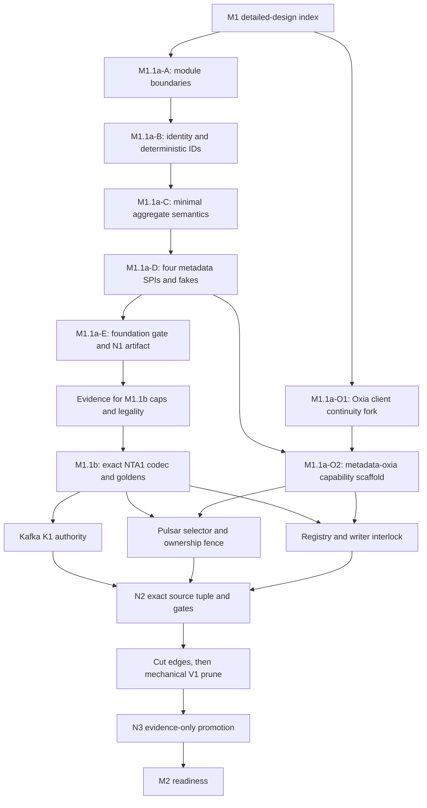

# M1 execution index

## Purpose and authority

M1 replaces the active V1 build/runtime graph with the first pure V2 metadata foundation. This file is the execution
index for that work: it orders reviewable slices, assigns prerequisites and gates, and prevents one implementation
target from crossing an OPEN contract. It does not restate the architecture.

Authority remains with accepted ADRs and the normative V2 contracts. In particular:

- [ADR 0081](../../../decisions/0081-v2-m1-pure-active-graph-and-promotion-boundary.md) owns the pure-graph,
  module, gate, and promotion boundary;
- [ADRs 0082 through 0085](../../../decisions/0082-v2-m1-domain-and-control-authority-contracts.md) own the domain,
  SPI, Kafka, Pulsar, Registry, continuity, and M1.1a readiness decisions;
- [the implementation plan](../../08-implementation-plan-and-gates.md) owns M1 scope and aggregate gates;
- [the scenario matrix](../../09-scenario-evidence-matrix.md) and
  [structured scenarios](../../v2-scenarios.json) own acceptance status;
- detailed designs in this directory own only code layout, call paths, threading, tests, and delivery order.

If a detailed design conflicts with an accepted ADR, the ADR wins and the slice stops until the detailed design is
corrected. A detailed-design status is not executable evidence.

## Baseline and completion boundary

The authoring baseline is the clean M0 split commit
`c8c1d0030ece7ce0ee4014544ce7f612e95fd394`. It is a repository milestone anchor, not a replacement for
`docs/v2/source-locks.json` or a promotion receipt.

M1 started from these facts; the first bullet is now superseded by the implementation record below:

- the M0 baseline had V2 implementation `NotStarted` and only documentation gates;
- the active Gradle/BOM/CI graph is still V1 residue, including KoP runtime;
- M1.1a alone is implementation-ready;
- complete NTA1, Registry writer capacity, receipt numeric caps, and final promotion evidence remain OPEN or pending.

M1 completes only when `v2M1FinalCheck` validates the pure V2 active graph, exact-source results, and trusted receipts.
Passing an intermediate slice gate cannot change M1 or a scenario to `PASSED_CURRENT_SOURCE`.

## Slice DAG

The graph expresses correctness dependencies, not permission to run several repository-mutating targets together.
Each target owns one row below and must preserve unrelated worktree state.

## Slice inventory

| Slice | Deliverable | Prerequisite | Exit gate | Current state |
| --- | --- | --- | --- | --- |
| `M1.1a-A` | add `nereus-domain` and `nereus-metadata-spi`; enforce Java 17/JDK-only dependency direction | this index and accepted [M1.1a design](m1.1a-domain-spi-foundation.md) | module compile plus dependency-surface checks | implemented and foundation-gated |
| `M1.1a-B` | bootstrap IDs, `ProtocolKindV1`, NPC1/NTI1/NPN1 leaves, NTB1/NSE1 IDs, strict names and goldens | `M1.1a-A` | domain unit/golden tests | implemented and foundation-gated |
| `M1.1a-C` | minimal independent aggregate values and foundation-only validator | `M1.1a-B` | semantic/negative API tests; no NTA1 activation | implemented and foundation-gated |
| `M1.1a-D` | exactly four production capabilities, closed outcomes, snapshots, deterministic test fakes | `M1.1a-C` | SPI contract tests | implemented and foundation-gated |
| `M1.1a-E` | `v2M1FoundationCheck`, reproducible JAR/source-JAR/POM hashing, M1 `InProgress` handoff | `M1.1a-A..D` | foundation gate; never M1 PASS | local gate implemented; N1 promotion pending |
| `M1.1a-O1` | expose ready/loss lifecycle from the Oxia client dummy barrier, including assignment-stream gaps and cancelable notification attempts; no server wire/RPC | confirmed client `24b730d1` / server `37a17bef` bases | fork focused tests and clean fork state | focused target complete at client `091a42c`; [design and evidence](m1.1a-oxia-client-continuity.md); no scenario promotion |
| `M1.1a-O2` | V2 aggregate/selector/Registry adapter scaffolding and store-wide continuity capability | `M1.1a-D`, `M1.1a-O1` | local fake tests; exact-source conformance remains pending | [accepted design](m1.1a-oxia-capability-scaffold.md); implementation in progress under the five-batch boundary |
| `M1.1b` | freeze and implement complete NTA1 encoder/parser, legality table, caps, formula, and goldens | four accepted codec decisions plus evidence | exact codec gate | **OPEN; do not implement** |
| `K1` | complete Kafka feature-2/API-32000/CreateTopics/image/publication authority | immutable post-M1.1b domain artifact | Kafka focused source gate | detailed design required |
| `P1` | selector CAS, authoritative ownership A/read/B, atomic ACTIVE fence and invalidation | `M1.1b`, `M1.1a-O2` | Pulsar/Oxia focused source gate | detailed design required |
| `R1` | compatibility-namespace Registry, writer commitment/interlock, derived views | accepted writer-count capacity plus `M1.1a-O2` | `REGISTRY_CONFORMANCE` | capacity evidence blocked |
| `G1` | fast/exact/final M1 gates and receipt validators | K1/P1/R1 plus accepted receipt caps | `v2M1Check`, `v2M1ExactSourceCheck`, `v2M1FinalCheck` | partially evidence blocked |
| `V1P` | cut settings/BOM/publication/CI edges, then remove V1 sources/tasks/scripts and KoP runtime | replacement graph and candidate M1 gates | active-graph/V1-absence checks | last mechanical implementation step |
| `N3` | receipts, attachments, exact scenario/index promotion only | trusted N2 execution | final receipt validation | evidence only |

## Codex target boundaries

Use one target per item below. A target must not silently absorb the next item because its tests happen to pass.

1. **Module boundary target**

   Add only the two projects, build/BOM entries, empty compile classpaths where required, and dependency/API-surface
   checks. Do not add identity or backend code.

2. **Identity/domain target**

   Add bootstrap identities, authority-leaf codecs, deterministic IDs, the minimal semantic aggregate model, validators,
   and unit/golden tests. Do not add NTA1 encoder/parser classes or a production backend.

3. **Metadata SPI target**

   Add exactly four capability interfaces, closed mutation results, versioned snapshots, deterministic in-memory test
   fixtures, and the intermediate foundation gate. Do not add generic metadata operations or Oxia dependencies.

4. **Oxia client continuity target**

   Work in the locked Oxia Java client fork only. Expose the existing first-dummy ready barrier and discontinuity/loss
   lifecycle; do not change the Oxia server protocol, add a durable cursor, or persist provider identities.

5. **Metadata-Oxia scaffold target**

   Consume the exact SPI, add capability adapters and store-wide continuity invalidation scaffolding, and keep all V2
   runtime activation fail-closed until exact-source conformance exists. Existing V1 best-effort watches do not satisfy
   this target.

Items 1 through 3 are implemented and locally gated as the M1.1a-A foundation described by
[M1.1a domain/SPI detailed design](m1.1a-domain-spi-foundation.md). Item 4 now has an
[accepted latest-source audit and component design](m1.1a-oxia-client-continuity.md), a pushed final fork, immutable
artifact/runtime identities, and focused current-source evidence. Item 5 now has a
[accepted component design](m1.1a-oxia-capability-scaffold.md); its immutable artifact bundle and aggregate-reader
correction are the first implementation batch. Runtime activation remains fail closed.

## Scenario ownership during M1.1a

M1.1a contributes executable local evidence but does not create a current-source PASS by itself.

| Scenario | M1.1a contribution | Still required after M1.1a |
| --- | --- | --- |
| `V2-META-002` | aggregate value/snapshot shape, four capability surfaces, closed fake outcomes | Kafka atomic authority, real Oxia exactness/response-loss, no child authority in the final graph |
| `V2-META-003` | non-zero IDs, protocol codes, NPC1/NTI1/NPN1/NTB1/NSE1 goldens, leaf/key cross-checks | accepted Pulsar maximum-name vectors and cross-repository artifact tests |
| `V2-META-004` | independent-field model and exclusion of derived/mutable facts | complete M1.1b field table, codec, caps, legality matrix, strict parser, Kafka/Oxia equality |
| `V2-PROFILE-001` | immutable selected profile/origin/catalog semantic values | complete creation authorities and runtime open/replay tests |
| `V2-MIGRATION-001` | ordinal-zero and second-epoch API absence in the domain/SPI | Kafka/Pulsar authority and process evidence |

`V2-META-003` is `IMPLEMENTED_NOT_RUN` because it now has a production owner and executable foundation gate, while its
full cross-repository/cap evidence has not run. All broader rows above remain `PLANNED`. A focused local unit test never
justifies `PASSED_CURRENT_SOURCE`.

## Commit and review order

The expected review sequence is:

1. this execution index and the first component design;
2. additive module/build boundary;
3. identity/domain implementation;
4. SPI/test-fixture implementation and foundation gate;
5. Oxia client fork in its repository;
6. metadata-oxia scaffolding;
7. evidence collection and a focused M1.1b grill;
8. NTA1 codec;
9. separate Kafka, Pulsar, and Registry changes;
10. M1 fast/exact/final gate completion;
11. settings/BOM/publication/CI cut;
12. independent mechanical V1/KoP-runtime deletion;
13. N2 execution and evidence-only N3 promotion.

Architecture changes, cross-repository source changes, and mass deletion must remain separate commits. The V1 prune
must not start merely because the replacement modules compile.

## Gate ladder

| Gate | When it exists | What it proves | What it cannot prove |
| --- | --- | --- | --- |
| `v2DocumentationCheck` / `v2M0Check` | now | accepted documentation/source/scenario consistency | any M1 implementation |
| `v2M1FoundationCheck` | now | domain/SPI tests, dependency boundaries, forbidden API absence, reproducible JAR/source-JAR/POM hashes | complete NTA1, backend conformance, pure final graph, M1 PASS |
| `v2M1Check` | after K1/P1/R1 and graph cut | ordinary deterministic M1 fast suite and V1 absence | exact external source/artifact/runtime identity |
| `v2M1ExactSourceCheck` | N2 | clean exact forks, immutable artifacts, real Oxia, focused fork tests | evidence provenance without trusted workflow/N3 |
| `v2M1FinalCheck` | N2/N3 | referenced gate/receipt schema and aggregate result | work not explicitly referenced by the receipts |

The intermediate foundation task has a deliberately different name from `v2M1Check`. It must report
`InProgress`/foundation-only language and fail if a script or document calls it M1 Final or M1 PASS.

## Stop conditions

Stop the active slice and return to design/evidence work if it would require any of the following:

- choosing a `FrameEncodingPolicy` kind/version/payload or an NTA1/Pulsar name cap;
- implementing an NTA1 encoder/parser or claiming canonical aggregate bytes before M1.1b;
- selecting `maxWriterCount=8` or completing the Registry codec/capacity gate;
- selecting receipt/attachment numeric caps or promoting an N3 receipt;
- adding an Oxia server RPC/wire change, durable notification cursor, or persisted connection/session/shard identity;
- exposing a fifth production metadata capability, generic key/value facade, child binding/Epoch store, or allocator
  candidate SPI;
- activating Kafka/Pulsar runtime, deleting V1 code, or removing KoP runtime inside a foundation slice;
- changing a scenario to `PASSED_CURRENT_SOURCE` without its exact current-source receipt.

## M1 exit checklist

M1 may hand off to M2 readiness only when all of these are true:

- the active build, BOM, publication, CI, and runtime graph is pure V2;
- no V1 compatibility facade or historical Phase/F9 executable remains;
- KoP runtime is absent while KoP design documents remain;
- complete NTA1 and Registry contracts are implemented against accepted bounds;
- Kafka, Pulsar, Oxia client/server, and domain artifacts match the exact locked/promoted source tuple;
- mandatory suites discover and execute non-zero tests with zero failure/skip/abort;
- N1/P1/K1/N2/N3 provenance and receipt attachments validate;
- scenario Markdown/JSON, docs, source locks, implementation status, and receipts agree;
- `v2M1FinalCheck` passes from a clean worktree.
