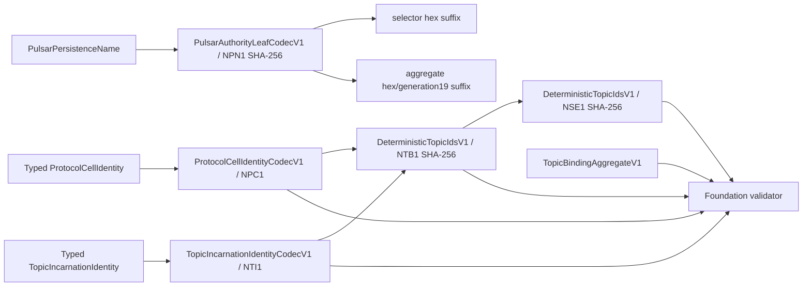

# M1.1a-A domain and metadata SPI foundation

## Role and baseline

This is the code-level execution design for the first bounded M1 implementation slice. It translates accepted
contracts into files, call paths, tests, and gates. It is not a new normative authority: accepted ADRs and
`docs/v2/01` through `07` win on every semantic conflict.

The implementation starts from:

- branch `main` at `c8c1d0030ece7ce0ee4014544ce7f612e95fd394`;
- source-lock SHA-256 `f0bc747994b5bb8a528673b25a7c3704c6ae1a88cb5de46de6d4c573f68e53f3`;
- the V1 module graph recorded in [settings.gradle.kts](../../../../settings.gradle.kts), with neither target module
  present;
- a clean worktree before this detailed-design change;
- M0 documentation split committed independently from all M1 code.

The semantic authorities for this slice are [ADR 0081](../../../decisions/0081-v2-m1-pure-active-graph-and-promotion-boundary.md),
[ADR 0082](../../../decisions/0082-v2-m1-domain-and-control-authority-contracts.md),
[ADR 0083](../../../decisions/0083-v2-m1-wire-control-and-evidence-bounds.md),
[ADR 0084](../../../decisions/0084-v2-m1-leaf-witness-registry-and-receipt-contracts.md), and
[ADR 0085](../../../decisions/0085-v2-m1-foundation-start-and-deferred-codec-bounds.md). The remaining blockers are
tracked in [open questions](../../open-questions.md).

## Slice result

This slice delivers two additive Java 17 modules:

```text
nereus-domain <- nereus-metadata-spi
```

It implements frozen identity/canonical-leaf semantics and an inactive metadata capability surface. It does not wire a
Kafka, Pulsar, or Oxia production runtime. Completion changes V2/M1 implementation status only to partial
`InProgress`; it cannot claim M1.1a, M1, or any exact-source scenario PASS.

## Implementation record

The Nereus-local foundation described here is now implemented:

- `nereus-domain` has an empty production classpath and owns strict canonical bytes/UTF-8, fixed bootstrap identities,
  `ProtocolKindV1`, NPC1/NTI1/NPN1, raw Kafka topic UUID validation, NTB1/NSE1 derivation, the independent aggregate
  model, and direct foundation validation;
- `nereus-metadata-spi` depends only on `nereus-domain` and exposes exactly the four accepted capabilities, both closed
  outcome sets, exact stored-byte/digest snapshots, and no backend or generic CRUD surface;
- literal independent golden vectors and negative vectors cover fixed-width order, strict UTF-8, unsigned declared-
  length rejection, reserved Kafka UUIDs, positive Pulsar generation/overflow, protocol/ID mismatch, and profile-policy
  foundation rules;
- `v2M1FoundationCheck` runs both module checks, documentation, production dependency resolution, forbidden API/import
  scans, and reproducible JAR/source-JAR/POM SHA-256 qualification. It is wired into ordinary `check` and PR CI.

This record has no append-only current-source receipt and therefore leaves the design `InProgress`, not `Verified`.
The Oxia continuity fork, metadata-oxia adapter, complete NTA1, Registry capacity/backend codec, Kafka/Pulsar runtime,
N1 promotion, and every M1 Final/PASS claim remain outside this implementation record.

## Module dependency boundary

### `nereus-domain`

Production compile/runtime dependencies are empty. JDK APIs are the only allowed imports. In particular, production
code must not depend on or import:

- Kafka or Pulsar classes;
- Oxia or a generic MetadataStore API;
- Netty, gRPC, Reactor, Vert.x, Guava, or another asynchronous/runtime framework;
- `nereus-api` or another V1 Nereus module;
- a backend version, generated Kafka wire record, provider client, or Java serialization.

JUnit and AssertJ remain test-scoped only. Root build tooling such as Checkstyle and Spotless is not a published module
dependency.

### `nereus-metadata-spi`

The only production dependency is `api(project(":nereus-domain"))`. JDK `CompletionStage`, collections, and value
types are allowed; no third-party asynchronous abstraction is allowed. The production capability package contains
exactly four interfaces:

```text
TopicBindingAggregatePublisher
TopicBindingAggregateReader
PulsarTopicGenerationSelectorStore
PulsarVirtualLedgerNamespaceRegistryStore
```

Supporting records/enums are typed requests, snapshots, and closed results. They do not expose a generic
`get/put/delete/list`, an umbrella `MetadataStore`, child Binding/Epoch stores, watch/list capability, or allocator-mode
SPI.

## Package and file inventory

The implementation uses the following public packages. Small package-private encoding helpers may share the listed
source files; they must not expand the public capability surface.

### `nereus-domain`

```text
nereus-domain/src/main/java/com/nereusstream/domain/bytes/
├── CanonicalBytes.java
├── CanonicalUtf8.java
└── Sha256Digest.java

nereus-domain/src/main/java/com/nereusstream/domain/identity/
├── Id128.java
├── DeploymentId.java
├── ReservationDomainId.java
├── KafkaCellId.java
├── PulsarCellId.java
├── KafkaTopicId.java
├── TopicBindingId.java
└── StorageEpochId.java

nereus-domain/src/main/java/com/nereusstream/domain/protocol/
├── ProtocolKindV1.java
├── ProtocolCellIdentity.java
├── KafkaProtocolCellIdentity.java
├── PulsarProtocolCellIdentity.java
├── KafkaTopicName.java
├── PulsarPersistenceName.java
├── PulsarTopicName.java
├── PulsarBindingGeneration.java
├── TopicIncarnationIdentity.java
├── KafkaTopicIncarnationIdentity.java
└── PulsarTopicIncarnationIdentity.java

nereus-domain/src/main/java/com/nereusstream/domain/codec/
├── ProtocolCellIdentityCodecV1.java
├── TopicIncarnationIdentityCodecV1.java
├── DeterministicTopicIdsV1.java
└── PulsarAuthorityLeafCodecV1.java

nereus-domain/src/main/java/com/nereusstream/domain/aggregate/
├── StorageProfileV1.java
├── ProfileOriginV1.java
├── PolicyCatalogDigest.java
├── FrameEncodingPolicyValueV1.java
├── TopicBindingV1.java
├── InitialStorageEpochV1.java
├── TopicBindingAggregateV1.java
└── TopicBindingAggregateFoundationValidatorV1.java
```

`FrameEncodingPolicyValueV1` is an opaque logical `{kind,formatVersion,payload}` value. M1.1a checks only the already
accepted structural rule (`NONE={0,0,empty}`, or both numeric fields in `1..65535`) and the accepted profile-level
NONE/non-NONE split. It assigns no non-NONE code, payload schema, or cap. That omission is intentional and prevents
this slice from masquerading as complete NTA1.

### `nereus-metadata-spi`

```text
nereus-metadata-spi/src/main/java/com/nereusstream/metadata/spi/capability/
├── TopicBindingAggregatePublisher.java
├── TopicBindingAggregateReader.java
├── PulsarTopicGenerationSelectorStore.java
└── PulsarVirtualLedgerNamespaceRegistryStore.java

nereus-metadata-spi/src/main/java/com/nereusstream/metadata/spi/model/
├── CreateMutationOutcome.java
├── ConditionalCasOutcome.java
├── CreateMutationResult.java
├── ConditionalCasResult.java
├── MetadataVersion.java
├── AggregatePublicationCandidate.java
├── VersionedAggregateSnapshot.java
├── PulsarTopicGenerationSelectorStateV1.java
├── PulsarTopicGenerationSelectorValueV1.java
├── VersionedSelectorSnapshot.java
├── PulsarVirtualLedgerNamespaceRegistryValueV1.java
└── VersionedRegistrySnapshot.java
```

Selector/Registry values carry capability-specific typed identity plus immutable candidate bytes so an implementation
can establish exact stored-byte equality. They are not backend codecs. The Registry value deliberately has no writer
count constant, assignment parser, or production capacity validator in this slice.

## Canonical identity representation

### Fixed-width values

`Id128` stores two longs and emits exactly 16 big-endian bytes. Typed wrappers reject all zero; `KafkaTopicId` also
rejects `{0,1}`, matching the locked Kafka `ZERO_UUID` and `ONE_UUID/METADATA_TOPIC_ID` set. No typed identity accepts a
text UUID as its canonical representation.

`Sha256Digest` owns a defensively copied 32-byte value and constant-shape equality/hash behavior. `TopicBindingId` and
`StorageEpochId` are distinct wrappers so they cannot be exchanged accidentally. Byte accessors return a copy or write
into a caller buffer; no mutable array escapes.

### Names

`KafkaTopicName` reproduces the locked Kafka rule without importing Kafka: non-empty, not `.` or `..`, at most 249
ASCII characters, and only `[a-zA-Z0-9._-]`. ASCII character count equals encoded byte length.

`CanonicalUtf8` uses a JDK encoder/decoder with `CodingErrorAction.REPORT`; malformed input, unmappable characters, and
unpaired UTF-16 surrogates fail. It performs no NFC, lowercasing, trimming, or replacement. Pulsar persistence/topic
wrappers apply no guessed per-name cap. Their final caps and maximum vectors remain M1.1b OPEN.

### Protocol variants

`ProtocolKindV1` is the only code table: `KAFKA=1`, `PULSAR=2`; `0` and `3..65535` are rejected. Sealed Cell and
incarnation interfaces expose `protocolKind()` and admit only their matching variants. The aggregate foundation
validator rejects a Kafka/Pulsar cross-variant even when every individual value is otherwise valid.

## Codec and derivation call graph



NPC1 and NTI1 encoders allocate only their exact checked length. Decoders operate on an already bounded input byte
array, use unsigned length checks against remaining bytes, reject overflow/underflow, decode strict UTF-8, select one
known variant, and require EOF. They do not use a proposed Pulsar format cap or allocate from an unchecked declared
length.

The exact encodings are:

```text
Kafka NPC1  = NPC1 || u16be(1) || deploymentId[16] || kafkaCellId[16]
Pulsar NPC1 = NPC1 || u16be(2) || deploymentId[16] || reservationDomainId[16] || pulsarCellId[16]

Kafka NTI1  = NTI1 || u16be(1) || topicId[16]
              || u32be(topicNameAscii.length) || topicNameAscii

Pulsar NTI1 = NTI1 || u16be(2)
              || u32be(persistenceNameUtf8.length) || persistenceNameUtf8
              || u32be(topicNameUtf8.length) || topicNameUtf8
              || u64be(bindingGeneration)

bindingId   = SHA-256(NTB1 || u32be(cellBytes.length) || cellBytes
                      || u32be(incarnationBytes.length) || incarnationBytes)

epochId     = SHA-256(NSE1 || bindingId[32] || u64be(0))

nameDigest  = SHA-256(NPN1 || u32be(persistenceNameUtf8.length) || persistenceNameUtf8)
```

`generation19` is produced with locale-independent ASCII digits and exact width 19. The selector suffix is 64 lowercase
hex digits; the aggregate suffix is `<digest>/<generation19>`. Backend root/prefix is not part of this codec.

## Aggregate model and direct validation

`TopicBindingAggregateV1` contains only:

- schema version 1;
- one `TopicBindingV1`: explicit protocol kind, binding ID, Protocol Cell, and complete typed incarnation;
- one `InitialStorageEpochV1`: Storage Epoch ID, ordinal zero, selected profile, origin, policy-catalog digest, and the
  opaque independent frame-policy value.

It contains no active/creating/deleting state, owner/session/version, time, retry ID, controller offset, attributes map,
derived Position Domain/payload/native authority, Primary WAL/checksum/encryption choice, repeated binding back-
reference, or initial sealed end.

`TopicBindingAggregateFoundationValidatorV1` validates the object graph directly:

1. schema version is one;
2. explicit protocol, Cell variant, and incarnation variant agree;
3. NPC1/NTI1 are structurally encodable;
4. rederived NTB1 equals the stored binding ID;
5. ordinal is exactly zero and rederived NSE1 equals the stored Storage Epoch ID;
6. profile/origin are closed values;
7. the frame-policy pair has legal zero/non-zero shape;
8. `OBJECT_WAL` is non-NONE and both BookKeeper profiles are NONE.

The validator never calls an aggregate encoder/decoder. It returns no “canonical NTA1” or admission token. M1.1b adds
the complete policy table, caps, NTA1 codec, persisted-byte equality, and final validator by composing this stable
foundation validation rather than routing validation through an encode/decode round trip.

## Metadata SPI semantics

All methods return JDK `CompletionStage`; implementations may complete inline or asynchronously, so callers assume no
thread affinity. Cancellation after dispatch is not rollback. A mutation that may have reached authority must resolve
through bounded exact reread or return `INDETERMINATE`.

Create outcomes are exactly:

```text
CREATED | EXISTING_EXACT | DEFINITIVE_CONFLICT | INDETERMINATE
```

Conditional CAS outcomes are exactly:

```text
APPLIED_EXACT | PREDECESSOR_UNCHANGED | DEFINITIVE_CONFLICT | INDETERMINATE
```

Result constructors reject impossible value/outcome combinations. Exact outcomes carry the exact versioned snapshot;
conflict/indeterminate outcomes carry no authority-granting value. A store implementation decides exactness from the
authority key, schema, digest, and canonical stored bytes; domain object equality alone is insufficient.

Capability methods are named by domain operation:

- aggregate `publishIfAbsent` and `readAggregate`;
- selector `readSelector`, `createSelector`, and `compareAndSetSelector`;
- Registry `readRegistry`, `createRegistry`, and `compareAndSetRegistry`.

There is no generic key argument or generic CRUD method. Selector and Registry CAS take an exact versioned predecessor;
`PREDECESSOR_UNCHANGED` means the candidate is absent and that exact predecessor still owns the key.

One `VersionedAggregateSnapshot` owns the aggregate, canonical stored bytes/digest, and opaque metadata version. Its
`binding()` and `initialEpoch()` accessors return projections from that same aggregate instance. No second read, decode,
key, write, cache, watch, list, or mutation path is available for either projection.

## Tests and golden vectors

### Domain tests

- `Id128Test`: exact 16-byte big-endian order, defensive copying, zero rejection, and Kafka zero/one rejection;
- `ProtocolKindV1Test`: codes 1/2 and rejection of 0/3/65535/negative inputs;
- `KafkaTopicNameTest`: locked alphabet, 249 boundary, empty/dot/dot-dot, non-ASCII, and unpaired surrogate rejection;
- `CanonicalUtf8Test`: strict valid round trip, malformed/truncated/overlong input, unpaired surrogate, no normalization;
- `ProtocolCellIdentityCodecV1Test`: exact Kafka/Pulsar NPC1 bytes, wrong magic/code/length/variant/trailing rejection;
- `TopicIncarnationIdentityCodecV1Test`: raw Kafka UUID, exact NTI1 bytes, strict UTF-8, length overflow/underflow,
  generation zero and `Math.addExact` overflow, wrong variant, and trailing rejection;
- `DeterministicTopicIdsV1Test`: frozen NTB1/NSE1 preimages and SHA-256, retry determinism, Cell rebuild/name/generation
  separation, protocol mismatch, ordinal non-zero rejection, and rederivation equality;
- `PulsarAuthorityLeafCodecV1Test`: frozen NPN1 digest, lowercase hex, generation19 boundaries, mismatched leaf rejection;
- `TopicBindingAggregateFoundationValidatorV1Test`: direct valid variants, every ID/protocol/ordinal/profile-policy
  mismatch, derived/mutable-field API absence, and no aggregate codec dependency.

Golden values are literal hex/ASCII constants computed independently in the test fixture and reviewed against the
accepted preimages. Production code output cannot generate its own expected values at test runtime.

### SPI tests

- reflection verifies the capability package contains only the four named public capability interfaces;
- every create/CAS enum member has an accepted result shape and no fifth value;
- an in-test deterministic single-key fake exercises create, existing exact, conflict, response-loss exact reread,
  predecessor unchanged, applied exact, and indeterminate cuts;
- `VersionedAggregateSnapshot` projection identity proves one aggregate/snapshot supplies Binding and initial Epoch;
- source/API scans reject generic CRUD/list/watch, umbrella `MetadataStore`, child authority, allocator modes, and
  Kafka/Pulsar/Oxia/Netty/framework imports.

No test invents a Pulsar name cap, NTA1 field/golden, Registry writer count, receipt cap, or allocator selection.

## Gradle and gate changes

The module skeleton change will:

1. add both projects to `settings.gradle.kts`;
2. add both constraints to `nereus-bom` without removing a V1 constraint;
3. add project build files with only the dependencies described above;
4. add `v2M1FoundationDependencyCheck`, which resolves production compile classpaths and requires:
   - domain: no project or external component;
   - metadata SPI: exactly project `:nereus-domain`, with no external component;
5. add `scripts/check-v2-m1-foundation.sh` for forbidden imports, forbidden API/symbols, exact capability inventory, no
   NTA1 codec, and no registered `v2M1FinalCheck`;
6. add intermediate `v2M1FoundationCheck`, depending on both module checks, dependency/API checks, and V2 documentation;
7. wire the dependency/API boundary check into ordinary root `check`.

The intermediate task must describe the result as M1.1a-A foundation only. It does not replace or register
`v2M1Check`, `v2M1ExactSourceCheck`, or `v2M1FinalCheck`.

## Delivery sequence

1. land this design and M1 execution index;
2. add module/build boundary and its empty dependency surfaces;
3. implement fixed values, protocol variants, codecs, derivations, aggregate model, and domain tests;
4. implement four SPIs, supporting outcomes/snapshots, and SPI tests;
5. add/activate foundation boundary gates;
6. synchronize implementation status, ADR refinement note, plan, scenario Markdown/JSON, tradeoff, and docs checks;
7. run all required verification from a clean scoped diff.

Each step is reviewable and may be committed independently. No step deletes or migrates a V1 module.

## Explicit non-goals

- complete NTA1 encoder/parser/goldens or a claim of exact NTA1;
- guessed FrameEncodingPolicy codes/payload/caps or Pulsar name/Cell/incarnation/total caps;
- Registry backend codec/capacity, `maxWriterCount=8`, writer-interlock execution, or real Oxia conformance;
- STRICT_SERIALIZED/RANGE_LEASED candidate implementation or production allocator SPI;
- Kafka KRaft fork changes or runtime activation;
- Pulsar ownership witness/runtime changes;
- Oxia continuity/client/server changes;
- `v2M1Check`, `v2M1FinalCheck`, receipt validation, N3 promotion, performance/parity/superiority claims;
- V1 runtime/Phase/F9/KoP removal, compatibility facade, deprecated shim, or V1/V2 dual read.

## Downstream integration points

- later M1.1a metadata-oxia work implements these four interfaces and supplies physical key/envelope handling;
- the separate Oxia client fork supplies ready/loss continuity, not this module;
- M1.1b freezes the four codec blockers, implements NTA1, and upgrades foundation validation to full canonical
  persisted-value validation;
- Kafka K1 consumes only an immutable source-qualified `nereus-domain` JAR/POM and maps generated fields directly;
- Pulsar P1 consumes domain plus SPI through its native witness integration;
- Registry work replaces the foundation Registry value with its accepted bounded codec only after writer-count evidence.

## Stop and completion conditions

Stop only the affected type/operation if implementation would require an OPEN value. Record the blocker in this design
and continue independent work. Stop the whole slice if an accepted invariant cannot be represented without a fifth
capability, generic metadata facade, backend dependency in domain/SPI, NTA1 activation, or V1/fork/runtime mutation.

M1.1a-A completes when:

- both modules build and publish source/JAR/POM artifacts through the existing build conventions;
- all listed frozen identities/codecs/derivations and direct foundation validation exist;
- exactly four capability interfaces and both closed outcome sets exist;
- unit, golden, outcome, dependency, and forbidden-surface tests pass;
- `git diff --check`, V2 documentation checks, `v2M0Check`, the foundation gate, and ordinary `check` pass, or an exact
  unrelated external blocker is recorded;
- docs/status/scenario entries say partial `InProgress`/`IMPLEMENTED_NOT_RUN` only where code really exists;
- M1.1b, Registry capacity, receipt caps, and promotion evidence remain explicitly OPEN;
- no task, document, or receipt reports M1 Final/PASS.
